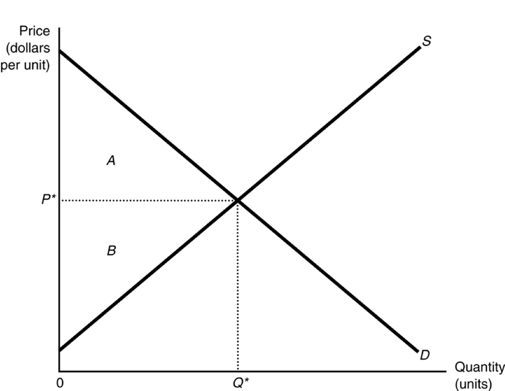

---
output:
  html_document: default
  ioslides_presentation: default
  pdf_document: default
---


## Econ 57a, Environmental Economics, Fall 2019	
### Module 1: Introduction   
* Environmental problems are challenging   
* Economics can help   
* Environmental economics and real-world policy-making   

## We all enjoy beautiful environments
{height=256px}     {height=256px}

{height=240px} {height=240px}


## Yet the environment faces challenges
* Climate change
* Air pollution
* Water pollution
* Natural disasters
* Biodiversity loss
* Deforestation
* ......

## 
{height=500px}

## 
{height=500px}

## 
{height=500px}

## 
{height=400px}

## Important implications on human society
* Climate change
	- Rising sea levels threatens coastal communities (small island countires, Florida, Boston)  
	- Extreme heat increases mortality, especially in low-income countries (India, Africa, Houston)
	- Increasing frequency of wildfires   
	- Reduces economic outputs, causing economic conflicts   
	- And, 
	
## 
{height=450px}

## How economics can help addressing environmental challenges
* Everyone loves the environment   
* But to what extent?   
* Will it be "worthwhile" to: 

##
- Ban the use of leaded gasoline in the United States?   
- Ban fracking in the state of New York? 

##
- Stop the construction of the Tellico Dam to protect the snail darter, an endangered species?
- Immediately stop generating power from all fossil fuels (coal, natural gas, etc.)

## 
{height=450px}

## Economics is essentially about tradeoffs:
* There will be economic benefits from protecting natural resources & the environment    
	- Lifes saved / diseases avoided      
	- Enjoyment from beautiful landscapes      
	- Proection of wildlifes    
	- Resources saved for future generations   

## Economics is essentially about tradeoffs:
* There will also be economic costs associated with those actions   
	- Costs to exhaust purifiers / waste water treatment plants / solar panels
	- Employment opportunities   
	- Power generation / flood control   
	- Foregone economic profits   

## 
{height=400px}

## Why is economics important in solving environmental problems?

## 
As a science, economics offer a unified way to see environmental problems:

* How “much” do we care about the environment? (demand)
* How much does it cost to protect the environment? (supply)
* What is the optimal amount of environmental protection (equilibrium)
* How much should we save for future generations (dynamic efficiency)

## TQs from you
> How can we quantify things like social losses which are not easily reduced down to dollar figures resulting from environmental problems?

> The author claims that monetizing the value of certain environmental factors is not the best metric to measure the positive impacts provided by things such as the Amazon rainforest. I'm curious as to what could be a better metric. 

> As new technology comes out to make vehicles more sustainable how does that affect an economy in the short and long term. Do these effects diminish as the technology ages?

##
{height=400px}

##
As a field in economics, environmental economics differs from standard economics in dealing with market failures:   

* Adam Smith: the invisible hand solves everything   
* But not when market fails:   
	- Property rights   
	- Externality   
	- Markets may be incomplete, or non-existent for most environmental goods and services
		* e.g. we cannot buy clean air (in general)
* Private markets may lead to inefficient outcomes in the presence of market failure(s)   

## 
{height=500px} 

##
{height=500px}

## TQs from you
> Opposers such as those who emphasize free markets and private economies don't understand that without government intervention, markets are inefficient. Government regulation when implemented effectively can decrease negative externalities and improve social welfare for all. 

## 
Environmental economics also aim to provide solutions to correct market failures:    

* Command-and-control regulation
	- Technological mandates
* Efficiency standards 
	- Renewable portfolio standards (RPS)
* Market-based solutions
	- Soda tax
	- Emission trading markets

## 
Insights on optimal use of our natural resources: 

* Optimal extraction of non-renewable resources
	- Fossil fuels, metals, etc.
	- Scarcity rents and opportunity costs
* Over-exploitation of renewable resources
	- Fisheries, grasslands, water, etc.
	- Tragedy of the commons
* Under-provision of public goods
	- The free-rider problem


## How are environmental economics practiced in policy-making

## Benefit-cost analysis in policy decisions   
* Reagan: every regulation needs to pass BCA   
* Environmenetal economics monetizes environmental benefits & costs
	- What's the economic loss from the BP oil spill?
	- What's the economic benefits from wetland protection?
	- What's the "Social Cost of Carbon"?
* For most environmental policies, benefits are much larger than costs   
	- The Clean Air Act   
	- The Clean Water Act


## Mechanism design in solving environmental problems
* The Waxman-Markey Bill
	- Creates a national carbon emission trading market
* The Acid Rain Trading Program
* Wetland banking
* Water banking

## The current state of business
{height=320px}

## Environmental economics under siege
> In my opinion, things are going very wrong in Washington, DC these days. Great EPA career staff, agency scientists in particular, are being hamstrung, silenced, and treated disrespectfully.

-Gina McCarthy, former EPA administrator (2018)

* Environmental policy should be armed with objective, verifiable scientific evidences
* Yet science is getting sidelined within the agency
* At the same time, science becomes polarized along political spectrums in the public's arena

## TQs from you
> I found the Boyle 2018 and McCarthy 2019 article to be quite troubling. I knew under Trump’s administration there were rollbacks to environmental regulations, but I did not realize that they were using unsound economic assumptions to justify them.

> I find it challenging to comprehend the current U.S. administration's verdict on climate change. Denying it is utterly illogical. Frankly, one can't choose to believe in climate change because climate change is a fact.

## TQs from you
> To use Boyle's example, "the resulting co-benefit" of the harmful pollutants from power plants "would not be counted" in Trump's EPA's process of a cost-benefit analysis. I think that this translates to simply doing poor research and would result in a B- paper here at Brandeis. What is the economic consequence of not counting these factors in their data? If Trump’s EPA can simply ignore or remove certain co-benefits to regulating a certain pollutant, how can anyone believe the data or reports coming from the EPA?

## Ways of alternative policy-making
* Exaggerating the cost of environmental protection
	- Jobs, but what jobs? Coal mining provides 50,000 jobs around the US
	- Of course, there needs to be objective evaluations of the labor market consequences from environmental regulations
	- Proper incentives stimulates innovation, which significantly lowers the expected cost of regulation
	
## Ways of alternative policy-making	
* Underestimating the benefits of environmental protection
 	- Abandon well-established assumptions and guidelines in WOTUS rule, Clean Power Plans, Clean Car Standards, etc.
 	- On the Social Cost of Carbon (SCC)
 		* Domestic-only effect, ignores global spillovers of CO2 emissions
 		* Uses a 7% interest rate, while the economic community recommends 3% or less
 		* Found a $1 per ton of carbon, as oppose to $51 in 2016
 		
## What does a 7% interest rate even mean

* Here's how your kid' utility is worth to us in 30 years when adopting a 3% interest rate
```{r}
1/1.03^30
```

* Here's how your kid' utility is worth to us in 30 years when adopting a 7% interest rate
```{r}
1/1.07^30
```
 		
## 
{height=450px}

## Ways of alternative policy-making
* Roll-back existing regulations 
	- Clean Power Plan
	- Clean Water Rule
	- Clean Car Standards
	- etc. 
	
## Ways of alternative policy-making
* Eliminating necessary institutions that safeguard scientific analyses
	- The EPA external advisory board on environmental economics
	- The Interagency Working Group on the Social Cost of Carbon

## Don't lose hope
> A clean, healthy environment is a basic human right and the foundation of our sustainable economy and quality of life. So, keep your foot on the gas and put your faith in human ingenuity and entrepreneurship. Let environmental economics drive us toward that clean, healthy environment. 

-Gina McCarthy

## Don't lose hope
* Know the economics (and the science)
* Use your economics to analyze real-world problems
* Don't fall into rhetorics

## TQs from you
> One thing I noticed, especially in the reading by Gina McCarthy, is how many professionals seem to think that (at least under the current administration) environmental economics/protections has to depend almost entirely on activism.


