
<!-- Just one possible MathJax CDN below. You may use others. -->

## Econ 57a, Environmental Economics, Fall 2019	
### Module 2: Efficiency   
* Supply, demand, and equilibrium
* Efficiency and the equimarginal principle
* Benefits and costs for environmental services

## The King of Burgers
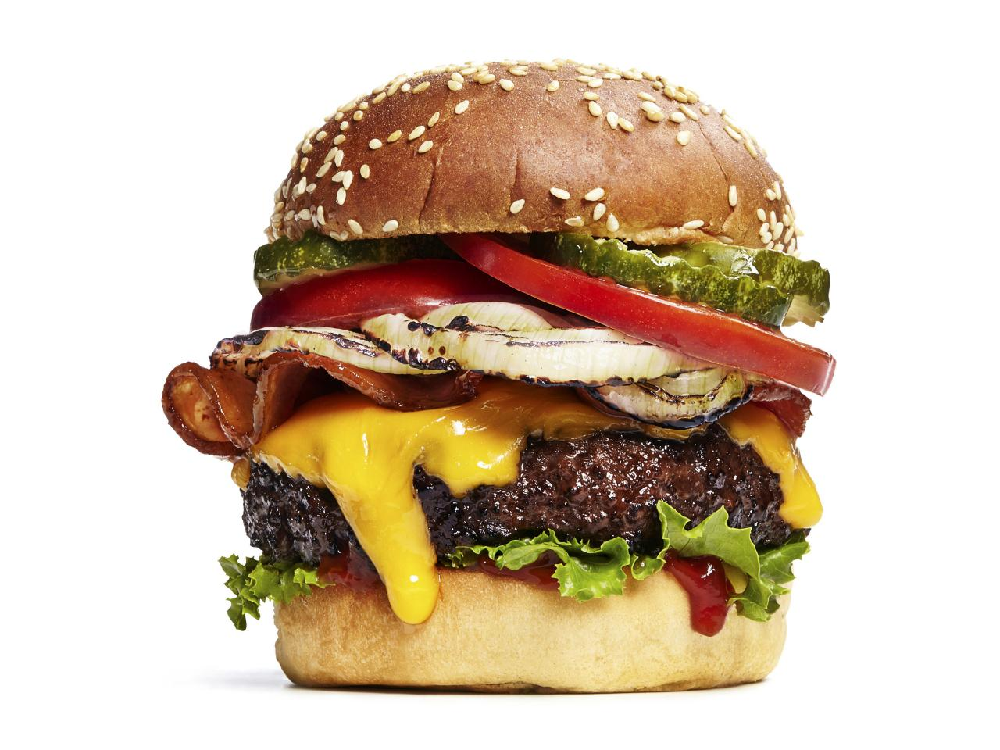{height=400px}

##
Robert Baratheon is a huge burger lover. One day he walks into a burger place, and finds the menu to be the following:

| Burgers         			|No. Sausages| Price         | WTP  |
| --------------------------|:---:|:-----:|:-----:|
| Veggie Burger  			|0| $4 		| $5 	|
| Cheeseburger      		|1| $6  	| $8.5 	|
| Double Cheeseburger 		|2| $8    	| $11	|
| Triple Cheeseburger 		|3| $10   	| $12.5	|
| The Ultimate Cheeseburger |4| $12 	| $13	|

## Maximize net benefits

| Burgers         | Price         | WTP  	|Net Benefit| Marginal Benefit 	|
| --------------------------|:-----:|:-----:|:-------:	|:-------:			|
| Veggie Burger  			| $4 	| $5 	|$1			|$4					|
| Cheeseburger      		| $6  	| $8.5 	|$2.5		|$3					|
| Double Cheeseburger 		| $8    | $11 	|$3			|$2					|
| Triple Cheeseburger 		| $10   | $12.5	|$2.5		|$1					|
| The Ultimate Cheeseburger | $12 	| $13	|$1			|$0					|

## Some Algebra

WTP: $$-0.5Q^2+4Q+5$$

### The demand for beef sausage:
P = 4-Q

### Price for beef sausage
P = 2

### Net benefit is maximized when price equals marginal benefit
Q = 2

## 
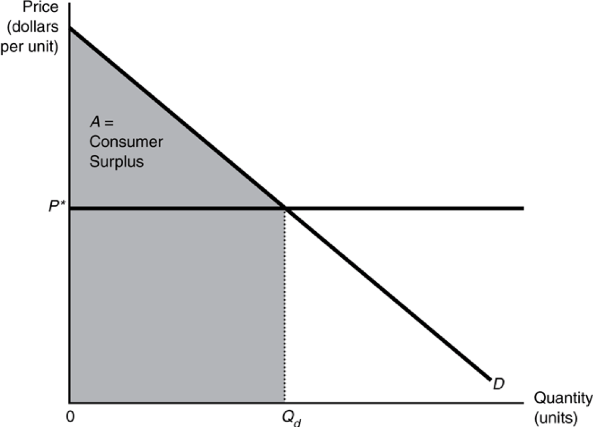{height=400px}

## Consumer surplus
Consumer surplus is the value that consumers receive from an allocation minus what it costs them to obtain it. Consumer surplus is measured as the area under the demand curve minus the consumer’s cost.

## Producer surplus
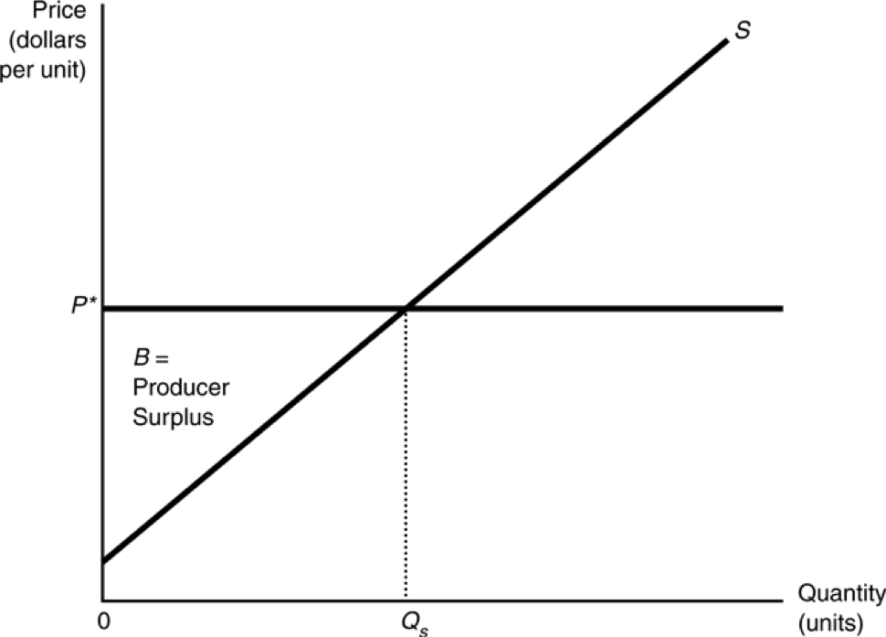{height=400px}

##Producer surplus
* Producer surplus is the difference between the amount that a seller receives minus what the seller would be willing to accept for the good.
* Given price P*, the seller maximizes his or her own producer surplus by choosing to sell Qs units. 
* The producer surplus is designated by area B, the area under the price line that lies over the marginal cost curve, bounded from the left by the vertical axis and the right by the quantity of the good.

## Equilibrium
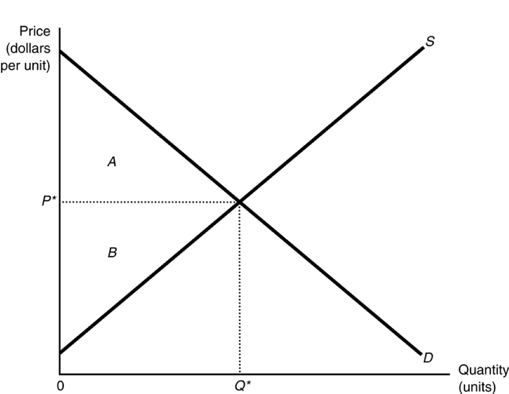{height=400px}

## 
A market equilibrium is characterized by the **equimarginal principle**, i.e., 

* For the consumer, price equals marginal benefit   
* For the producer, price equals marginal cost   
* Thus a market equilibrium is characterized by:   

**Marginal Benefit = Marginal Cost**

## The First Welfare Theorem 
a.k.a the Invisible Hand Theorem

> A *complete and competitive market* leads to a *Pareto efficient* allocation of resources.   
- Adam Smith 

* Pareto efficiency: no other feasible allocation could benefit at least one person without any deleterious effects on some other person
* Equilibrium from a competitive market is (Pareto) efficient

## So, what happens when the good in question is environmental pollution?

Question: What is the optimal level of particulate matters (PM)? 

## 
{height=400px}

## 
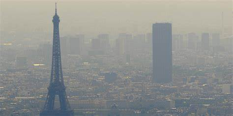{height=380px}

## 
### We need to find:      

* A demand curve
	- How much will we benefit from reducing pollution?
* A supply curve
	- How much will it cost to reduce pollution?
* An optimal level of pollution that equates supply and demand

## Exposure to particulate matters will cause:
* Alzheimer's (Science, 2017)
* Dementia (Bishop et al., 2017)
* Lower test scores (Ebenstein et al. 2016)
* Irrational stock trading behavior (Heyes et al. 2016)
* And much more

## 
{height=600px}

## 
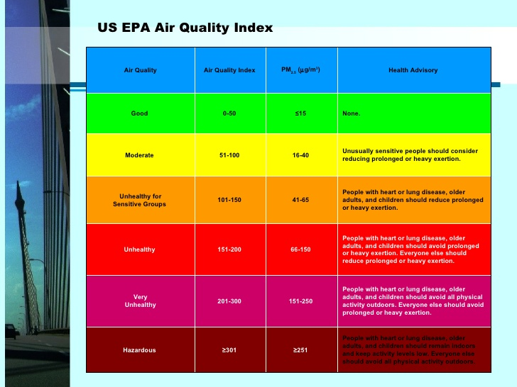{height=600px}

## Marginal benefit of (reducing) environmental pollution
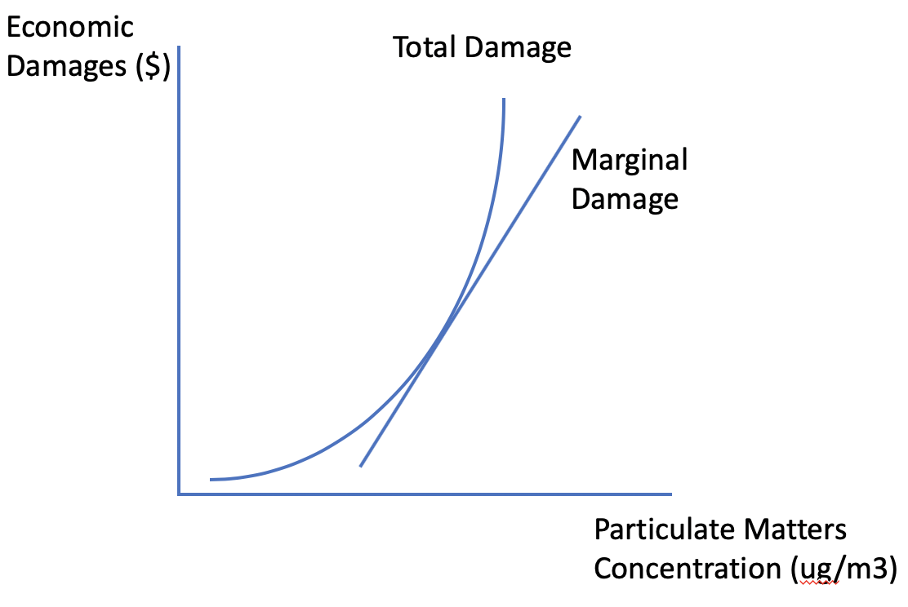{height=400px}

##
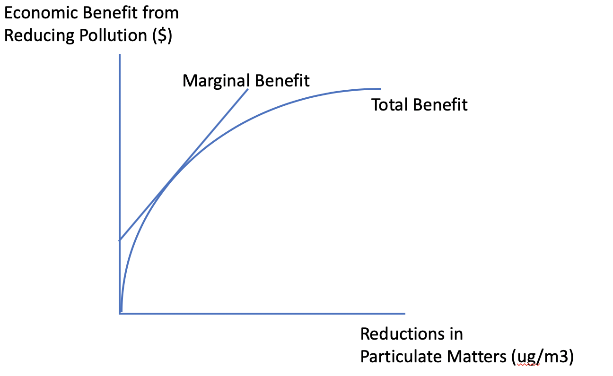{height=400px}

## What about the costs

Ways to reduce particulate matters:  

* Ban straw burning    
* Switching from coal fired to natural gas fired power plants    
* Stringent vehicle emission standards    
* Switching to electric cars    
* And...

## The Beijing Olympics
Beijing is notorious for its poor air quality. 

{height=400px} 

## 
But during the 2008 Beijing Olympics, the air quality is surprisingly good. Why?

##

> Factories in Beijing and the surrounding region were ordered to shut down weeks ahead of the opening ceremony. 

> Nineteen days before the Games were due to start, officials implemented restrictions on the use of private automobiles in the city. 

> Technicians practiced seeding clouds to bring cleansing rains.

-USC US-China Institute    

## 
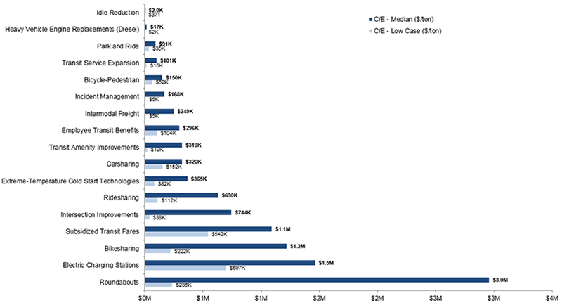{height=500px}   

## 
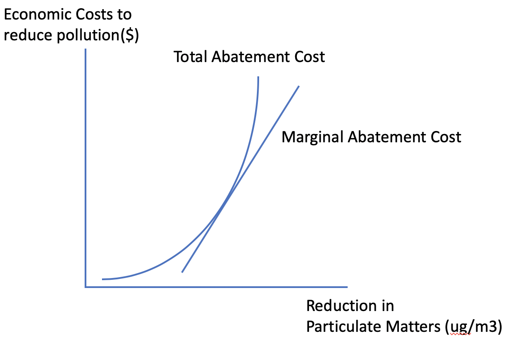{height=400px} 

## 
{height=500px}

## 
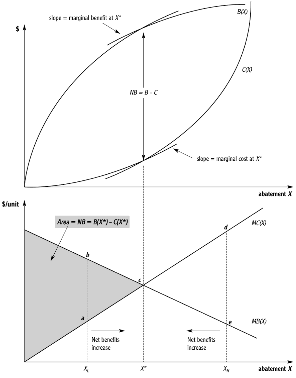{height=500px} 

## 
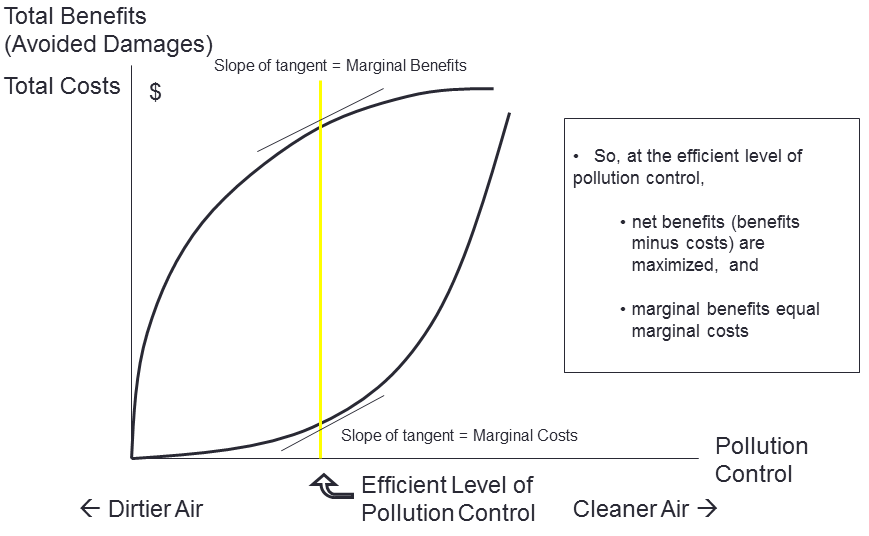{height=500px} 

## 
Question: Will it be optimal to remove all particulate matters from the air?

