title: 'Module 3: When do markets fail?'
output:
  slidy_presentation: default
  beamer_presentation: default
  html_document:
    df_print: paged
  ioslides_presentation: default

## Econ 57a, Environmental Economics, Fall 2019	
### Module 3: When do markets fail?  
* Externality
* Property rights
	- Exclusivity (tragedy of the commons)
	- Rivalry (free-riding)
* Other market failures: monopoly, assymetric information, Governmental Failure

## Recall the Invisible Hands Theorem:

> A *complete and competitive market* leads to a Pareto efficient allocation of resources.

This requires that:    

* Firms and consumers take prices as given (no monopoly or monopsony)
* Perfect information about the good being traded
* **The market is complete, i.e., all the relevant costs and benefits are borne by the firms and consumers involved in the transactions**

## Externality
If an agent making a decision that does not bear all of the consequences of his or her action, then there exists an **externality**.

## In human language:
"Tyrion enjoys smoking cigar at home. His wife, Sansa, was diagnosed with lung cancer. Doctor says it was partly due to her exposure to second-hand smoking.

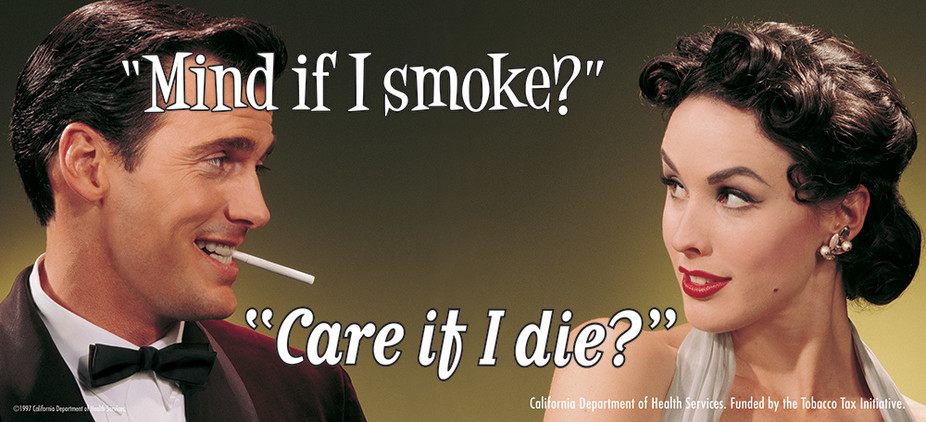{height=300px}

## 
"Tormund lives in New York City, and he loves drinking soda. Because soda is so cheap he drinks three bottles per day. At the age of 45, he was diagnosed with obesity, diabetes, and cardiovascular diseases. The city now spends ~$5000 each year on Tormund's healthcare."

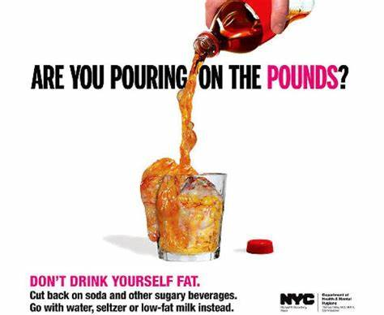{height=400px}

## 
Red Keep LLC is a small mining company located near Riverrun. They extract heavy metals such as iron, copper, and uranium. Along the process, they discharge wastewater containing highly toxic metals and organics into the nearby Red Fork River. 

Several year later, doctors find that children born in the town of Maidenpool, located at the downstream of the plant, suffers from leukemia at a much higher odds than children elsewhere. 

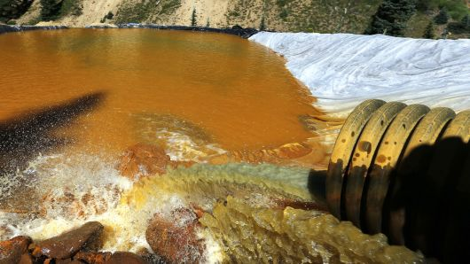{height=300px}

## Let's get into the numbers

Red Keep LLC can mine the uranium with total cost of: $$P = 0.5Q^2$$

Thus the marginal cost of production is: **P = Q**

The market demand for uranium is: **P = 30 - Q**

##
For a private market, the equilibrium price and quantity will be determined by setting the supply equal to the demand:

**Q = 30 - Q**

which yields:

**Q' = 15, and P' = 15**

## 
The production of uranium generates toxic wastewaters, which causes a damage of $10 per unit of uranium mined. 

The marginal social cost of uranium mining is thus determined by:

**Marginal Social Cost(MSC) = Marginal Private Cost(MPC) + Marginal External Cost(MEC)**

Or, numerically:

**MSC = Q + 10**

## 
A socially optimal level of uranium production requires that marginal social cost equals to marginal benefits (the demand):

**Q + 10 = 30 - Q**

which yields:

**$Q^*$ = 10, and $P^*$ = 20**

## 
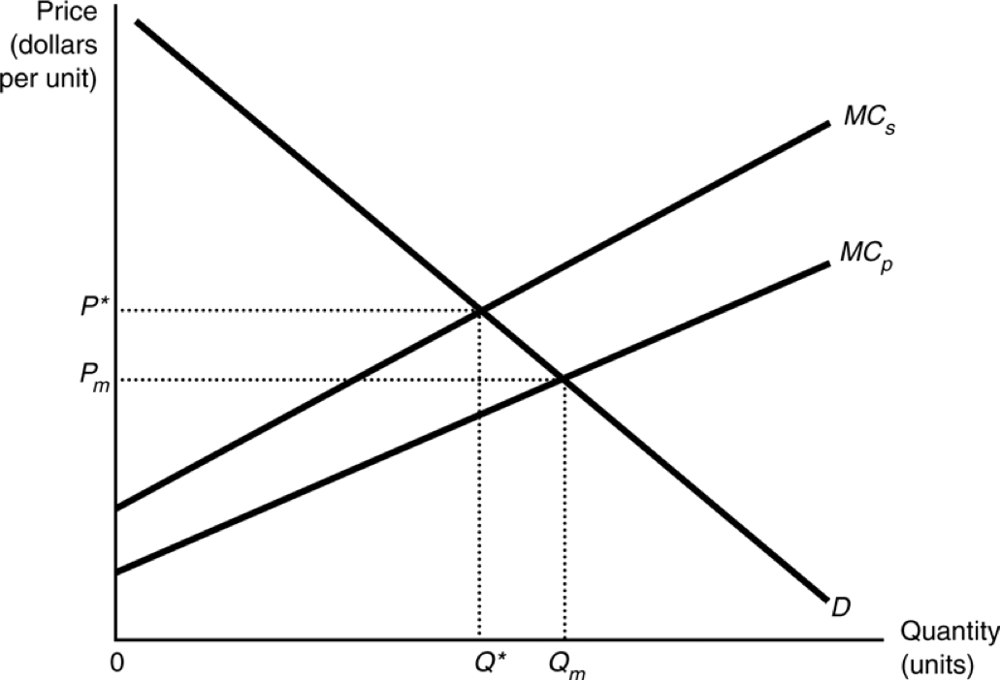{height=400px}

##
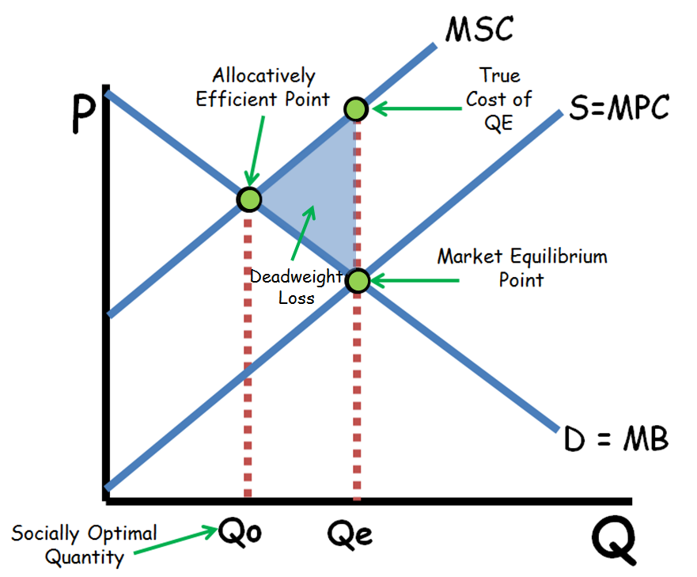{height=500px}

## What can we learn?

* The output of the commodity is too large.
* Too much pollution is produced.
* The prices of products responsible for pollution are too low.
* As long as the costs remain external, no incentives to search for ways to yield less pollution per unit of output are introduced by the market.

## A couple of notes on externalities

Externalities can be positive, negative, or pecuniary:

* External cost (negative externality): 
	- Environmental pollution from production
	- Traffic congestion 
	- Extraction of common-pool resources
* External benefits (positive externality)
* pecuniary externality

## Examples of positive externality
A new cinema opens at the Winterfell Shopping Center. The openning of the cinema increases revenue for nearby restaurants, coffee shops, and department stores because movie fans will often visit those stores before and after the movie.

Question: when will this positive externality disappear?

## Examples of positive externality
Planted forestry provides landowner with timber revenue, but at the same time generates:

* Carbon sequestration
* Wildlife habitat
* Soil conservation

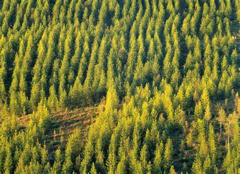{height=300px}

## Pecuniary externality

* Pecuniary externalities arise when the external effect is transmitted through **altered prices**. 
* e.g., a new firm moves into an area and drives up the rental price of land, labor, and materials. 
* Pecuniary externality does not cause market failure because:
	- Higher rents reflect the true scarcity of factor inputs
	- Market allocation of resources are still efficient

## Property rights and perverse incentives

Property rights: a bundle of entitlements defining the owner’s rights, privileges, and limitations for use of the resource

A property can be owned by:

* Individuals
* The government (state-owned properties)
* Communities
* Open-access 

## Key features of property rights

* **Exclusivity: All the benefits and costs can only accrue to the owner**
	- The owner can allow or exclude others from consuming the good
* Transferability: Property rights can be transferred to others
* Enforceability: Property rights can be secure from seizure or encroachment

## Rivalry

Another important concept related to the nature of the good is called **rivalry**: 

A good is rival if one person's consumption of that good diminishes (or impairs) other people to consume that good. 

## Are the following goods excludable? rival? 

## An apple
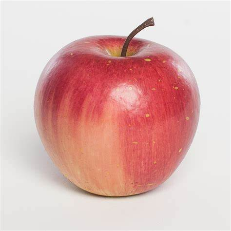{height=400px}

## Tom Brady's house
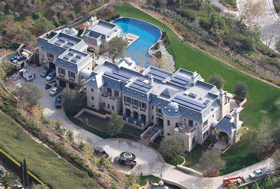{height=400px}

## Massachusetts Turnpike
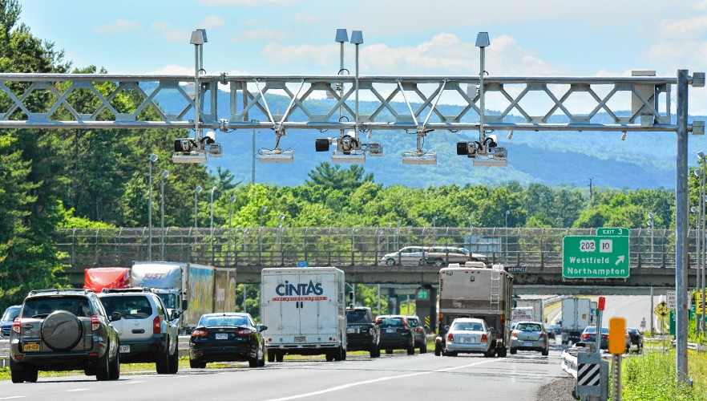{height=400px}

## BLM Grassland in Utah
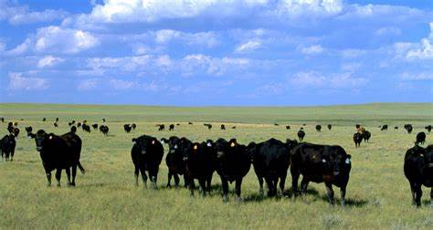{height=400px}

## 
{height=450px}

## Rainy Lake, MN
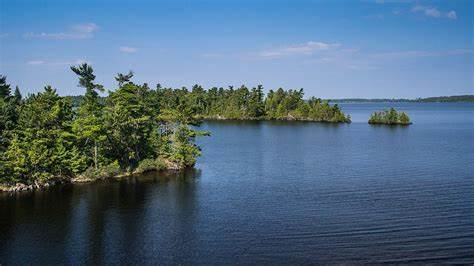{height=400px}

## Clean air
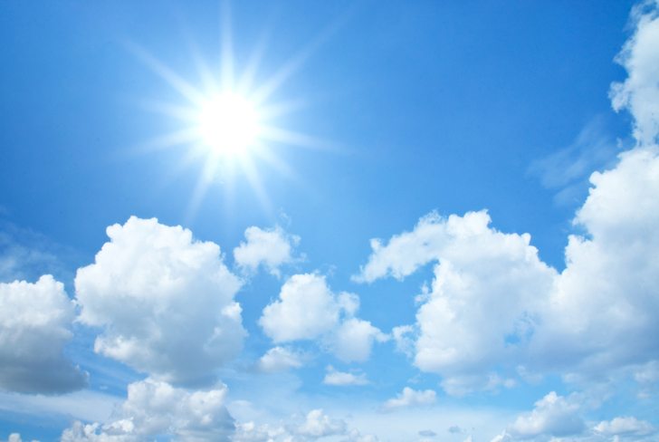{height=400px}

##
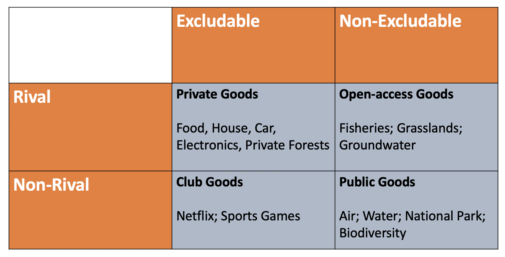{height=400px}

## A continuum of public goods
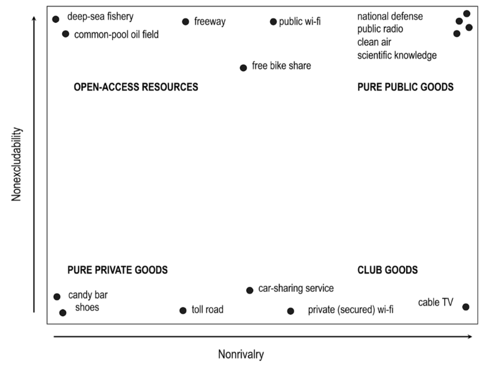{height=450px}

## Excerpts from the CNN Town Hall last Wednesday
> If I start from the moral position, that we have no choice but to do everything that we can, with countries all over the world, to save this planet for our children and future generations, that will mean change.    
- Senator Bernie Sanders

> If you believe that God is watching (as humanity spews pollutants), what do you think God thinks of that? This is less and less about the planet as an abstract thing and more about specific people suffering specific harm because of what we're doing right now. At least one way of talking about this is that it's a kind of sin.    
- Mayor Pete Buttigieg

## Questions:
1) Is environmental pollution (resource over-exploitation) a moral issue?
2) Could an appeal to conscience/culture solve the problem?

## The open-access problem
Open-access resources, or common-pool resources, are characterized by: 

* Non-excludablity, i.e., users cannot exclude others from using the same resource
* Rivalry, i.e., harvest of one user diminishes the total amount of resources for others to harvest

Typical open-access resources include:

* Grassland
* Fishery
* Groundwater (and surface water in the US West)
* Fracking

## Tragedy of the commons

In his 1968 book, Garrett Harding coined the term "tragedy of the commmons", that self-interested humans will enter and over-exploit the common-pool resources, even though collectively this diminishes the resource pool.

{height=350px}

##

* Adding an additional cattle creates an externality for all other users, that there is fewer grass to feed the herds.
* This externality will not be internalized (taken accounted for) as long as the grassland remains open-access.

> The only sensible course for him to pursue is to add another animal to his herd. And another, and another... Therein is the tragedy. Each man is locked in to a system that compels him to increase his herd without limit — in a world that is limited. Ruin is the destination toward which all men rush, each pursuing his own best interest in a society that believes in the freedom of the commons.

##
Harding believed that the problem lies within human nature: the selfishness, the rationality, decisions that make sense as an individual but do not as a society when dealing with the commons:

* Prisoner's dilemma
* Overgrazing
* Over *breeding*

## An appeal to morality cannot solve the problem: 

> It is a mistake to think that we can control the breeding of mankind in the long run by an appeal to conscience ... The argument is straightforward and Darwinian.

## And the only remaining problem is, for people to mutually agree to these coersions.

> But temperance also can be created by coersion... Who enjoys taxes? We all grumble about them. But we accept that voluntary taxes would favor the conscienceless. We institute and support taxes and other coercive devices to escape the horror of the commons.

> Rather than rely on propaganda we follow Frankel's lead and insist that a bank is not a commons; we seek the definite social arrangements that will keep it from becoming a commons.

## TQs from you
> When I first read Hardins "The Tragedy of the Commons" I was a little surprised that his solution to overpopulation was to restrict "breeding rights" seeing as today we know that this can actually be quite harmful to an economy and risk disrupting a healthy age demographic. 

## TQs from you
> By advocating for coercion and limiting "breeding rights", (Hardin) infringes on personal freedom and also deprives less privileged people in the world of such rights while only marginally affecting the rich, furthering the wealth gap. He also does not consider how humanity as a whole has constructed and built the elaborate society we have today, and such contributions could potentially balance out some vices coming from us humans. 

## TQs from you
> When pollution of common waterways and air was limited, people's freedom to dispose of their pollutants anywhere was limited. However, this benefited far more people than it hurt. We live in a limited world and it is time we acknowledge that. Similarly if we were to limit the commons of breeding, many people would cry out about the (impingement on their freedom. But as Hegel said“Freedom is the recognition of necessity.” If people continue to breed unchecked, eventually there will not be enough food and space to go around.

## Is over-population a problem? And if so, is mutual coersion the best way to deal with it?

## The Malthusian Trap
{height=450px}

## Population in China
{height=450px}

## 
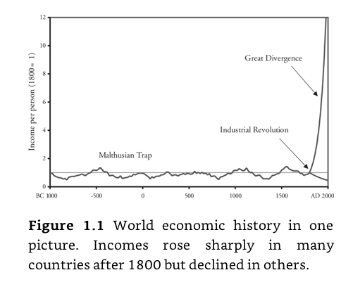{height=450px}

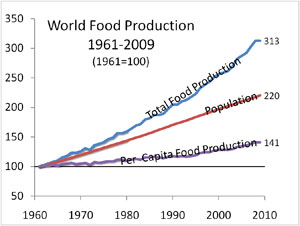{height=450px}

## 
>We (Bill Nordhaus and I) both believe that only new discoveries can protect the environment and sustain material progress. We both believe that such discoveries are possible. I am perhaps a bit more optimistic than Bill that the discovery and adoption of new low-carbon energy technologies will be less costly and less disruptive than everyone seems to think. Once people get serious about adopting some policy measure which foster discoveries that truly add social value, discoveries will follow.        
- Paul Romer, on the possibility of progress

## 
And when the government did try to limit *breeding* via coersion, what is going to happen?

## 
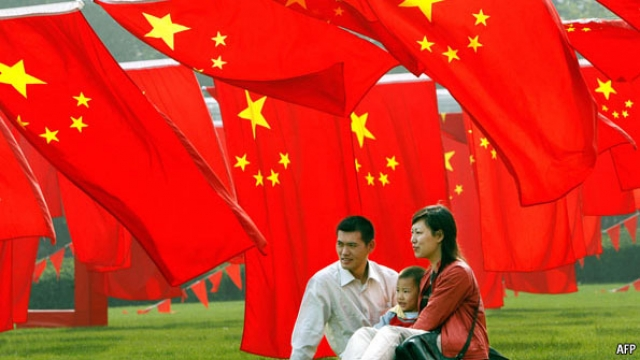{height=450px}

## Let's formalize the problem

Blackwater Bay is an area known for its commercial fishery for high-quality salmons. 

## 
The growth of the fish stock in the Blackwater Bay fishery follows a logistic growth function: 

{height=350px}

## 
In the long-run, fishing efforts and the sustainable total catches also have a inverted-U shaped relationship:

* At first, putting in extra boats increases total catches   
* After a certain point, putting extra boats decreases total catches, as the fishery is unable to fully replenish   
* The relationshiup between total number of boats, B, and total value of catches (in $1000 dollars), TVC, has the following relationship:   

$$TVC = 100B - 2B^2$$

* And the cost of adding each additional boat is $10,000, i.e., 

$$MC = 10$$

## 
For the fishery to have the highest net benefit, we need to solve: 

**Marginal Benefit = Marginal Cost**

where MB is the slope of the total benefit, or 
$$MB = 100 - 4B$$ 
(differentiate the total benefit function gets you the marginal benefit). 

This yields:

$$100 - 4B = 10$$

$$B^* = 22.5$$

## 
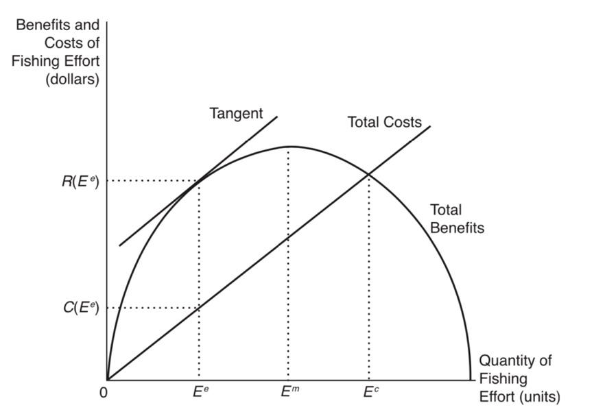{height=400px}

## 
Under the socially optimal outcome, there are economic rents generated from the fishery. To see this, calculate the net benefit from the fishery: 

**Net Benefit = Total Benefit - Total Cost**  

At B=22.5, the net benefit from the fishery is: 

NB = 100 * 22.5 - 2 * 22.5 * 22.5 - 10 * 22.5    
   = 1012.5

In other words, each boat will get a rent equal to *1012.5 / 22.5 = 45* from the fishery. 

## 
The open access nature of the fishery dictates that additional boats will enter the fishery as long as there are economic rents to be extracted from the resource. 

An open-access outcome is characterized by:

**Total Benefit = Total Cost**

where at such point each and every boat just breaks even from the fishery. Notice that the total cost is just **TC=10B**, we have:

$$100B - 2B^2 = 10B$$   

$$B^{OA}=45$$

## 
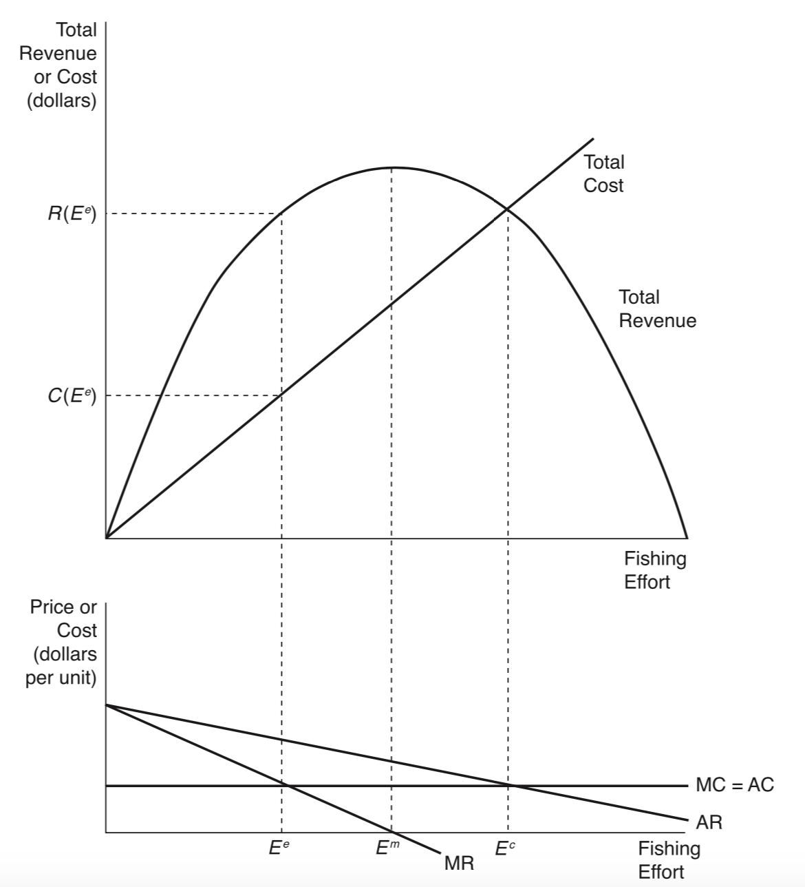{height=500px}

## Takeaways from the problem 
If the fishery is a private good, i.e., **excludable**, then: 

* A sole owner of a fishery would have a well-defined property right to the fish and would want to maximize his or her profits.    
* Profit maximization will lead to an efficient level of fishing effort   

## 
Yet ocean fisheries are typically **open-access** resources. Thus, no single fisherman can keep others from exploiting the fishery.    

* Each user entering the resource pool creates a negative externality for all other users
* An open-access regime diminishes economic rents that could be generated under a private regime 
* This phenomenon is called **rent dissipation** 

## Other ways to formalize the commons 

* Prisoner's dilemma
  - In a one-shot game, both prisoners will "defect" even if both cooperate would be the better equilibrium. 
  
## 
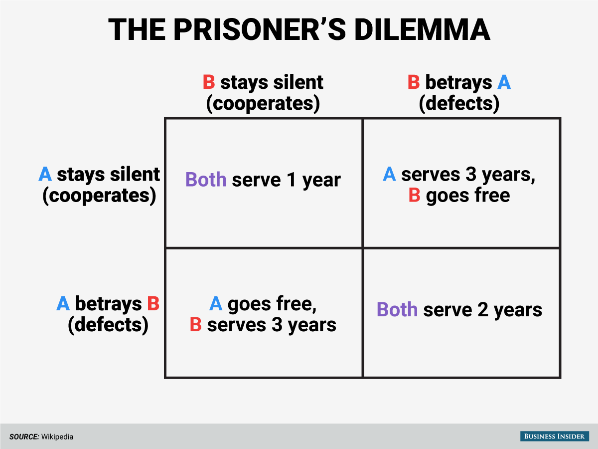{height=450px}

## 
Collective action problem

> unless the number of individuals is quite small, or unless there is coercion or some other special device to make individuals act in their common interest, rational, self-interested individuals will not act to achieve their common or group interests.     
-Olson(1965)

## Public good and the free-riding problem
Now we turn to another class of property right regime, public good (or bad). Public goods are characterized by:

* Non-excludable: anyone can enjoy the good 
* Non-rivalry: the enjoyment of one person does not diminish enjoyments for the others

Typical public goods include:

* Clean air
* Clean water
* Public parks
* Biodiversity

## The problem with public good
* Once a public good is provided, it is likely provided for everybody within that community
* People will **free-ride** on the public good, i.e., they want to enjoy the good but do not want to pay
* A free rider is someone who derives benefits from a commodity without contributing to its supply. 

## A quantitative example
* The Gods Eye is a small freshwater lake, the shores of which have 3 occupied homes 
* The water quality of the lake has been contaminated. At present the lake contains 5 ppm of a contaminant 
* It is possible to clean the water by using a fairly expensive treatment process. 

## Individual and Aggregate Demand for Lowering Lake Pollution
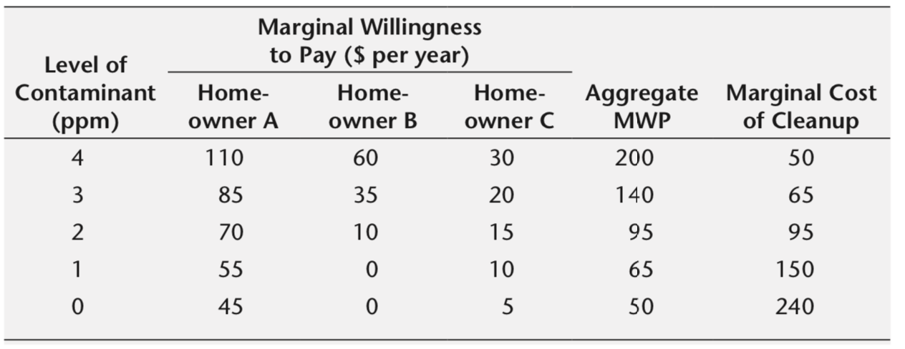{height=300px}

##
* The efficient level of contamination is 2 ppm
* If cleanup is funded privately, the level of contamination is 3 ppm, and only Homeowner A pays

## Let's Formalize this problem
Suppose there are two homeowners, each with a demand curve of: 

Demand for A: **50 - Q**    
Demand for B: **30 - 2Q**    

The marginal cost for providing abatements is **MC = 45**

## 
The aggregate demand is given as the *vertical* sum of the two individual demands, because all consumers will consume the same amount of public good:

Aggregate demand:     
**80-3Q** when Q $\leq$ 15, and    
**50-Q** when Q > 15

This is DIFFERENT from what the aggregate demand for a private good, which is a *horizontal* sum of the individual demands. 

## 
The socially optimal provision of abatement will be:

**Aggregate Demand = Marginal Cost**    
80 - 3Q = 45    
Q* = 11.67    

## 
If abatement is provided privately though, only homeowner A will be willing to chip in. This leads to:

**Demand for A = Marginal Cost**    
50 - Q = 45    
$Q_P$ = 5    

## 
* Homeowner B will **free-ride** on the cleanup that A pays for
* Hard for Homeowner A to coordinate the payments due to **transaction costs**, especially when benefit or damage are bore by a large group/the public
* **Private market will under-provide public good, as the provision of public good creates a positive externality that cannot be internalized via the market**

## Summing up
* Private markets do not necessarily lead to efficient outcomes
* Externality distorts the market, which leads to sub-optimal allocation of resources
* Some property right regimes can create perverse incentives that lead to resource over-exploitation, under-provision of public goods, etc.  

