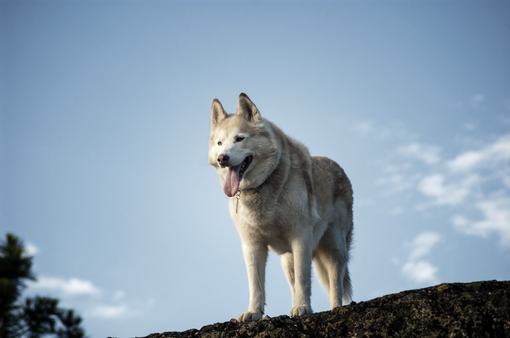

---
output:
  slidy_presentation: default
  html_document: default
  ioslides_presentation: default
  beamer_presentation: default
---

## Econ 57a, Environmental Economics, Fall 2020	
### Module 0: Kickstarter
    

## What kind of drink do trees like the most?

## 
Xinde "James" Ji    

Florence Levy Kay Fellow in Environmental Economics

Department of Economics and Environmental Studies Program

xji@brandeis.edu

Office: Sachar 001A

Office hours: T/Th 2:00-4:00 pm

## Here's where my office is:

https://brandeis.zoom.us/j/3579158444

{height=400px}

## 
In order to better know you guys, please fill out the following survey: https://xji.typeform.com/to/LOhUOFrc

I will share my answers with you in a bit :)

## Here we go

* Xinde Ji

* James (or Professor J)

* I am from Shanghai, China. I speak Chinese (Mandarin, Shanghainese) and English.

## Favorite book / TV show / movie

{height=450px}

## Spiritual Animal
Here's what I think I am:

{height=450px}

## 
Here's what my wife thinks I am:

{height=450px}

## Place I want to visit the most

{height=450px}

## 

What environmental problems am I interested?    

* Climate Change
* Air pollution
* Water scarcity

## How much to accept to take part in the trial?

### $50,000

## How much to pay for the cure?

### $500

