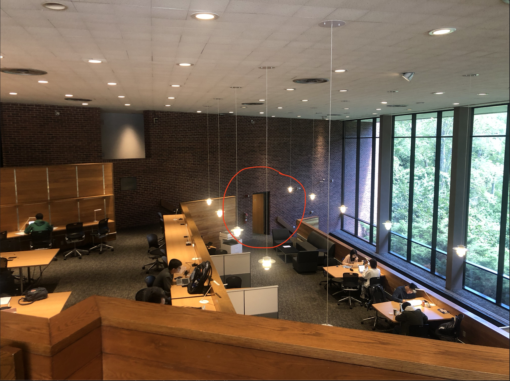

---
output:
  beamer_presentation: default
  html_document: default
  ioslides_presentation: default
  slidy_presentation: default
---

## Econ 57a, Environmental Economics, Fall 2019	
### Module 0: Kickstarter
    

## What kind of drink do trees like the most?

## 
Xinde "James" Ji    

Florence Levy Kay Fellow in Environmental Economics

Department of Economics and Environmental Studies Program

xji@brandeis.edu

Office: Sachar 001A

Office hours: T/Th 2:00-4:00 pm

## Here's where my office is:
{height=450px}

## 
{height=450px}

## 
In order to better know you guys, could you please take out a piece of paper, and answer a couple of question. I'll share mine with you after this. 

* Your name

* How would you like to be addressed (nickname, pronoun, etc.)?

* Where are you from?

* What language(s) do you speak?

## 
* Your favorite book / TV show / movie?

* What is your spiritual animal?

* Which place do you want to visit the most in the upcoming year?

## 

* What's the last economics course you have taken? When? 

* What environmental / resource problem(s) are you interested in? Why?

## 
* You are approached by a representative from a big pharmaceutical company who invites you to participate in a test trial of a new drug. She informs you that there is a 1 in 10,000 chance that the drug may have serious side effects that can lead to your death. 

* How much compensation will you be willing to accept in order to take part in the test?

## 
* You recently completed a DNA test, which reveals that you are susceptable to a certain type of virus. The doctor informs you that about 1 in 10,000 people in the population will have the chance to be contacted, and die from this virus. She also informs you that there has been a vaccine developed for this virus that will make you immune from it for your lifetime.

* How much will you pay for this cure?

## Here we go

* Xinde Ji

* James (or Professor J)

* Shanghai, China

* Chinese (Mandarin, Shanghainese), English

## Favorite book / TV show / movie

{height=450px}

## Spiritual Animal
Here's what I think I am:

{height=450px}

## 
Here's what my wife thinks I am:

{height=450px}

## Place I want to visit the most

{height=450px}

## 
Last econ class:   

* Natural resource economics, Fall 2016

What environmental problems am I interested?    

* Climate Change
* Air pollution
* Water scarcity

## How much to accept to take part in the trial?

### $50,000

## How much to pay for the cure?

### $500

