---
output:
  html_document: default
  slidy_presentation: default
---

## Group Presentation Order


```{r,echo=F}
set.seed(19)

a = c("Carbon Tax","CCT","Cool_Group","Judges for Endangered Species","Pink Gorrilaz","Property Rights and Wrongs","Protectors","Student Coalition for the Green New Deal","The Windmills","VAR","Vroom Vroom","We Love James")
b = sample(a,replace=F)
out = data.frame(group_name=b,order=1:length(a),day=c(rep("12/3",8),rep("12/6",length(a)-8)))
print(out)
```

##
Whiskey is for drinking; water is for fighting over. -Mark Twain    

When the well's dry, we know the worth of water. -Benjamin Franklin

## 
So far in this class we have talked about:

* Environmental Externality 
    - Pollution control
* Property Rights Regimes
    - Exclusivity, Rivalry, and Transferability
* Scarcity
    - What measures economic scarcity
    - What happens when market cannot deliver the signal of scarcity

## In this module we will talk about:

* What are we talking about when we talk about water? 
* Water quantity
    - Who is using the water? 
    - Who owns the water?
    - How to allocate water? 
* Water quality
    - Sanitation
    - Pollution

## 
<iframe width="560" height="430" src="https://www.youtube.com/embed/CtN-qish49k" frameborder="0" allow="accelerometer; autoplay; encrypted-media; gyroscope; picture-in-picture" allowfullscreen></iframe>

## 
* Only a tiny fraction of the earth's water can be used
    - 0.3% of the water feeds 7 billion people
* 750 million people lacks clean water
    - Drinking dirty water leads to a series of diseases, or even death
* A drop of water is worth more than a sack of gold to a thirsty man

## 
When we "conserve" water, what are we really conserving? 

Or, what is the harm of "wasting" water?

## Two fundamentally different challenges

* Water quantity problem
    - Not enough water to suffice human need
    - Cape Cod, California, Dubai, Israel
    - A resource problem: property rights
* Water quality problem
    - Water is not clean enough to drink/use/recreate
    - Charles River, Potomac, Yangtze, Ganges
    - An environmental problem: externality


## 
1.  From your perspective, at what point (if any) does this discussion about water rights break down or become irrelevant for the Western US?    
2.  How do dramatic technical innovations fit into the economic assessment? What is the probability of the implementation of approaches that are currently considered ‘wild’ (for example, piping water from Canada and/or Alaska, large scale desalination factories and piping from the west, etc). At what point (if ever) do these become feasible?     

##           
3.  At the moment, there are clear winners and losers in the water rights systems of the western states. What would happen to the system if a technological solution were found (and implemented) that removed the concern about water supply in the region?    


## Water as a resource
* Surface water is a renewable resource consisting of rivers, lakes, and reservoirs. 
* Groundwater is water that collects underground in aquifers. 
    - Some aquifers are non-recharging and are thus nonrenewable resources
    - Others could potentially be recharged if hydraulically connected with a surface water system

##
* Many places in the world is facing water challenges
    - 4 Billion people is under stress at least seasonally
    - Half of them live in India or China
* Supply of water
    - Surface water
    - Groundwater
* Demand for water
    - Population
    - Water usage patterns

## Drought has been particularly challenging
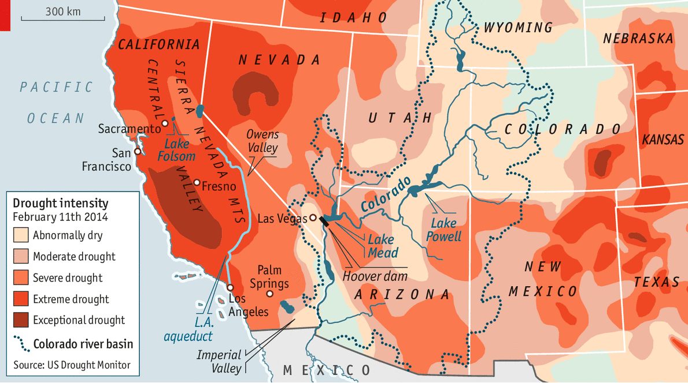{height=400px}


## 
{height=400px}

## 
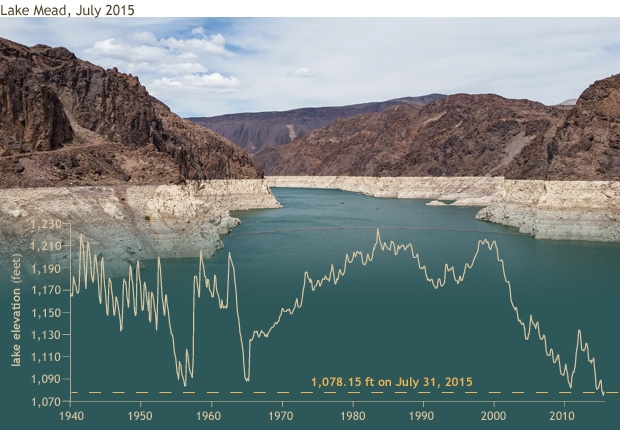{height=400px}

## 
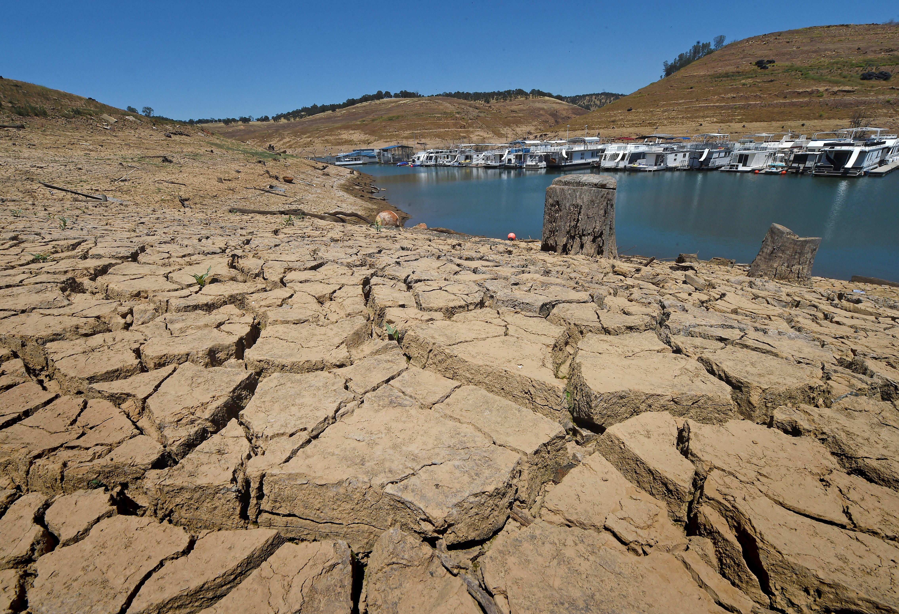{height=400px}


## 
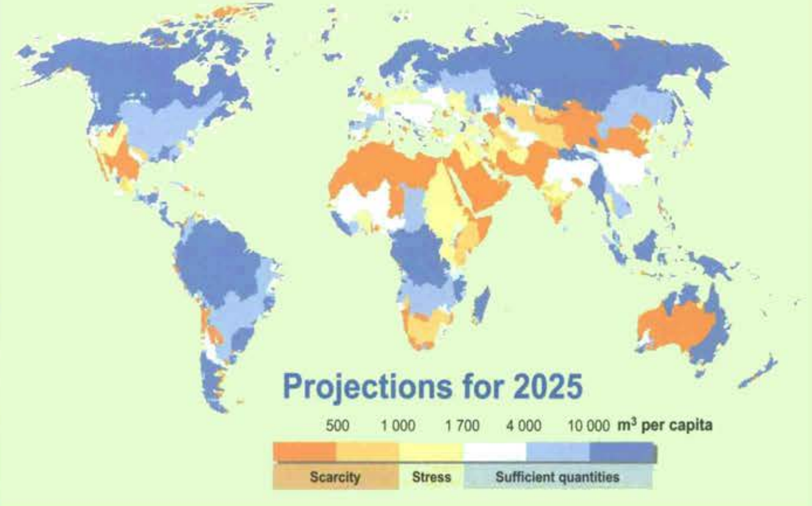{height=400px}

##
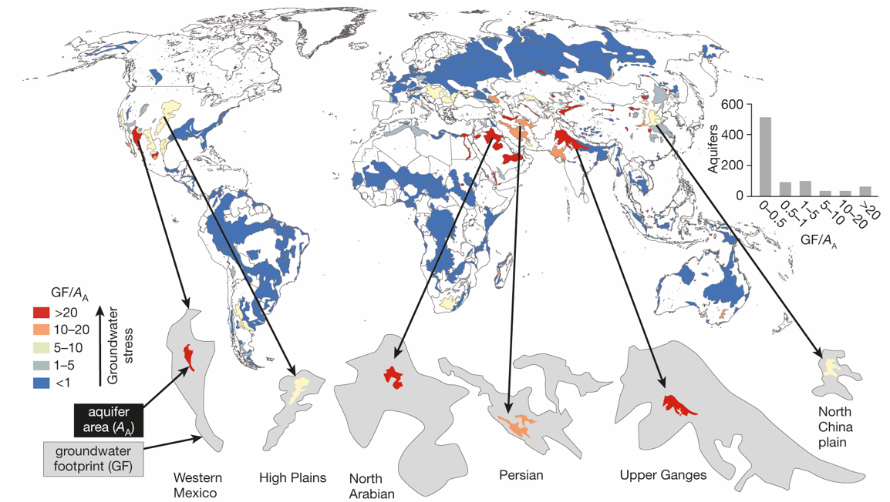{height=400px}

## 
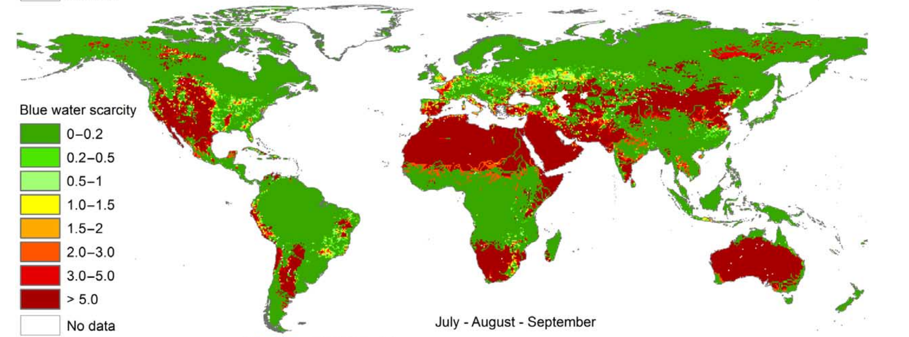{height=350px}

## 
* Everything till now is "physical scarcity"
* Or rather, a simple way of relating "reserves" to "production"
    - Many people, little water - water stress
    - Few people, much water - water abundance

What can we tell, and what needs to be figured out from this analysis?

## The Economic Problem
* The Demand side problem:
    - Every user should have the same "marginal benefit" from using water
    - Drinking water has the highest utility, followed by domestic use, industrial, and lastly agricultural use
* The supply side problem
    - Getting water from the cheapest source(s)
    - Move to the "substitutes" if price for water is high enough

## 
* The institutional problem
    - What if there is no market signal for scarcity?

How many of you pay for a water bill based on volumes?

## Who is using water?

## 
{height=400px}

## 
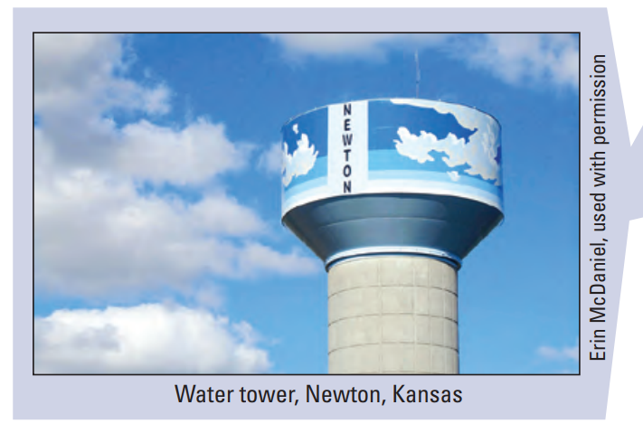{height=400px}

## 
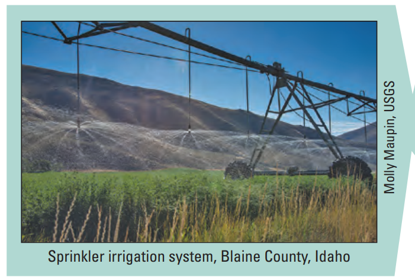{height=400px}

## 
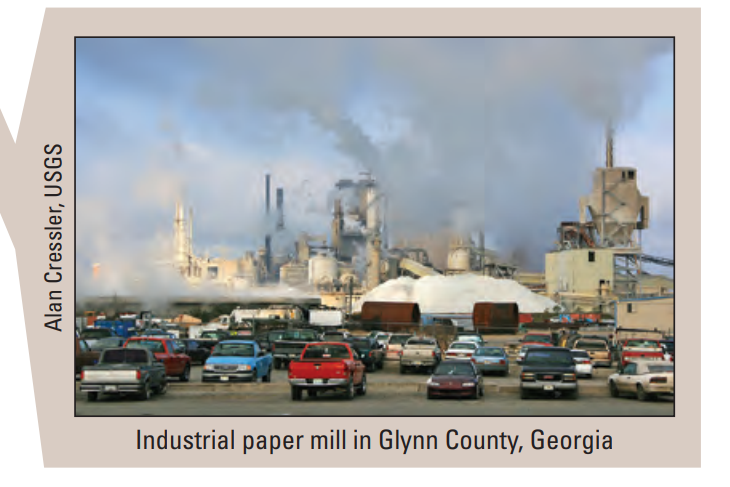{height=400px}

## 
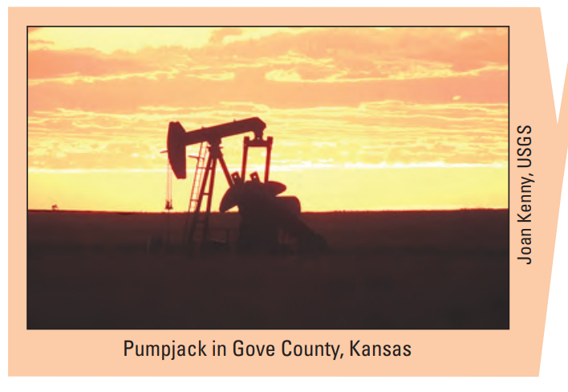{height=400px}

## 
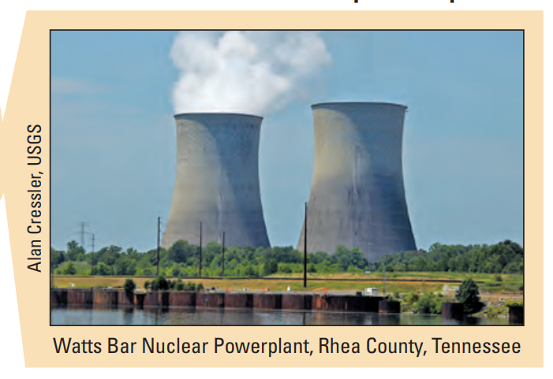{height=400px}

## Who is using water?
Could you rank the following six sector by their water extraction?

* Domestic
* Other public supply
* Agriculture
* Industrial
* Mining
* Thermoelectric power

## Water extraction in the US, year 2010
| Sector|Percentage|
|-----------|------|
| Thermo power| 45%
| Agriculture| 37%
| Domestic| 8%
| Other Public Supply| 5%
| Industrial| 4%
| Mining| 1%

## 
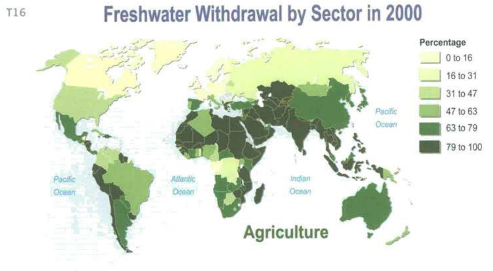{height=400px}

## 
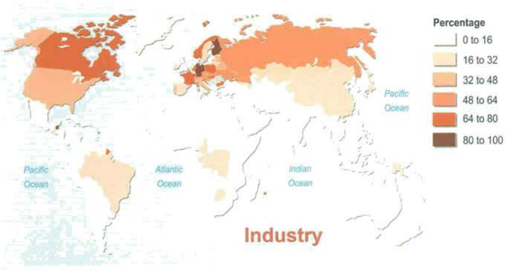{height=400px}

## 
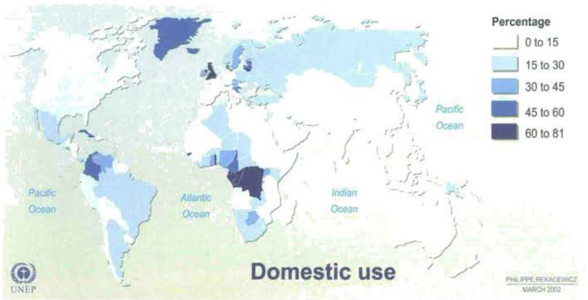{height=400px}

## But not all uses are equal

Why do we complain so much about water used for irrigation, but not for thermal power generation?


##
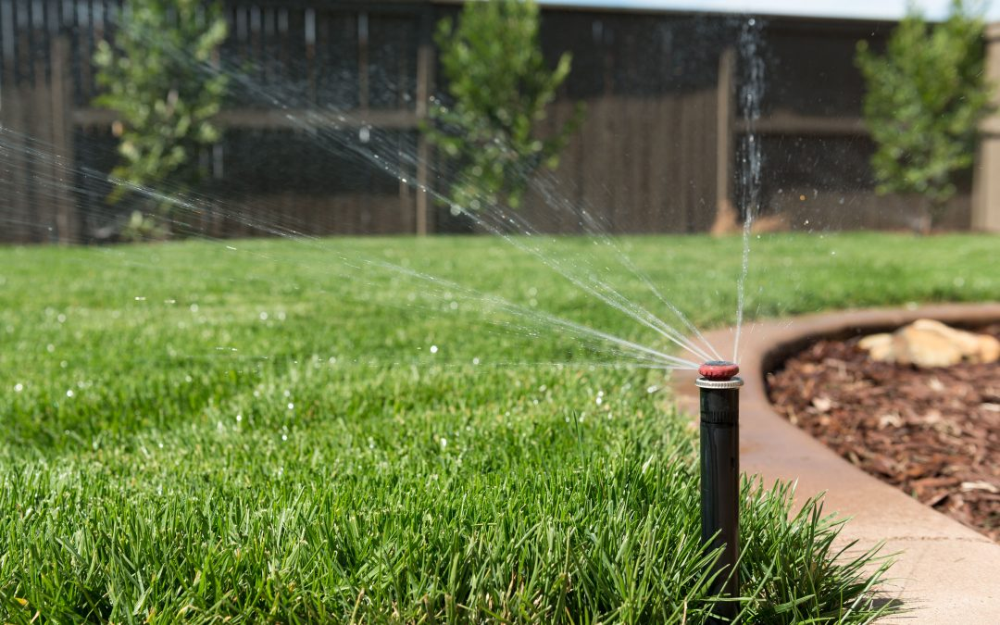{height=450px}

## 
* Water extraction (withdraw): amount of water that is taken out from the natural water body
* Consumptive use: The part of water withdrawn that is removed from the immediate water environment
    - Evaporated/transpired
    - Absorbed by crops/products
    - Consumed by humans/livestock
* Return flow (Non-consumptive use): The part of water withdrawn that returns to the immediate water environment

## 
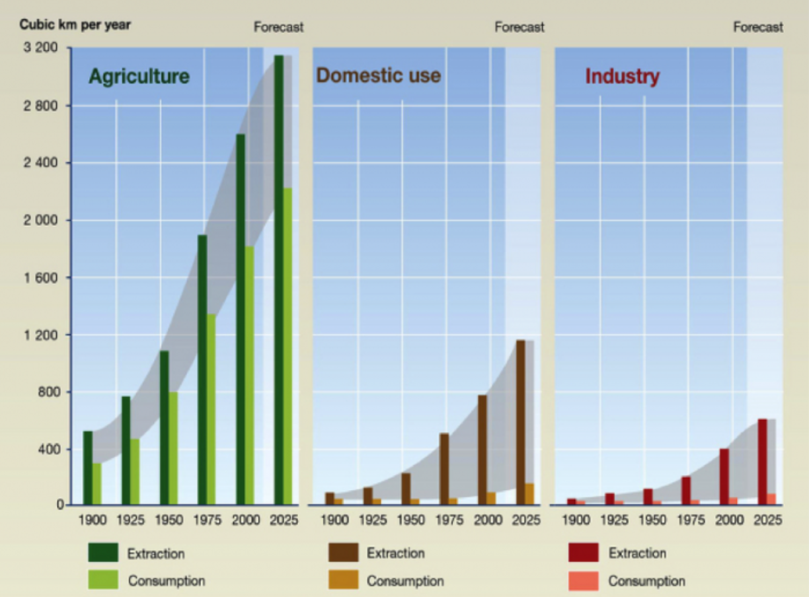{height=450px}

## 
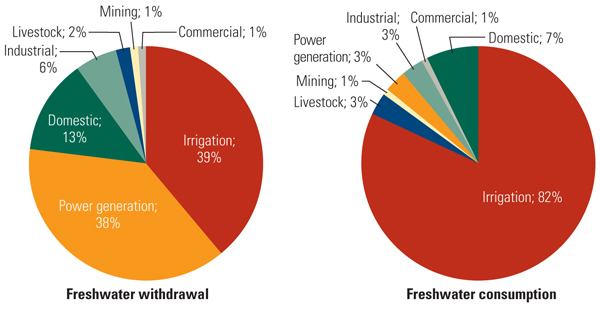{height=400px}

## This clearly doesn't make sense
At the peak of the California water crisis, restaurant customers have to pay for tap water. There are limits on how residents can shower. 

Meanwhile, farmers in central valley are pouring water on their almonds, oranges, grapes, etc. 

Why is that? Could they simply trade with each other?

## Who owns water in this country?
Two set of commmon law doctrines govern the legal **right** to use surface water

* Riparian doctrine
* Prior appropriation doctrine

##
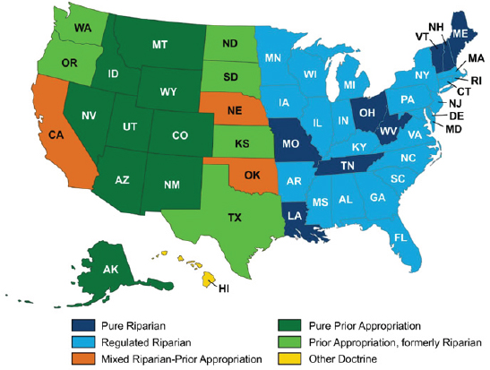{height=400px}

##
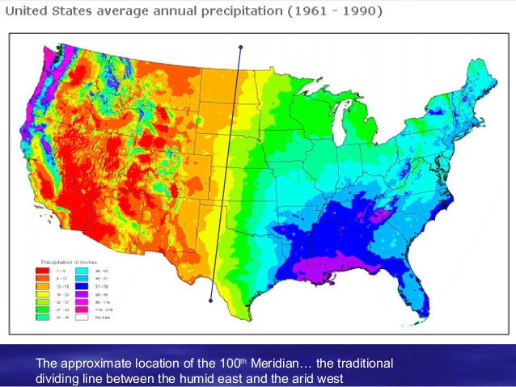{height=400px}

## The Riparian Doctrine

"Anyone who owns property adjacent to the river has a right to use water"

* "Riparian": relating to or situated on the banks of a river
* English Common Law Heritage
    - Used in Canada, Australia, Eastern US
* Beneficial use clause: water has to be put into beneficial use
* Non-injury clause: one's use of water should not injury another party's capability to use that water


## Illustration of Riparian Rights

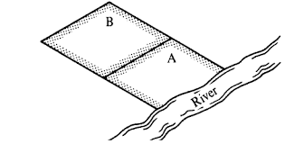{height=400px}

## Type of property rights 
Does the Riparian doctrine satisfy these characteristics?

* Exclusivity
* Transferability
* Rivalry

## 
Then why aren't there problems with water resources in most part of the Eastern US?

##
<iframe width="560" height="430" src="https://www.youtube.com/embed/MgU895ln9P8" frameborder="0" allow="accelerometer; autoplay; encrypted-media; gyroscope; picture-in-picture" allowfullscreen></iframe>

## The Prior Appropriation Doctrine
"First in time, first in rights"

* Anyone who claims to use water first have the right to acquire water with priority (seniority)
* In the case of a water shortage, junior water rights will be curtailed (cut off) if there is not enough water in the system

## Additional Provisions in the Prior Appropriation Doctrine
* Beneficial use clause: water has to be put into beneficial use
    - As long as one can demonstrate beneficial use, one can apply (and be approved) of a reasonable amount of water right
* Usufructuary clause: use it or lose it
    - If a right holder no longer uses water, that particular right will be (partially or fully) confiscated

## Sample of a water right
https://www.dropbox.com/s/fprz6f5tarpyibg/Water%20right%20examples.pdf?dl=0

##
{height=450px}

## 
{height=450px}


## Problems with prior appropriation
* Water allocation is based on "seniority"
    - If your great grandfather settled at the river basin a year earlier than mine, you get the water during a drought and I don't
* Neither an efficient nor a "just" allocation system
    - Those with junior rights will be completely cut off during a drought
    - (Few) winners and (lots of) losers

## 
* Coase theorem: if property rights can be traded with zero transaction cost, then allocation is still efficient
* Water trades have been extremely hard
    - "Tragedy of the anti-commons"
    - The coordination problem: most water is held by irrigation districts, who has to seek consent from all share-holders before selling water
    - Third-party effect
* Even trade can happen, transaction costs are high
    - "Water Rights Lawyers"
    - Supreme Court cases

## But why prior appropriation?
Doesn't the Lincoln-era folks see the problem we face today?

Or, putting it in another way, if you are tasked to design a way to allocate water in semi-arid part of the world (US West, Northern India, Northwestern China, or the Middle East), will prior appropriation be your choice?

Why not assigning water proprotionally?

## A historical note

* When this nation is founded, English common law dominated the legal thinking of the founding fathers
    - Riparian Law governs water use at that time
    - Think about England in particular: do they have a water shortage problem?
* There were abrupt shifts between 1850-1920, from Riparian to Prior Appropriation Laws in the Western States
    - The Manifest Destiny: the country moved further West to settle
    - Settlers were awarded land as a reward if they could settle in the Western lands

## 
* The settlers quickly figured out that without water, no crop will be able to survive in the Western US
    - Irrigation is needed
* And the Riparian doctrine won't work so well in the Western US

For a couple of reasons. What are they?

## Riparian is not the best way to go
Because of the scarce nature of water in the West (and the lack of a price signal to reflect that)

* Water uses are not quantified
* Only way of exclusion is through land ownership
* Discouraged settling further into lands that are far away from the river
    - Many lands more fertile than riparian lands with access to irrigation water

## Prior Appropriation
* Quantifies water to a specific use
* Establishes a "private" property right
    - Just like giving out free lands, the government also gave out free water
    - That was part of the incentives for the settlers
* Only junior rights needs to be monitored
    - Reduces monitoring cost

## A more important incentive
* Irrigation project requires large initial investments
* To put down an investment, a farmer will have to know:
    - When this ditch is built, there's better water flowing through it
    - Otherwise, it won't be worth it
* Prior appropriation limited new entry
    - Anyone who came in later will have junior rights
    - Senior rights will always be secure in the long-run

## Institutional arrangements
* United States quickly expanded west-ward
* Agriculture became sustainable with large-scale irrigation projects
    - Ditches
    - Dams
* Prior appropriation played a crucial role in the development of the US West

## 
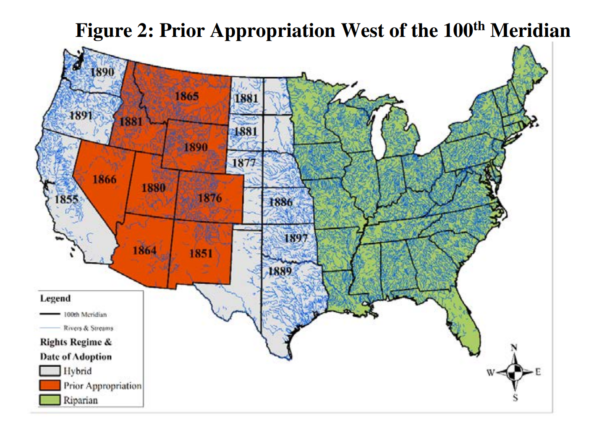{height=400px}

## Institutional Path Dependence
* Path dependence: how events/decisions happened in the past may have long-run consequences, even though past circumstances may no longer be relevant
* Our present is largely shaped by the historical critical junctures in institutional choices (Acemoglu and Robinson)
    - The Glorious Revolution
    - World War II
    - Presidential term limits
* Prior appropriation is certainly one of the legacy institutions
    - Water infrastructure no long need coordination
    - Creates winners & losers

##
From your perspective, at what point (if any) does this discussion about water rights break down or become irrelevant for the Western US?  

## 
How do dramatic technical innovations fit into the economic assessment? What is the probability of the implementation of approaches that are currently considered ‘wild’ (for example, piping water from Canada and/or Alaska, large scale desalination factories and piping from the west, etc). At what point (if ever) do these become feasible?   

## Wild technologies
* Desalination
* Piping water from Canada/Alaska
* Dragging Icebergs from the Arctic
* Ship water from Minnesota

When will these become relevant?

## Marginal benefits and prices for water

| Use|Marginal Benefit | Average Price|
|-----------|------|---------|
| Domestic| 1122| 652|
| Agriculture |250|16|

(Units: $/Acre Foot)

## Cost of Wild technologies
| Technology|Cost ($/acre feet)|
|-----------|------|
| Surface water withdraw| $4|
| Pumping cost from Ogallala (scarcity rent included)| $300|
| Carlsbad Desalination Plant| $2000|
| Dragging iceberg from Antarctica |$2500 (?)|
| Rail shipping from Minnesota to California|$160,000|

## Other solutions to water scarcity
* What are the potential ways to limit water use? 
* And who is the world's leading player in this?

##
At the moment, there are clear winners and losers in the water rights systems of the western states. What would happen to the system if a technological solution were found (and implemented) that removed the concern about water supply in the region?    

## Water Markets
* 


