---
title: 'Module 3: When do markets fail?'
output:
  slidy_presentation: default
  beamer_presentation: default
  html_document:
    df_print: paged
  ioslides_presentation: default
---

## Real world examples of (proposed) pollution taxes:

* Gasoline tax
* Carbon tax
* Wastewater discharge levies

## 
Pigouvian policies are in theory efficient, but not without caveats:

* Sound economic policy may not be politically popular
* Tax is a "bad" word, especially in this country 
* Especially problematic if the tax involves a personal choice: are we a "nanny state" or what?
* Hard to adjust the tax rate once it becomes law, even if new information pours in

## 
Wait a minute. Is there another way?

## 
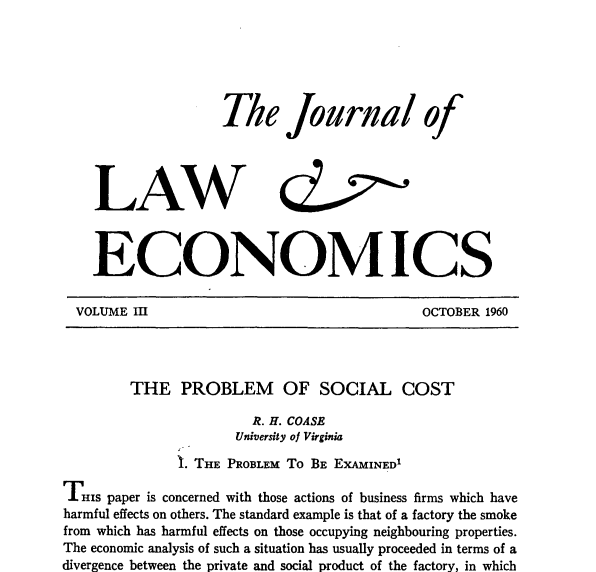{height=450px}

## 
The idea is simple: assign the property right to either party, and let them negotiate with each other.

* If residents have the right to enjoy clean water supply, then the mining company will pay the residents in order to pollute
* If the mining company has the right to pollute, then residents will pay the company for it NOT to pollute

## The Coase theorem
**If property rights are well-defined, and there are no transaction costs, then no matter what the initial allocation of resources, negotiation between parties will reach a pareto-optimal outcome WITHOUT interventions from the government.**

## How is the Coase theorem useful?
All we need is a "clearly-defined" property right structure, and then we can:

* Let the court decide who has the right to the good
* Let the parties trade with each other: cap-and-trade
* Privatize the good at large

##
> People who profit off of harmful behaviors, when you take away that money — because you take them to court and you sue them, as I have done — it's extraordinary how they will change behaviors. They have to be held accountable.     
-Senator Kamala Harris

## The Mock Trial
Jon Snow vs. Daenerys Targaryen (2019)

## Paper I gave Jon
Your name is Lord Jon Snow, a rancher living near the Long Lake, a small lake in the state of Wyoming. The lake is the only freshwater source nearby, and your herd of cattle depends on that lake to survive. Unfortunately, a farmer nearby named Daenerys Targaryen also wants control for the Long Lake to irrigate his field, and there is no way that the lake can be shared between you two. You think you are entitled to the right to use the lake, so you decide to take him to court. 

According to the best of your estimate, the lake generates $X worth of value to you. That is, if you lose control of the lake, there will be about $X worth of economic damage to your cattle. 

## Paper I gave Dany
Your name is Queen Daenerys Targaryen, a farmer/landowner living near the Long Lake, a small lake in the state of Wyoming. The lake is the only freshwater source nearby, and your farmland depends on that lake to remain irrigated. Unfortunately, a rancher nearby named Jon Snow also wants control for the Long Lake to feed his cattle, and there is no way that the lake can be shared between you two. You think you are entitled to the right to use the lake, so you decide to take him to court. 

According to the best of your estimate, the lake generates $Y worth of value to you. That is, if you lose control of the lake, there will be about $Y worth of economic damage to your cattle. 

## The polluter-pays principle
Assigning the "right to clean environment" to the public: polluters have to seek permission from the public (pay) in order to pollute. 

* Usually a point-source affects a broader community    
  - coordination problem    
* Avoids moral hazard    
  - If smokers have the right to smoke, they will just extort non-smokers
* Discourages entry into polluting industry    

## Basic Components of a Cap-and-Trade are: 
1. Establish a policy cap, i.e., the optimal quantity of pollution emission/resource extraction for the society
2. Issue permits to the polluters/extractors with the total amount of quota equal to the cap
3. Each polluter's emission cannot exceed the amount of quota they hold
4. Establish a market for the polluters to trade their quotas with each other

## What changed?
1. The permit (and the pollution at large) is now a private good: 
  - Exclusivity: Only the firm holding the permit can emit
  - Rivalry: One firm "consuming" the permit reduces the amount that other firms can emit
  - Transferability: the permit can be transfered in a marketplace

2. There is now a market to trade these permits:
  - Externality exists because "markets do not reflect the true benefit or cost of one's action"
  - Market price is the best signal to indicate the scarcity of a resource

## Quantity instrument in the fishery example
Recall the fishery problem last time, where an open-access resource faces rent dissipation:
* After a certain point, new entry to the fishery decreases everybody else's catch
* An open-access fishery will be overfished because the fishery cannot limit entry

## 
* Marginal benefit for the fishery given numbers of boats B is **100 - 4B**

$$MC = 10$$

## 
For the fishery to have the highest positive benefit, we need to solve: 

**Marginal Benefit = Marginal Cost**

where MB is the slope of the total benefit, or 
$$10 = 100 - 4B$$ 
$$B^*=22.5$$

## An open-access outcome is characterized by:

**Total Benefit = Total Cost**

where at such point each and every boat just breaks even from the fishery. Notice that the total cost is just **TC=10B**, we have:

$$100B - 2B^2 = 10B$$   

$$B^{OA}=45$$

## Alaska's Salmon Regulation
* In the 1950s, Pacific salmon fisheries were over-exploited
* Government decided to act:
  - Shorten fishing periods
  - Restrict fishing technology
    * Prohibit the use of nets/traps
    * Banned engine-powered fishing boats!

##
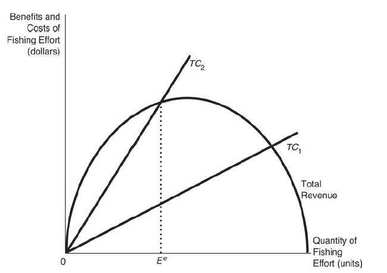{height=450px}

## Rights-based policies
Give 22.5 units of permits to all fisherman/woman, i.e., limits B*=22.5

##
{height=450px}

## 
Rights-based approach works better:

  - Individual Veseel Quota (IVQ)
    * Only works in the short-run
  - Invidiaul Fishing Quota (IFQ)
  - Individual Transferable Quota (ITQ)
  - Territorial Use Rights Fisheries (TURF)

## 
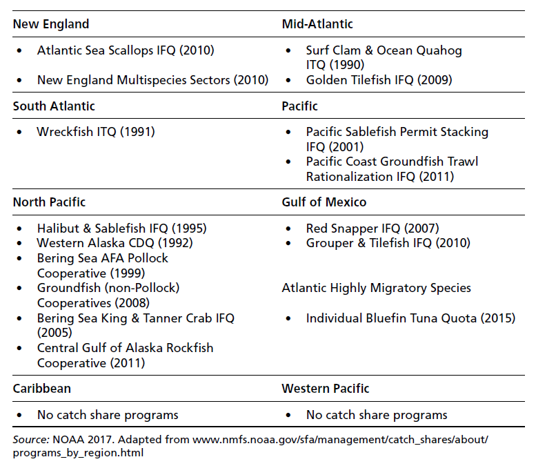{height=450px}

## Alaska's ITQ restriction (Kroetz 2017)
Permits (quota) assigned to vessel sizes:

* A(Unrestricted size and type), B(35-60ft), and C(<35ft)
* Quotas are traded within each vessel category

What's gonna happen?

## Real-world rights-based programs
* Wetland Banking
* Air pollution Cap-and-trade (sulfur, carbon, mercury, nitrogen)
* Fishing quotas

## Caveats about Cap-and-Trade
* Prices are volatile
  - Affected by 1) policy shocks 2) market shocks
* Needs strong governmental backup
  - Solidity of the property rights
* Create pollution hot spots
  - Trading partners may not necessarily locate within proximity
  - Environmental justice concerns

## 
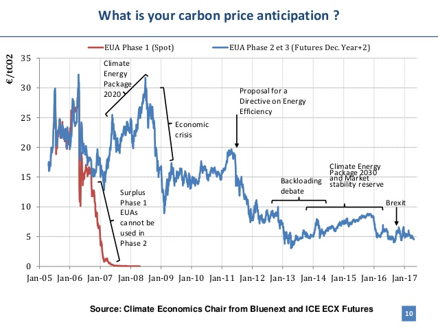{height=450px}

## 
If tax and cap-and-trade are equivalent, then what is the fuss about choosing carbon tax or carbon trading?

## 
* Congressman O'Rourke: Cap-and-Trade
* then Congressman Markey: the 2009 bill

* Andrew Yang: Carbon Tax at $40/ton
* Mayor Buttigieg: Carbon Tax
* Senator Booker: Carbon fee

## 
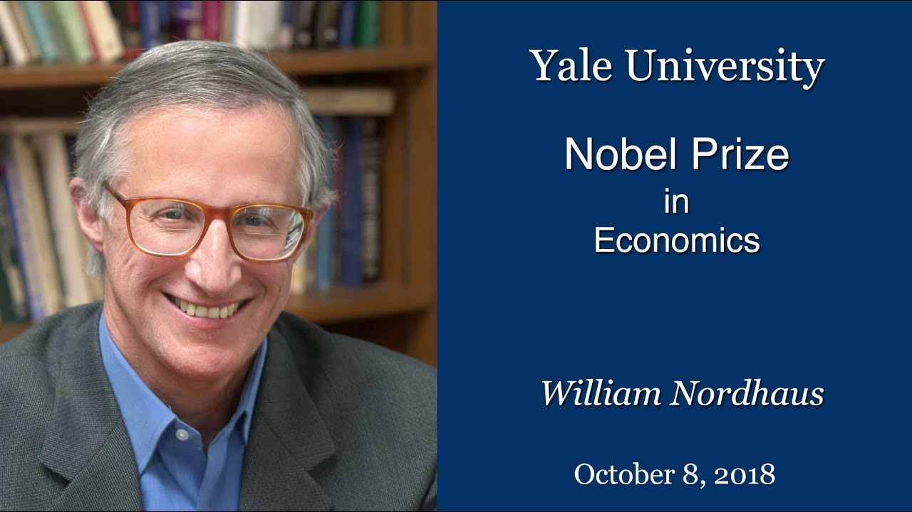{height=250px}
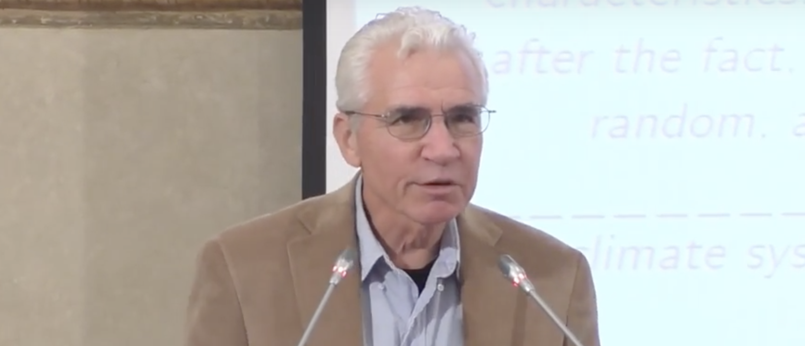{height=250px}

##
* Nordhaus: Structural modeling on the "Social Cost of Carbon"
  - A "know-it-all" model
  - Advocates for carbon tax
* Weitzman: what really matters is the tail events, not the average
  - Prevent catastrophic events 
  - Advocates for cap-and-trade

## The Role of Uncertainty
* If the regulator has complete information about marginal costs, then tax and cap-and-trade are equivalent
* Not necessarily the case
  - Uncertainty in measurement
  - Innovation
  - Firms reporting strategically

## Prices vs. Quantities
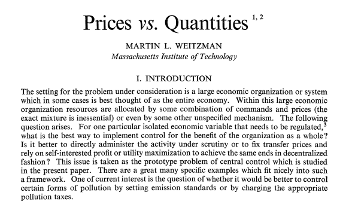{height=450px}

## 
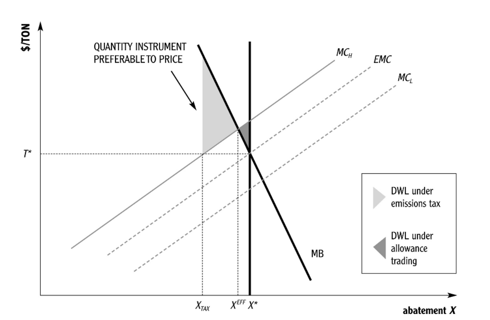{height=450px}
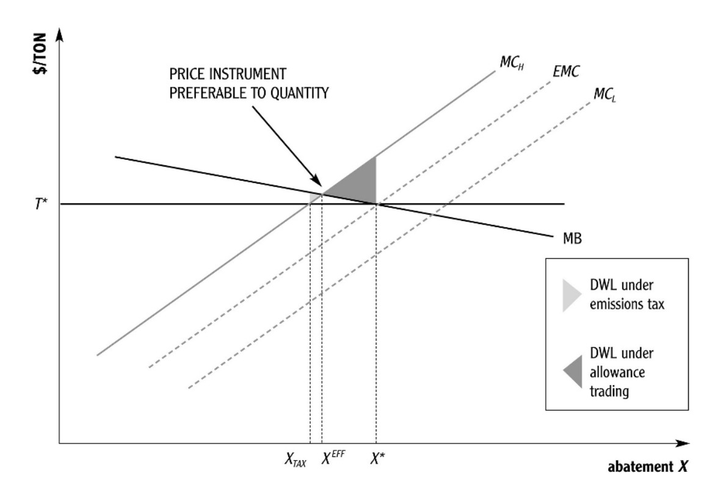{height=450px}

## 
* Tax is preferred when MC is steeper than MB
  - Getting the price right is more important
* Cap-and-trade is preferred when MB is steeper than MC
  - Getting the quantity right is more important

## Are common-pool resources always better governed by governmental regulation?

## The Case for Privatization (Enclosure)
Coase theorem also clearly suggests that if property rights are clearly-defined, then the resource allocation will be efficient. 

## Trophy Hunting
* Poaching is a huge threat to African wildlife
* Especially elephants, but also Buffalo, Antelope, etc.

##
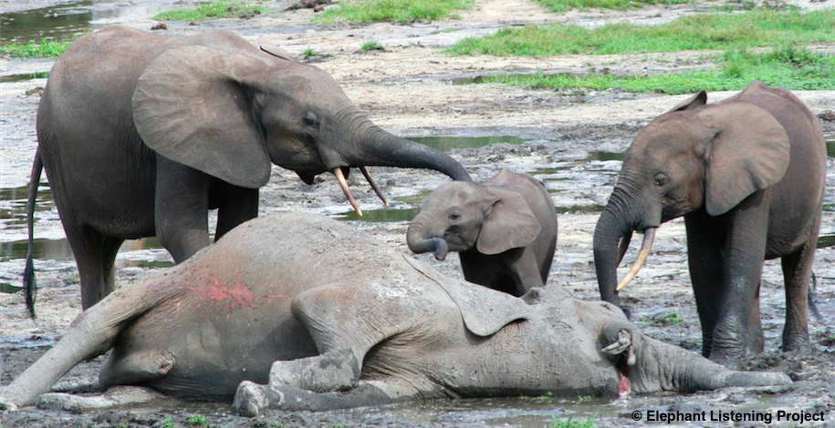{height=450px}

##
{height=450px}

##
{height=450px}

## A bit about Mozambique
* Per capita GDP of $415
* Independence war 1964-1975, Civil War 1977-1992

## Coutada 11: the Meat Locker
* Coutada: "Hunting District", one district is roughly the size of the Grand Canyon National Park
* Warring factions go there to shoot bush meat to feed rebels and national army
* Russians go in with helicoptor gunships to hunt Cape Buffalo, can them, and ship them to Afghanistan
* Locals "poach" to feed the family
* By 1994, only 2100 Cape Buffalo and 44 Sable Antelope were left

## 
In year 1994, a South African named Mark Haldane leased Coutada 11 from the Mozambique government

* Mark is a hunter himself
* Has business in Zimbabwe and South Africa

## 
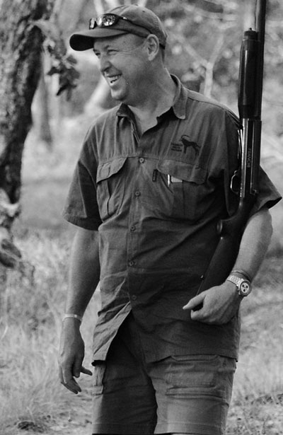{height=450px}

##
Mark wanted to set up a trophy hunting program in the area to attract wealthy Westerners, so he worked with the locals:

* Give back the meat to the local villages
  - Most locals can't afford an adequate diet
* Give the locals job opportunities
  - Hired 150 people in the camp
  - 20-plus men anti-poaching patrol, most used to poach themselves
  - Make sure outsiders do not come in and poach

## 
Trophy hunting site opens up:

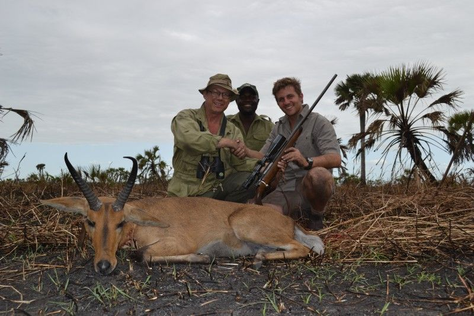{height=400px}

## What happened after a couple of years?
Cape Buffalo: from 2100 to over 21000
Sable Antelope: from 44 to over 5000

And, financially, the program is completely self-sustainable.

## 
Question: why is that?

## 
* Turning an open-access resource into a private resource:
  - Exclusivity
  - Enforceability
* Provide incentives to the locals

## 
Any problems/concerns with the approach?

## 
* Animal welfare?
* Other non-hunting values?

## 
> Most modern economic theory describes a world presided over by a government (not, significantly, by governments), and sees this world through the government’s eyes. The government is supposed to have the responsibility, the will and the power to restructure society in whatever way maximizes social welfare; like the US Cavalry in a good Western, the government stands ready to rush to the rescue whenever the market ‘fails’, and the economist’s job is to advise it on when and how to do so. Private individuals, in contrast, are credited with little or no ability to solve collective problems among themselves. This makes for a distorted view of some important economic and political issues.
-Sugden(1986)

## Coase and Pigou represent two alternate school of thoughts
* Government as the Leviathan
  - Command and Control, Tax, or Issuing Permits
  - Market failure has to be corrected by governmental intervention
* Privatization as the Magic Wand
  - Clearly define property rights of the common-pool resources
* Tragedy of the commons cannot be avoided if these prescriptions are not adopted. 

## This is far from reality
* Self-regulated irrigation systems in Nepal, Spain, Phillipines
  - Irrigation systems usually suffer from the collective action problem
  - Self-regulated via informal talks amongst farmers
  - More efficient & effective than government-managed rules

## 
* Fishing in the Cree Nation of Hudson Bay, Canada
  - Long-lasting social rules that govern how to fish
  - Violators face social disgrace as well as mild penalty
* Other fisheries in Turkey, Sri Lanka

## Top-down approach may not work well in reality in those situations

The top-down approach will need:
* Knowledge about localized benefit and costs
* Strong, local enforcement
* Free of corruption

## 
Recall that in the one-shot prisoner's dilemma game, self-interested individuals end up in a socially non-optimal (Nash) equilibrium.

What if the game is not played "one-shot", but are played for multiple rounds?

## Axelrod's Tournament
In 1980, Robert Axelrod, professor of political science at the University of Michigan, held a tournament of various strategies for the prisoner's dilemma.

The basic rule of the tournament is this:
* Each player is paired with another random player in the pool
* The game is going to play 200 rounds
* The final score is the sum of total scores in all rounds

## Different strategies emerge
* "The Fool": One who always corporates
* "The Cheat": One who always defects
* "The Unpredictable": One who randomly chooses to corporates or defects

## 
* The Tit for Tat: cooperates on the first move, and mimic what the other play did on the previous move
  - retaliates if the other player defects
* The Tit for Two Tat: 
  - retaliates if the other play defects two times in a roll
* The Two Tit for Tat
  - retaliates two times if the other play defects

## 
* "The Grudger":
  - Cooperate until the other play defect, then defect forever
* "The Opportunist": 
  - start with tic-for-tat, but randomly defects every 5-15 moves, hoping others won't find out
* "The Gradual Punisher"
  - retaliates one time for the first defect, two times for the second, ...
  
## 
The "Tideman and Chieruzzi"

1. Every run of defections played by the opponent increases the number of defections that this strategy retaliates with by 1.

2. The opponent is given a ‘fresh start’ if:

  * it is 10 points behind this strategy
  * and it has not just started a run of defections
  * and it has been at least 20 rounds since the last ‘fresh start’
  * and there are more than 10 rounds remaining in the match
  * and the total number of defections differs from a 50-50 random sample by at least 3.0 standard deviations.

## Who wins?
Benchmark: 

* Defect while the other cooperate: 1000
* All cooperate: 600
* All defect: 200
* Cooperate while the other defect: 0

## 
With a maximum of 600 points, here they are:

* Tit-for-tat: 504
* Tideman and Chieruzzi: 500
* The Gradual Punisher: 480.7
* The Grudger: 473
* The Opportunist: 400
* The Random: 276

## The Follow up Tournaments
* The second tournament: 
  - 62 submissions, full knowledge of others in the pool ahead of time
  - Tit-for-tat comes in first
* The evolutionary tournament:
  - Number of strategies in the pool ties to how well that strategy did in the previous round
  - Survival for the fittest
  - Tic-for-tat wins again

## Implications from Axelrod's Tournament
* The prisoner's dilemma is not necessarily a dilemma in the long-run
* Be a "nice guy" is evoluntionarily compatible
* Punishment is necessary

## How does that help governing the commons
* Cooperation is achievable without governmental intervention or privatization of the resource
* Trust can be gained through "reciprocity": good will exchanges between individuals
* Still face the risk of "defection"

## Ostrom's Observation
Rather than using a pen and a pencil, Ostrom really went into the field:

* Study a large number of institutions that work empirically
* Detailed information about those institutions
* Document common features, look for regularities
* Needs more sophisticated, qualitative theory

## What does she find?
Ostrom's principles of designing long-surviving institutions

1. Define boundaries clearly
2. Design FAIR rules to use the resource (usually proportional to the benefit)
3. Involve the participants into the rule-making process
4. Monitor and enforce these rules locally
5. Apply gradual sanctions to violators

## The power of norms
These principles are usually conveyed through norms

* Humans are evolutionarily adapted to follow norms
* Norms are monitored by the entire community
* Passed along generation-by-generation (repeated games)

##
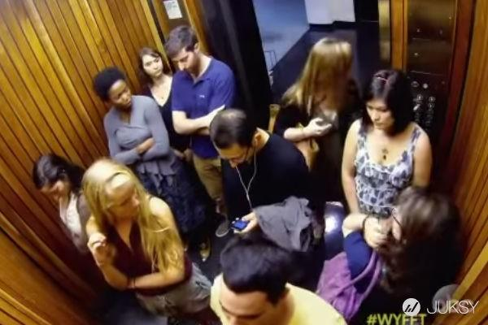{height=400px}

## What can threaten these self-governing rules?

##
* Outside forces (national government, international aids) trying to impose a uniformed standard
* Rapid change in technology/monetary input
* Transmission failure when passing along to the next generation
* Corruption
* Lack of fair and low-cost conflict resolution mechanisms

## Takeaways from this module
There are three schools of thought to correct market failure:

* Taxation (Pigou)
* Clarify property rights (Coase)
  - Create market for public/common-pool goods
  - Privatization
  - Litigation
* Cooperative institutions
  - Potentially works, but are fragile

# TQs from you
I strongly identify myself with the notions of the Coase Theorem. I believe that when you get to the grassroots level of human welfare, individuals looking to have the best outlooks for other is the foundation of a just society. Individuals will consistently look to get the best/most out of any situation they are - people may can have the potential to do such when only including parties that would be affected. Just like the individuals involved, government will look to gain something out of being in a situation as there must be some type of incentive/motivation in their attendance. The elimination of government in matters of environmental economics leaves the solution to be dealt with the parties involved where the two, three or however many don't lose any benefit from unnecessary government intervention. 

President Reagan ran on the notion the government isn't the solution to problems but itself is the problem. A hands off approach by government would give the proper room for those involved to settle the environmental issue.  