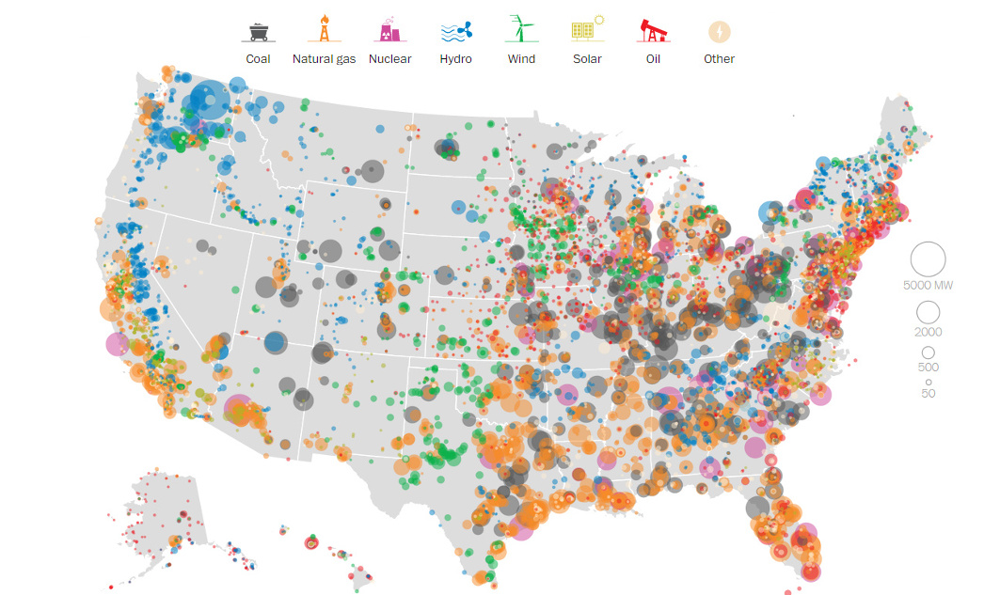
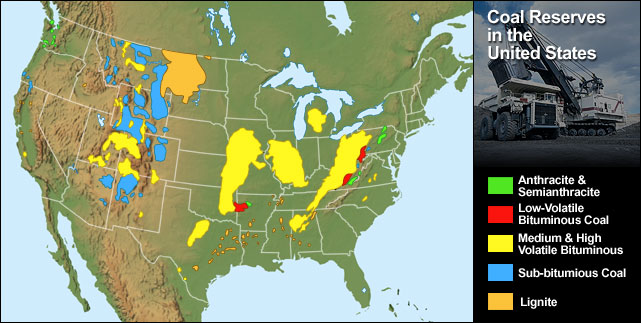
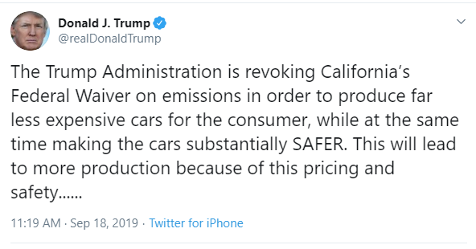
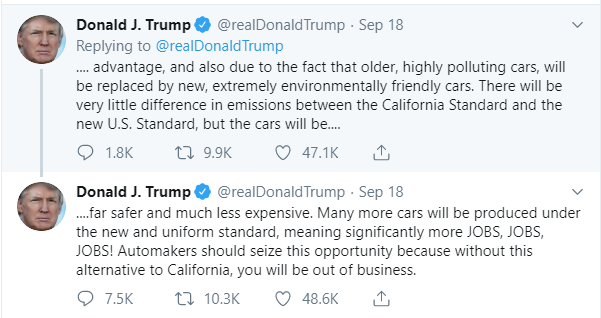

---
output:
  beamer_presentation: default
  html_document: default
---

title: 'Module 5: Command-and-Control vs. Market-based Policy?'
output:
  slidy_presentation: default
  beamer_presentation: default
  ioslides_presentation: default


## 
Recall last time we established that:

* Different ways to correct market failures:
  - The Pigovian approach
  - The Coasian approach
  - The Ostrom aprroach

## 
In this module, we are going to provide a comparative analysis about:

* Cost-effectiveness
* Innovation
* The US Sulfur Trading Scheme
* Do we ever prefer command-and-control?

## How does the government usually get into the business?
* Thou shalt not murder
* Thou shalt not commit adultery
* Thou shalt not steal

...

## 
The most common form of governmental regulation is called **command-and-control** regulation:

* Mandated standard or practices
* Excessive amount of pollution "breaks the law"
* Enforced by the government


## 
Real world command-and-control regulation generally falls into the following categories:

* Ambient Standards
  - Mandates the amount of pollutants in the ambient environment
* Performance standards
	- Requires the amount/concentration of emission to be below a certain level
	- Total Maximum Daily Load
	- Vehicle Emission Standards
* Technological standards
  - Requires certain technology to be implemented
  - Best Available Control Technology (BACT)

## Is command-and-control a good idea?

##
There are two firms in the city of Kingslanding that can produce the same kind of printing paper. "Paper.ai" is a state-of-the-art company that automates every step in their production. "The Baratheon's Paper Mill" is an old style mom and pop shop that relies heavily on labor. 

Both of the two firms emit suspended solids into the nearby river body. However, their ability and cost to abate these suspended solids are drastically different: Paper.ai is empowered by robots to remove solids from the water, while the Baratheon's Mill filters out solids by hand. 

## 
Under the unregulated scenario, both firms will emit **10** units of suspended solid into the water body. However their marginal abatement cost is different. Here is the marginal cost each firm has to pay to abate **Q** units of suspended solid: 

Paper.ai: $MAC_A: P = Q$   
Baratheon's: $MAC_B: P = 2Q$

where Q is the amount of solid waste discharged into the river body. Paper.ai is more efficient in abating pollution than Baratheon's.

## The Command-and-Control Approach
Suppose the policy goal is to reduce total discharge by **10** units. Here's how a emission standard works: 

Paper.ai and Baratheon's will each abate their discharge by **5** units. Or equivalently, each firm can only discharge 5 units into the water body.

## 
Paper.ai: Marginal abatement cost is **$5** when **Q=5**    
Baratheon's: Marginal abatement cost is **$10** when **Q=5**    

Total Cost for the program:        
Paper.ai: $5*5*0.5 = \$12.5$      
Baratheon's: $10*5*0.5 = \$25$    

Total cost for the society: **$37.5**

## This does not minimize the societal cost to achieve the policy target:
* At the margin, it costs less for Paper.ai to abate than Baratheon's
* Baratheon's can simply pay Paper.ai for $7 to abate one more unit. Both would gain. 

## Nor does it encourages further abatement
* There is no incentive for both firms to abate further once it reaches the standard
* Emission standard does provide incentives to innovate to reduce cost, but not to reduce emission
* Technological standard provides no incentive to innovate at all (MAC is locked in)

## The tax approach
Here's how a tax works:

Both firms will pay a tax rate of **t** for each unit of discharge. The tax rate is set such that the two firms meet the total abatement target of **10** units.

Firms will abate up to the point where the MAC is equal to the tax rate. 

## 
The optimal tax rate is somewhere between $\$5$ (MAC for paper.ai) and$\$10$ (MAC for Baratheon's)

To find out the optimal tax rate, we can do:

* Aggregate the two MAC curves: $P = \frac{2}{3}Q$
* Plug in the policy target: $Q=10$
* Optimal tax rate: $t = \$6.67$

## 
Under $t = \$6.67$, the amount of abatement will be:

$Q_A = 6.67$ and $Q_B = 3.33$

Amount of emission: 3.33 and 6.67

## 
And the total cost for the two firms:

$$TC_A = 6.67*6.67/2 = \$22.22$$
$$TC_B = 3.33*6.67/2 = \$11.11$$

Total cost to the society: **$33.33**

## This minimizes the cost of societal cost:
* At the margin, all firm pay the same MAC to abate
* The "equi-marginal principle"
  - Total cost is minimized when marginal cost for all firms are equated.

## This also encourages further abatement and innovation
* Firms have an incentive to innovate and bring down MAC
* Further reduces pollution if abatement can be achieved at a lower cost

## Finally, the cap-and-trade approach
Here's how a cap-and-trade works:

The government issue a total **10** units of discharge permits to the two firms. Firms can only discharge the amount that is equal to their permitted amount. 

## 
Let's say each firm starts with **5** units of permit in hand, and each need to abate **5** unit of discharge.

There is an incentive for the Baratheon's to purchase additional permit, with a price lower than $10, and discharge additional solid. 

In turn, there's an incentive for Paper.ai to sell the permit, with a price higher than $5, and abate more.

##
At the equilibrium, marginal abatement cost will be equalized for the two firms. That coincides with the price of the permit. At which point no firm has any incentive to trade anymore. 

This can be quantitatively solved by the following system of equations:

$$Q_A + Q_B = \text{Total Amount of Abatement}$$
$$MAC_A = MAC_B$$


##
$$Q_A + Q_B = 20 - 10$$
$$Q_A = 2Q_B$$

which leads to: $Q_A=6.67$, $Q_B=3.3$, and $MAC_A=MAC_B=\$6.67$.

## Equivalence of Tax and Cap
* When the cost curve is certain, Pigovian tax and Cap-and-trade yield the exact same result
* The aggregate demand approach and the equi-marginal approach are equivalent

## 
Total cost for Paper.ai equals to its own cost, minus the revenue from selling the permit     
```{r}
6.67*6.67*0.5 + (3.33-5)*6.67 
```
Total cost for Baratheons equals to its own cost, plus the revenue from buying the permit
```{r}
3.33*6.67*0.5 + (6.67-5)*6.67 
```
Total cost for the society: 
```{r}
6.67*6.67*0.5 + (3.33-5)*6.67 + 3.33*6.67*0.5 + (6.67-5)*6.67 
```

## Does initial allocation of allowances matter?

## Initial allocation does not matter at all
Coase theorem predicts that initial allocation should not matter at all, as long as property right is complete and there is no transaction cost. We can verify that.

Say now Baratheon's gets all **10** unit, and Paper.ai gets **0**.

Baratheon still wants to sell, Paper.ai wants to buy, so at the equilibrium we still have $MAC_A = MAC_B = P$, where there is no further incentive to trade. 

which leads to: $Q_A=6.67$, $Q_B=3.33$, and $MAC=\$6.67$.

## The distribution of costs are different:
Total cost for Paper.ai: 
```{r}
6.67*6.67*0.5 + (3.33-0)*6.67 
```
Total cost for Baratheon's 
```{r}
3.33*6.67*0.5 + (6.67-10)*6.67 
```
Total cost for the society: 
```{r}
6.67*6.67*0.5 + (3.33-0)*6.67 + 3.33*6.67*0.5 + (6.67-10)*6.67 
```

##
{height=450px}

## Takeaways from the Model
* Tax and cap-and-trade instruments are equivalent
* Both encourages innovation & further reduction in pollution
* Performs better than command-and-control under ideal conditions
* Magnitude of cost-saving depends on the heterogeneity of abatement technology

## Some real-world market-based policies
* The US Sulfur Dioxide Market
* Water Quality Trading
* Municipal Waste Management

## The US Sulfur Policy, Historically

* Sulfur dioxide creates acid rain, plaguing the Midwest
* (Old) power plants contribute the most
* Protected by the 1977 Clean Air Act Amendment:   
  - The grandfathering provision: older plants are not subject to new emission standards
  - Hopes for gradual phase-out
  - Creates huge incentives to keep dirty, grandfather plants open

## Clean Air Act, 1990 Amendment
* Creates a cap-and-trade market for sulfur dioxide
* Cap: reduce 10 million tons of sulfur comparing to 1980 level
  - Has little idea for the what actual benefit curve looks like
  - Cap determined on the "elbow" of the cost curve
* Allocate "allowance" to existing power plants for free

## Performance of the Program
* Policy target successfully achieved
* At a much less cost
* Encourages innovation on abatement: patents, new technology
* Striking cost-benefit ratio: benefit overweighs cost 50 to 100 times!

## 
{height=450px}

## 
{height=450px}

## Doing the Right Thing for the Wrong Reason

* Originally aims to curb acid rain
* Turns out the largest benefit comes from health benefits

## 
{height=450px}

## An Unanticipated Consequence of Deregulation
* Cost was much less than expected
* Innovation plays a role, but not the entire story

## Largest benefits come from input substitution
* Power plants switching from high-sulfur to low-sulfur coals
* That was actually not started by the cap-and-trade program

##
{height=450px}

##
{height=450px}

## Rail shipping rates go down
* Coal from Powder Basin (Wyoming) contains the lowest sulfur level (clean coal)
* Deregulation of US railroads
  - The Railroad Revitalization and Regulatory Reform Act of 1976
  - Staggers Rail Act of 1980
* Shipping rates decreased dramatically
* Power plants switched to low-sulfur coals, probably regardless of the cap-and-trade

## Conservatives demonize their own innovation
* George HW Bush signed of on the cap-and-trade
* HW is also a proponent of cap-and-trade for carbon dioxide
* CAA Amendment of 1990 had universal, bipartisan support:
  - Senate: 89-11
  - House: 401-21
* George W Bush proposed a further 70% reduction of sulfur in 2005, again using cap-and-trade

## 20 Years Later
* The economics is still sound
  - Greg Mankiw, chief economic advisor for George W, supports a carbon tax
* The political support is not there
* Waxman-Markey bill of 2009: carbon cap-and-trade
  - 219-212 in the house, 4 republicans supported it
  - Dies in the Senate
* "cap-and-TAX" vs. "selling licenses to pollute"

## What the government gives, it can take away

## 
{height=450px}

## In the 2000s
* Title IV program did not address the particulate matters problem
* The Clean Air Interstate Rule (2005)
  - Tightens cap by 2/3
  - Allowance price skyrocketed
* North Carolina sued the EPA, aim to vacate CAIR. Appeals court sided with NC
* CAIR reprimanded back to the EPA

## Obama's new Cross-State Air Pollution Rule
* State-specific cap
* Only allows intra-state trade
* Mandates on technology
* Sulfur trading market essentially died

## Take a minute:
What are the implications of the $SO_2$ trading scheme on combating climate change through regulating $CO_2$?

## Lessons from the sulfur trading program (Schmalensee and Stavins 2012)
* A policy can be established, but also vacated
  - Especially true for policies made through rule-making
* Politics trumps economics
* Information is gathered over time, and expect unintended consequenses


## Issues with incentive-based policies
Is incentive-based policy always preferred?

## Pollution Hotspots
* When pollution cannot be uniformly mixed, hotspots will appear near high-polluting firms
  - Nitrogen Oxides
  - Mercury
* Marginal damage is not equalized over space: economic inefficiency
* Environmental justice concerns

## Cost of Monitoring and Administration
* Targeting large producers are easy
* But how to implement a tax or a cap-and-trade on consumers?
  - What do we need to have every vehicle owner paying an emission tax?
* Coase theorem only works when transaction cost is zero

## 
On the other hand, market-based policies do encourage compliance

* Command-and-control faces political lobbying and backslash
* High compliance cost - more incentive to lobby/sue
* Market-based policies encourage innovation
  - Tech-savvy firms now have a comparative edge
  

## Linking Jurisdictions
If pollution can be uniformly mixed, then it might be a good idea:

* Larger, more vibrant market 
  - Less price volatility
  - Less market power held by each firm
* Equate marginal abatement cost between jurisdictions
  - Further cost-saving
* Prevents pollution havens
  - Race to the bottom

## An Extreme Example of Jusrisdiction
* President Obama set vehicle emission standard rules, aiming at doubling fuel-economy by 2025
* Critical step in combating climate change & air pollution
* The Trump administration aims to roll back Obama-era emission standards

## 
* Obama's rule requires an average of 54 miles-per-gallon (mpg) for vehicles
* Trump's new rule requires an average of 37 mpg

## Toyota Prius: 54 mpg
{height=450px}

## Toyota Corolla (standard): 37 mpg
{height=450px}

## Ford F150: 25 mp
g{height=450px}

##
* California intends to keep the higher emission standard
  - 6 billion tons less of carbon emission
* Automakers agree
  - 17 automakers urges the administration to re-consider the decision
  - Four struck a deal with California to voluntarily comply to the higher standard
* This seems to have angered the president

## What are the automakers thinking?

## They are already innovating
  * Research and development already in place
  * Climate change will eventually force the reinstatement of those rules
  * Fuel efficiency leaders have an competitive edge in the game

## And two standards will be a regulatory nightmare:

  * California is too big a market to ignore
  * But how? Different pricing in California vs. Nevada? 
  * Compliance: what if a customer brings a vehicle from Nevada to California? Will that violate the standard?

## The administration's response?

## 
{height=450px}

## 
{height=450px}

## 
* The administration revoked California's ability to set higher emission standards
* DOJ on bringing anti-trust suits against the four carmakers that voluntarily comply
* Detering other firms that wish to join voluntarily (Mercedes-Benz)

## Takeaways from this module
* Command-and-control regulations are:
  - Cost-ineffective
  - Diminish incentives to innovation
* Pollution tax and allowance trading are equivalent:
  - Both satisfies the equi-marginal principle, thus efficient
  - Encourages innovation


