---
output:
  html_document: default
  ioslides_presentation: default
---

title: 'Module 6: Measuring Benefits'
output:
  slidy_presentation: default
  beamer_presentation: default
  ioslides_presentation: default


## Mid-term Grade Distribution
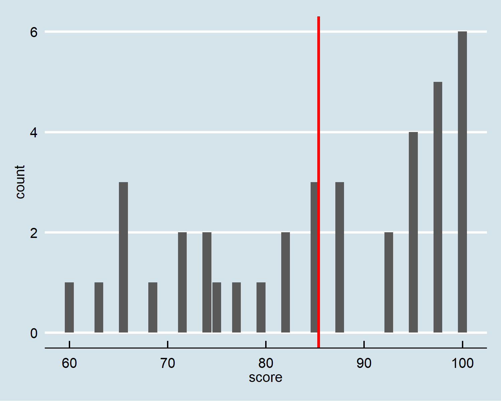{height=450px}


## 
So far in this class we have talked about:

* Environmental and resources problems arise from market failures
	- Externality
	- Property rights
* Ways to correct for market failures
	- Market-based policy
	- Command and Control
	- Privatization
	- Community-based management

## 
In this module, we are going to look into ways to measure environmental benefits. We will talk about:

* Why putting a dollar tag on the environment?
* Why environmental benefits are hard to measure?
* Types of Benefits
* How to measure benefits
	- Revealed Preference Methods
	- Stated Preference Methods
* The value of a (statistical) life

## Should we (as a society) put a dollar tag on the environment at all?

* Are we selling off the environment?

##
* Societal values are mostly human-centric
	- Mostly care about what is beneficial to our species
* Environmental protection involves trade-offs
	- We love the environment, but no more (and no less) than other stuff in our life
	- Are you willing to live in a society that is free of SO2, climate change, etc., but with no electricity?
* Strong backup from economic theory
	- Link between wealth and utility
	- Supply, demand and equilibrium

## Benefit-cost Analysis
* Most laws and rules require benefit-cost analysis since the Reagan administration:
	- Natural resources damage assessments, such as for oil spills (NOAA)  
	- For the designation of critical habitat under the Endangered Species Act (U.S. Fish and Wildlife Service) 
	- Dam relicensing applications (The Federal Energy and Regulatory Commission)
* Putting dollar numbers on environmental benefits satisfy that requirement

## Damage curve (marginal benefit from environment)
* Everyone loves the environment, but to what extent?
* Helps guiding policy-design
	- What's the best amount for a carbon tax? 
	- How many acres of National Park shall we establish?
	- How stringent should the vehicle emission standard be?
 

## Why environmental benefits are hard to measure?
* Markets are the best way to measure benefits (and costs)
	- An apple
	- Bottled water
	- Timber revenue
* Most environmental goods and services are not traded on the market:
	- Carbon dioxide emission
	- A cleaner Charles River
	- Yosemite National Park
* This requires **non-market valuation** techniques

## "Willingness to pay"
* The amount of wealth a consumer is willing to sacrifice for the good
	- "I am willing to pay $2 for that apple"
	- "I am willing to pay $1,000 to enjoy Yosemite"
* Measures consumer surplus
* Total WTP for the society: adding everybody's WTP up
	- Aggregate demand

## WTP vs. WTA
* WTP is not the only way to measure consumer surplus
* Willingness to accept: amount of compensation in exchange of losing something
* In theory, these two should be (approximately) identical:
	- My WTP is $2 for that apple (my utility gain from that apple is worth $2)
	- If someone offers me $2.01, I will happily sell that apple to the guy (WTA)
	
## 
Though in reality, WTA >> WTP

* Income effect: by accepting compensation the individual gets a bit richer
* Loss aversion: a loss is more painful than a gain (Kahneman and Tversky 1974)
	- Value function around the reference point is S-shaped and asymmetrical
	- People value loss more than they value gains

## Recall the first class:
* You are approached by a representative from a big pharmaceutical company who invites you to participate in a test trial of a new drug. She informs you that there is a 1 in 10,000 chance that the drug may have serious side effects that can lead to your death. What is your WTA?

* You recently completed a DNA test, which reveals that you are susceptible to a certain type of virus. The doctor informs you that about 1 in 10,000 people in the population will have the chance to be contacted, and die from this virus. She also informs you that there has been a vaccine developed for this virus that will make you immune from it for your lifetime. What is your WTP?

## Empirical Distribution of the Class
Mean WTA: $39 Billion    
Median WTA: $100 Million

Mean WTP: $6.4 Billion    
Median WTP: $1000    

##
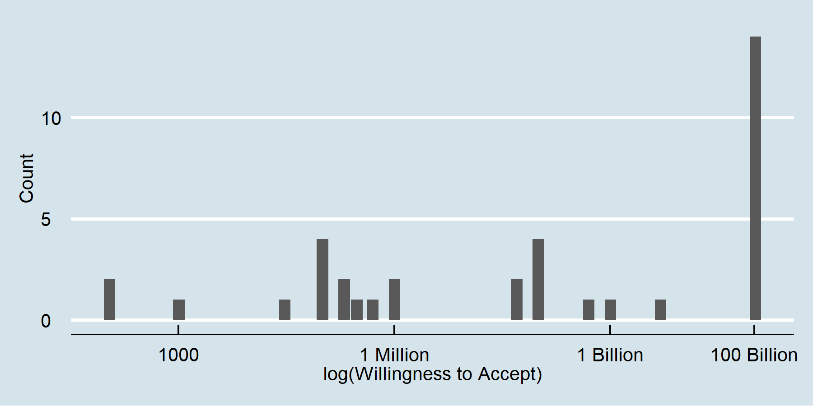{height=230px}

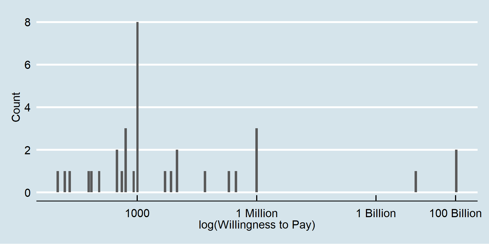{height=230px}

## Prospect theory: value function
{height=450px}

## Risk Assessment and Perception
The first step towards assessing environmental values is to understand what risks are involved

* Mortality risks
* Flood risks
* Risks of tail weather events: hurricanes, drought, etc. 

## Take a guess of the following mortality risk:
* Death from Airplane Crash
* Death by Mass shooting in the US
* Homicide by gun in the US
* Exposure to air pollution in Los Angeles

|Event|Risk|
|----------------------------------|------------|
| FDA Safety Guideline for food| 0.1 per 100,000|
| Peanut Butter | 0.8 per 100,000|
| Car accident| 14 per 100,000|
| Cigarette smoking | 150 per 100,000|


## 
|Event|Risk|
|----------------------------------|------------|
| **Airplane Crash** | 0.02 per 100,000|
| **Death by Mass shooting** | 0.12 per 100,000|
| Eating Peanut Butter | 0.8 per 100,000|
| **Homicide by gun in the US** | 3.6 per 100,000|
| **Class Example** | 10 per 100,000|
| Car accident| 14 per 100,000|
| **Particulate air pollution in CA**| 50 per 100,000|
| Cigarette smoking | 150 per 100,000|


## (Mis)perception of risk
* Public distrust of expert / science
* Lack of knowledge
* Bias against small probabilities

## Prospect theory, again
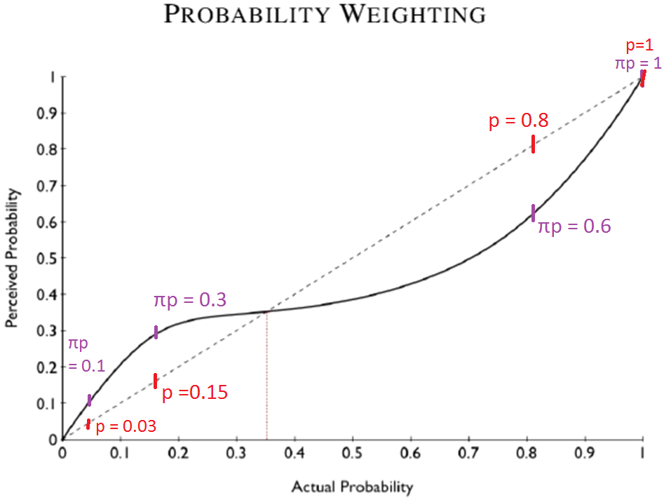{height=450px}

## Also, not all risks should be treated equally
* The government tend to less regulate when it involves individual's choice
    - Smoking
    - Alcohol abuse
* And do more by providing public goods / information
    - Air pollution
    - Airline safety

## Valuing "statistical" live

* What are you even talking about? Of course life is priceless
* Any attempt to put a price on human life is immoral itself

## And of course, there are contentions around that very idea
* EPA reduced its **Value of Statistical Life (VSL)** in decision-making
  - Public outcries
* EPA used a lower VSL for senior citizens
  - AARP strongly opposed it

## But saving lives also entail tradeoffs
* Reducing risk for one group could mean increasing risk for another
* Public resources are limited: 
	- Hire police officers
	- Monitor and enforce environmental regulation
	- Improve healthcare quality
	- Renew infrastructure
* Decisions have to be made, one way or the other

## Questions
* Are we really talking about the "economic value of a life"? Or is it something else? 
* Who gets to say how much a "statistical life" is worth?
  - The government?
  - A clever economist? 
  - The public?

## Let's pause for a second and go back to 70 years ago
* Year 1949, WWII ended just four years earlier
* Cold war just started, US rivaled with USSR (Soviet Union)
* The RAND company got a task from the US Air Force:
	- USAF was planning air strikes to the Soviets
	- Wanted RAND to optimize the choice of bombs and bombers to maximize damage, subject to a budget constraint
	- Classical constrained maximization problem

## 
* RAND presented their plan at the USAF, and got bombarded
	- They favored a high-damage, high-casualty plan
	- Many in the room were former pilots, who took great offense to that plan

## The criterion problem
* RAND started to put actual weights on airplane crews in its objective functions
* This fundamentally becomes an economics problem: casualty is part of the "cost"
* And the key to this problem is to factor in casualty in a profit maximization problem

## Armen Alchian (1951)    
* Humans have intrinsic values above the investment they represent, and cannot be directly represented by any dollar figure
	- Humans cannot be bought or sold in our society
* However, there will be some price range beyond which society will not pay
* Therefore, there is some "exchange ratio" between human lives and dollars, appropriate in our context

## The "exchange ratio"
Alchian went on and wrote: 

* But we (as economists) will be very brave to attempt to predic what this exchange ratio should be
* It will be the responsibility of the Air Force or the [Joint Chiefs of Staff] to select one of the points as the most sensible one
* This ratio should be selected very early in the analysis, in order to solve the problem

## Popular approaches at that time
* The replacement cost approach    
	- What a pilot's life worth is the cost the USAF has put in to train/replace that pilot
* The human capital approach
	- What a life's worth is the sum of remaining wages that person can earn in the future

What are the problems with the above two approaches?

## Thomas Schelling comes in
* Berkeley BA, Harvard PhD in 1951
* Vesting fellow at RAND in 1958
* With his student Jack Carlson, a former Air Force pilot, Schelling start to look at the problem more rigorously

##
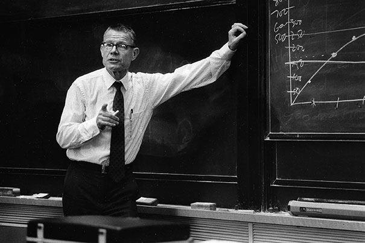{height=450px} 

## A problem of trade-offs 
* Saving lives entails actual and opportunity costs
* By evaluating choices upon those trade-offs, we can infer the value of a life
* USAF was already making these types of choices between costs and lives

## Capsule ejection system for a B-58 bomber
* USAF designed and installed an emergency ejection system for B-58 bomber, costs $80 million
* It would save 1-3 lives annually
* Implied that the "money valuation of pilot's lives" were at least $1.2-9.0 million

##
{height=450px} 

## But who should have a say on the "exchange ratio"?
* USAF (or other public agencies) cares about the *aggregate* number of fatalities
	- That is, the expected number of lives saved for the public
* That is not the trade-off that individuals are facing at all!
* Carlson (1963): An USAF pilot took up a *risk* of dying of 2.32 per 10,000 annually, for some $2280 of increased pay

## Is it life? Or is it risk?
* From an individual's perspective, this is NOT a choice between **life** and cost
	- Not the death of any specific, known person
	- That remains a moral question
* To the individual, they are evaluating between a small **risk** and the cost
	- Or rather, this is "statistical life", i.e., the probability of death
* And that is what public investments should be based on
	- Value of statistical life needs to come from the individuals who face the risk of fatality 
	
## And who should have the say?
Schelling (1968) writes:

* We figure out the value of a good through a market
* Death is different from most commodities, but: 
  - People have been dying for as long as they have been living
  - where life and death are concerned, we are all consumers
  - Economic decisions are made regarding how much we are willing to pay to extend our lives (reduce risks)
* People whose lives may be saved SHOULD have something to say about the value 

## Consumers' sovereignty should reign
* It is every one of our choices that counts, not the preference of public officials
* It is the economists' job to figure out how much people values risk
  - Through directly observing individual decisions
  - Through surveys


## "Value of a Statistical Life"
* How much individuals value mortality risks

**VSL = WTP(WTA) / Mortality Risk**

* Public benefits from reducing mortality risk are the aggregate of individual valuations

**Total Benefits = VSL * Expected Lives Saved**     

where Expected Lives Saved = Mortality Risk * Number of People Impacted

## How do economists get VSL?
* Contingent valuation
* Hedonic methods

## Compensating wage differentials
* Working in the mining industry has an annual risk of 24.5 per 100,000 workers.
* On average miners earn $2,000 more than a worker in the service sector, who has an annual risk of 1.5 per 100,000 workers
* Holder everything else equal (race, age, education, skills, etc.), the VSL is given by:

**VSL = $\Delta$Wage / $\Delta$Mortality Risk**

In math, we have:
```{r}
2000 / (24.5/100000-1.5/100000)
```


## Some empirical evidence
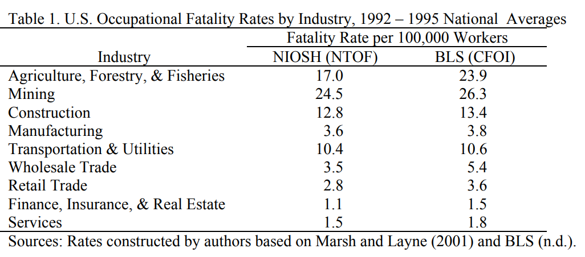{height=400px} 

##

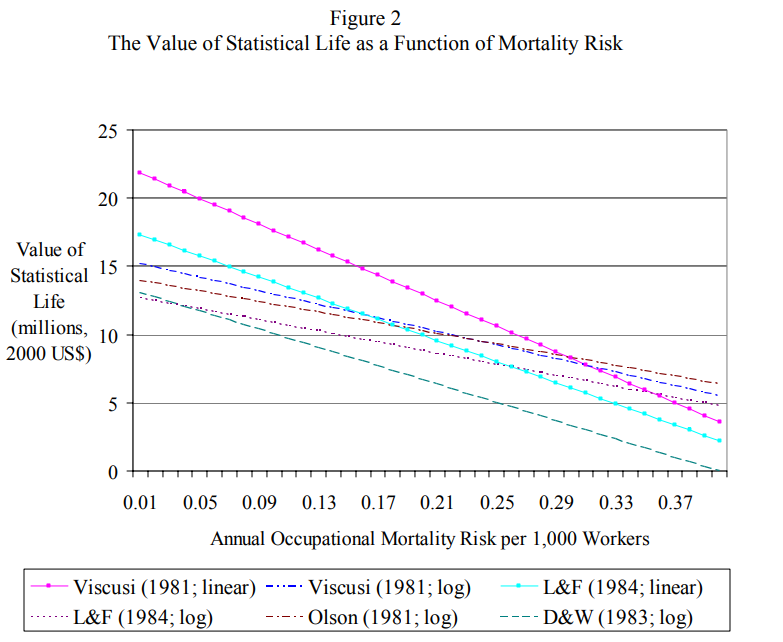{height=450px} 

## Kahneman and Tversky (1979)
You are forced to play the Russian roulette with a mafia boss, and the boss give you a chance to remove one bullet from the pistol roulette. Which of the following scenario will you be willing to pay more:

1. Reduction from 4 bullets to 3
2. Reduction from 1 bullet to 0

##
{height=450px} 

## 
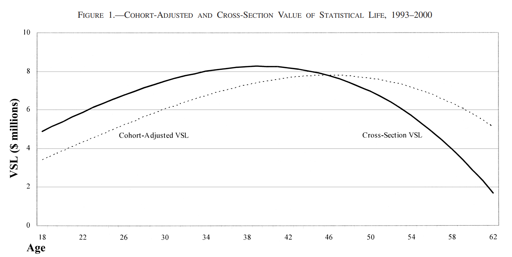{height=450px} 

## The remaining problem

Should the VSL be different across different populations? 

## TQs from you
* "Although the numbers being lower for older people may sound harsh, from an economic perspective it totally makes sense (because seniors are willing to pay less for risk reduction than prime-age citizens)."

* "However, what these readings fail to consider is that environmental problems disproportionately affect poorer and marginalized populations...We must do something about how our environmental policy decisions do not reflect the wellbeing and voices of marginalized populations"

* "Are the upper class willing to pay more in avoidance of fatal risks than the lower class, so that VSL tends to be higher as people become wealthier? If so, will this further support critiques of VSL to argue that lives of the poor worth less than those of the rich...?"


## Types of Environmental Values
* Use Value
	- The willingness to pay for direct use of the environmental resource
* Option Value
	- The willingness to pay for future ability to use the environment 
* Existence Value (Non-consumptive use value)
	- Individuals’ willingness to pay to preserve a resource that he or she will never use 

## 
* Total Willingness to Pay

Total WTP = Use Value + Option Value + Nonuse Value

## Classifying Valuation Methods

* Stated preference method
	- Methods to elicit respondents' willingness to pay when the value is not directly observable
* Revealed preference method
	- Solicit WTP from actual choices made by individuals

## State preference method
* Let people "state" their preference in hypothetical scenarios
* Is able to measure almost anything:
	- Especially for "non-use" values: existence values, intrinsic values, etc.
	- What is your WTP to protect the snail darter even if you have no chance to see it in your lifetime at all?
* Main stated preference methods include:
  - Contingent valuation
  - Choice experiment

## Contingent Valuation Method
* It is to elicit people’s willingness-to-pay (WTP) in a hypothetical market
* A NOAA panel (1993) legitimized the use of contingent valuation
* Exxon Valdez Oil Spill (1990)
    - CV found a economic loss of $4.9 billion, admitted by the court
    - Recreational demand found only $3.8 million (Hausman, Leonard and MacFadden 1995)
    - Exxon Mobil ended up paying $3 billion in settlement

## Choice Experiments
* Respondents are asked to choose among alternate bundles of goods
* Each bundle has a set of attributes and the levels of each attribute vary across bundles
* WTP identified through choice differences

## 
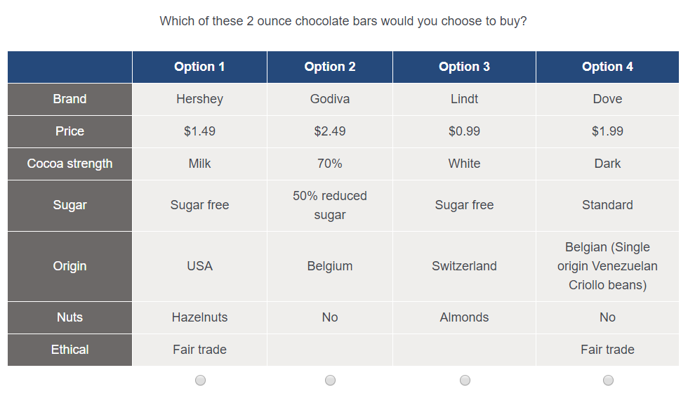{height=450px}

##  
* State preference methods potentially suffer from potential biases
	- Hypothetical bias
	- Strategic bias
	- Embedding bias
	- Framing
* Biases may over-state or understate the true WTP
* Requires high-quality survey design

## 
A deadly virus has hit your city, and there are 600 people infected by that virus facing life threats. You are presented with the following two procedures to help them: 

A. Save 200 people for sure.    
B. 33% chance of saving 600 people, 66% chance of saving no one. 

## 
A deadly virus has hit your city, and there are 600 people infected by that virus facing life threats. You are presented with the following two procedures to help them: 

A. 400 people will die for sure.    
B. 33% chance that no people will die, 66% chance that all 600 people will die. 

## Revealed preference method
* Let people reveal their preference through actual choices
* Application limited mostly to "use values"
	- Homeowner valuation of clean water
	- Tourist/hiker valuation of national park
	- Value of life through wage compensation

## Hedonic method
* Hedonism: "pleasure", advocated by Epicurus, the Greek philosopher
* Infer the "implicit" price of a non-market good through price differences of commodities traded on the market
	- Property value studies (Rosen 1974)
	- Wage studies 

## Hedonic property value method
* Home property prices are determined by a bundle of attributes
	- Area, bedrooms, bathrooms, yard, age of the structure, etc.
* Entails public goods that are not (usually) transacted on the market
	- Distance to MTA / I90 / Wholefoods
	- School district
	- Waterfront / Beachfront
	- Exposure to air pollution
* All these attributes will factor into the price of that property

##
{height=450px}

## Implicit price for educational opportunity
* Take two identical houses across the street, everything else is the same: square footage, bedrooms, school districts, etc.
* The only difference is: 
	- One is in a good school district
	- The other is a bad school district
* Price difference between the two house reflects the implicit price of educational opportunity:
	- People are willing to pay more to get into the good school district
	- Black 1999 (QJE): sample in Middlesex, Essex, and Norfolk
	- 10% increase in test scores -> 5% increase in housing prices 

## School district boundary in Melrose, MA
{height=450px}

## Guess how much was this apartment in Beijing sold for:
* 118 sqft (11 m3)
* No bathroom, no kitchen
* Has electricity, but no AC/fan
* School district of the "Beijing Second Experimental Primary School", one of the best primary schools in Beijing

## 
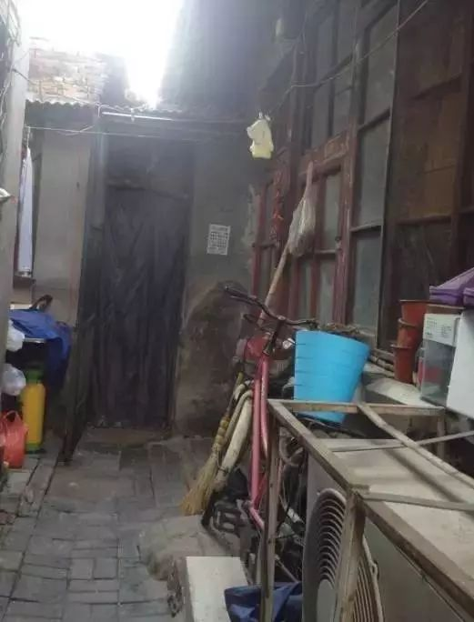{height=450px} 

##
{height=450px} 

## Take a guess
A. $10,000    
B. $50,000     
C. $100,000     
D. $300,000    
E. $1,000,000     

## Implicit price of industrial pollution
* Pete and his husband live quietly in a small town in the suburb of South Bend
* One day, the mayor announced that a coal-fired power plant is moving into the town, polluting local air
* Pete' house itself does not change at all, except:
	- The house is now plagued with air pollution
* Market price of Pete' house drop by 11% on average (Currie et al. 2015 AER)
* Only affecting houses within a 1-mile radius

## Hedonic property value
Holding everything else equal: 

* WTP for environmental quality = price differences of a clean and a dirty house
* Total benefit for the society = Price Differences * Number of Houses Affected 
* Lower bound of monetized environmental quality
  - What about other types of uses?
  - What about non-use values?


## Takeaways from the module
* Environmental benefits include:
  - Use value
  - Option value
  - Non-use value
* Measuring environmental benefits requires different techniques because they are not usually incorporated by the market
* Non-market valuation techniques include:
  - Revealed preference methods
  - Stated preference methods
* Value of Statistical Life


## The impossible three-legged stool
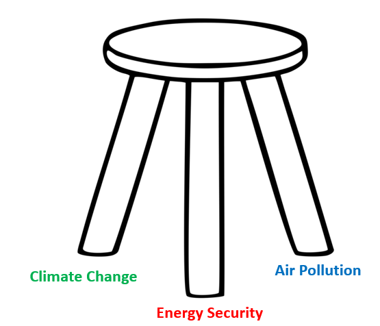{height=400px} 

## Questions
* What are the risks associated in this case? 
* What are the trade-offs? 
* Will the situation be different in another place / under a different culture? 

## Taiwan's problem
* Taiwan used to have three nuclear power plants, and are constructing a fourth (Nuclear IV)
	- 20% of total power generation
* Fukushima Daiichi disaster hit in 2011, citizens of Taiwan were terrified
	- What are the risks of a similar nuclear disaster?
	- Massive protests against nuclear power on the street
* The Democratic Progressive Party (DPP, liberals) led the campaign to remove nuclear in the energy balance
	- A failed referendum in 2014
	- Candidate Tsai Ing-Wen ran on a nuclear-free platform in 2016, aim to achieve nuclear-free in 2025

## 
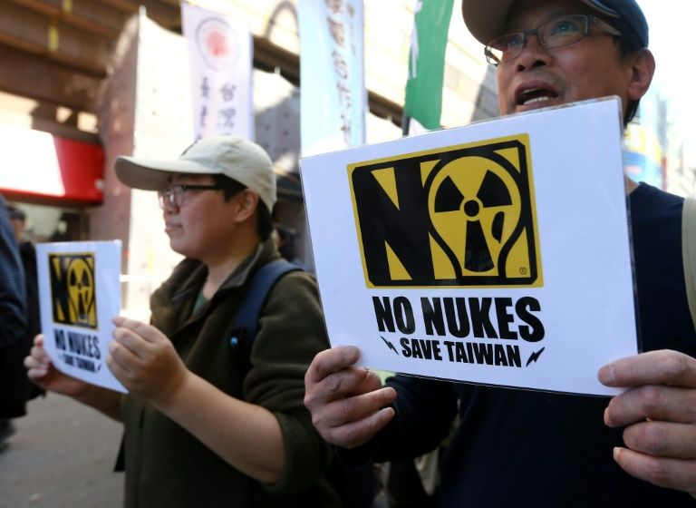{height=450px} 

## 
{height=450px} 

## 
* Tsai, a Harvard and LSE grad, won the election in 2016
* Began to implement her campaign promise of nuclear-free in 2025
* But there is just one problem:
	- Taiwan didn't have enough power generation capacity to begin with
	- Alternative were coal-fired power plants, which were already under-capacity


## The 8/15 power outage
* On 8/15/2017, six generators at the Tatan power plant fully tripped 
* With limited backup generating capacity, the entire Taipei city blacked out
* Huge economic losses 
* Hospital reported two incidents of stopped respirators, an ongoing surgery was cancelled

##
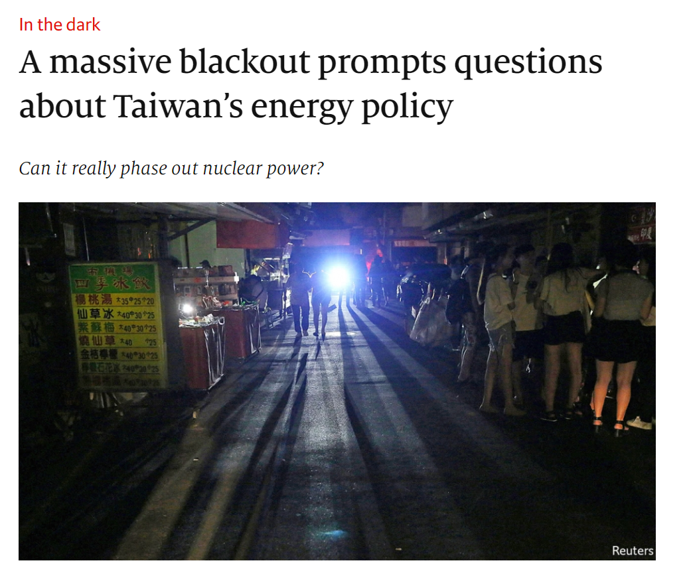{height=450px} 

## It is not only the black-out
* After the blackout, Tsai's administration began increasing capacity for coal-fired power plant
* That leads to another problem: air pollution (and climate change)
* Increased capacity of coal-fired power plants just exacerbated the problem
* DPP constituents in the Southern part were especially hurt

## 
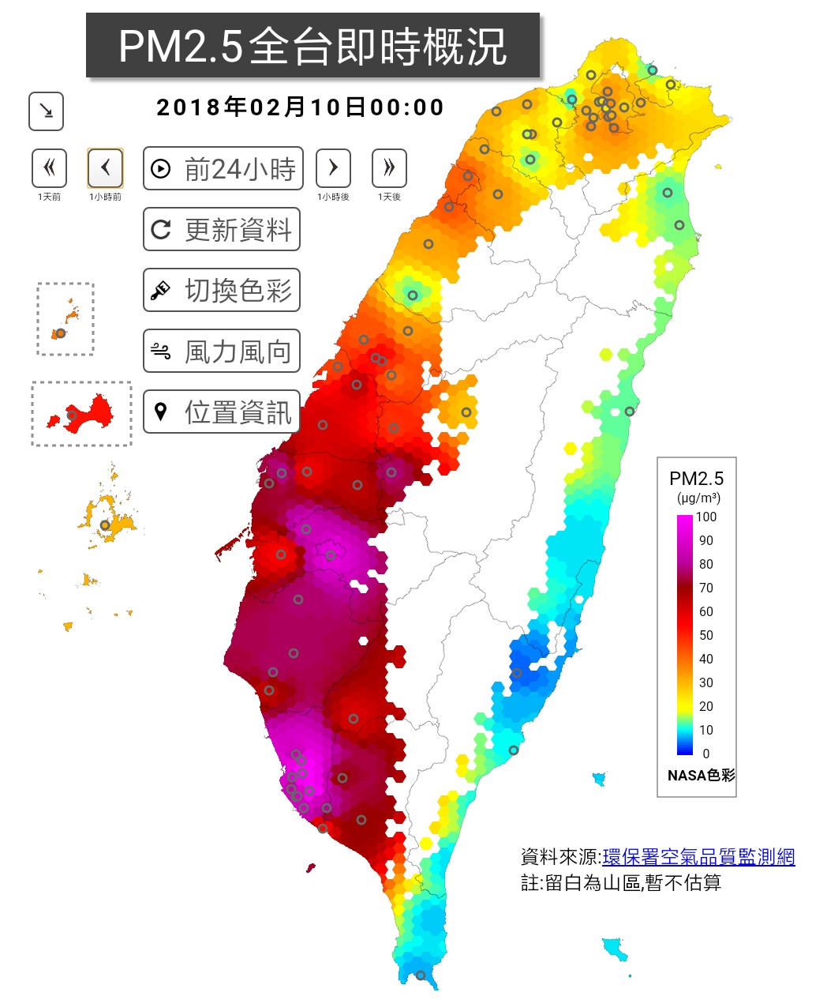{height=450px} 

## 
* The Kuomintang (KMT, conservatives) led a huge anti-pollution campaign in 2017
* Demanding changes in energy and environmental policy
	- More stringent environmental regulation
	- Shifts in the energy balance

## Tsai caved in
* Facing political pressure, Tsai walked back on her campaign promise
* A 2018 referendum successfully terminated the nuclear-free 2025 plan
* Nuclear IV is still on hold, but Tsai is facing increasing pressure to resume it

## Questions
* What are the risks associated in this case? 
* What are the trade-offs? 
* Will the situation be different in another place / under a different culture? 

