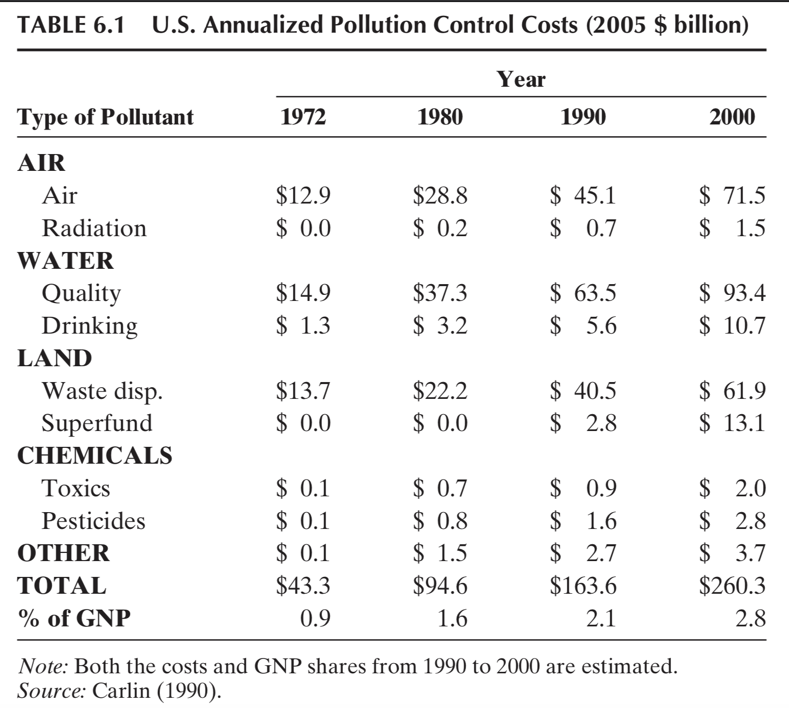
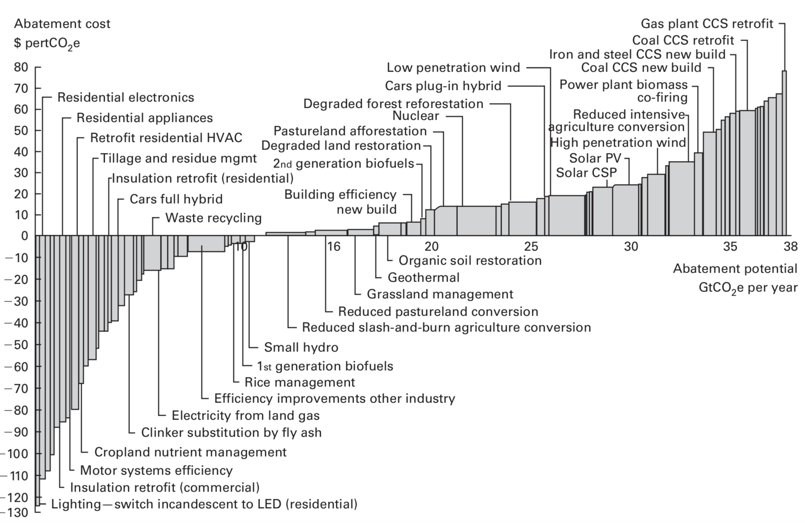
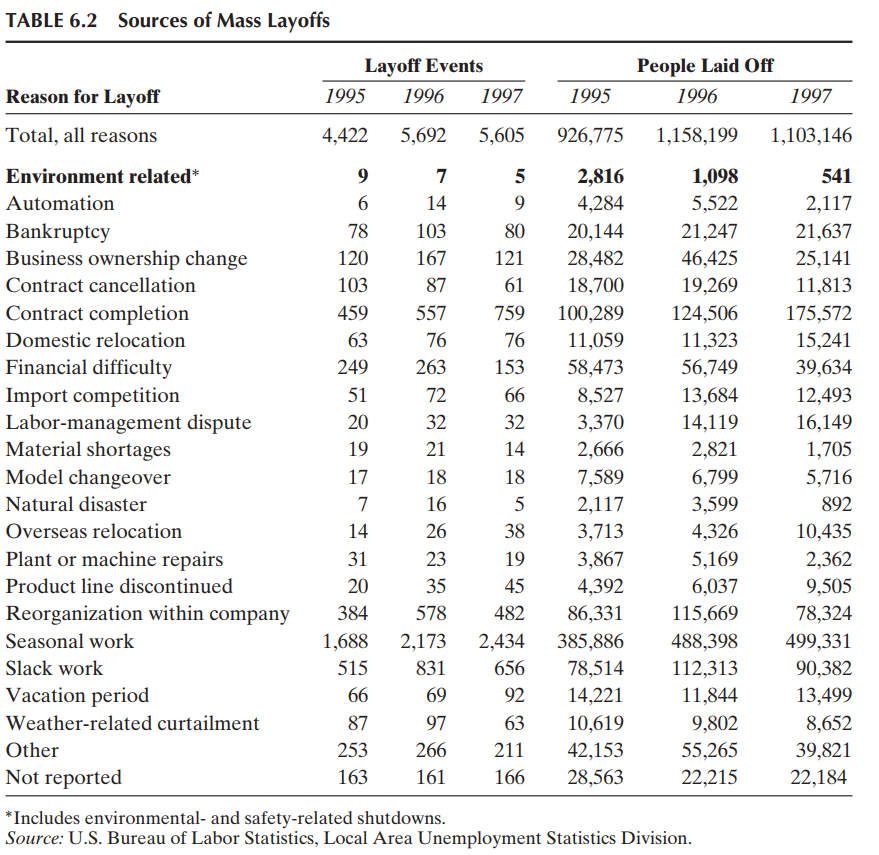
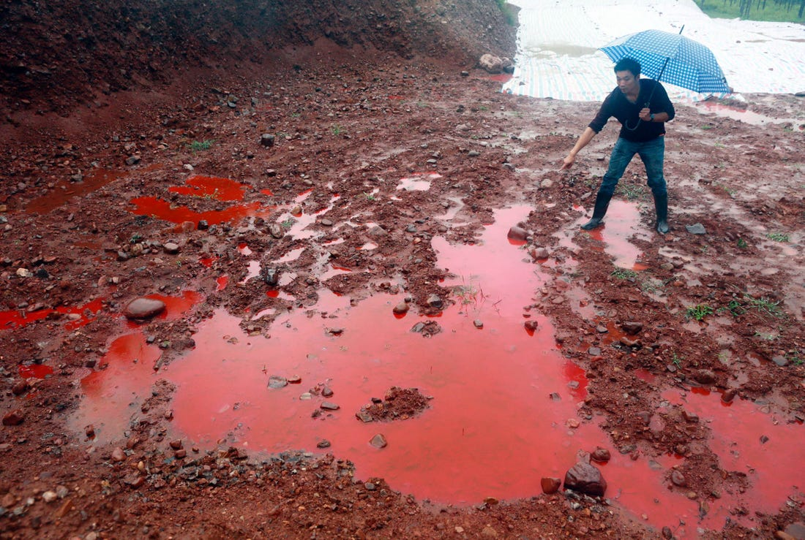
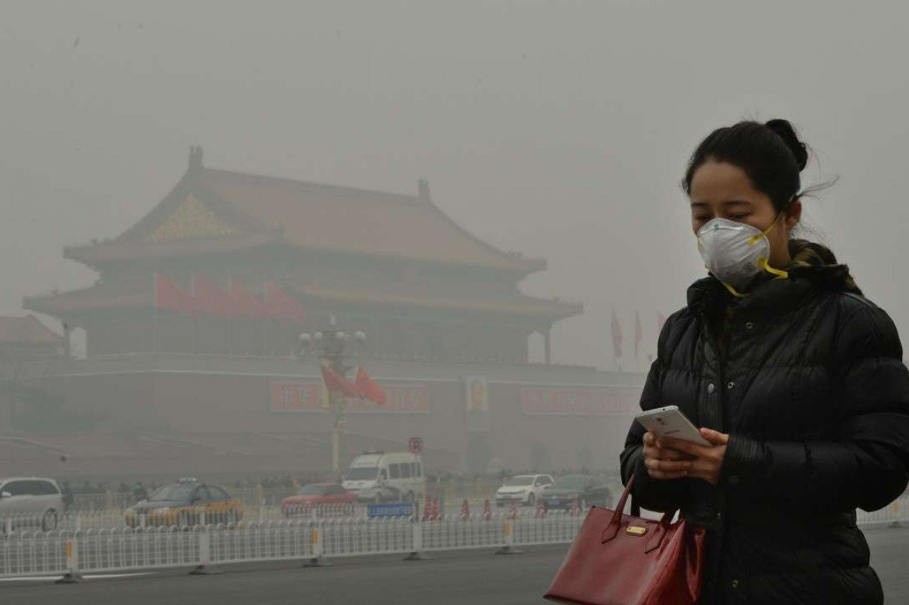
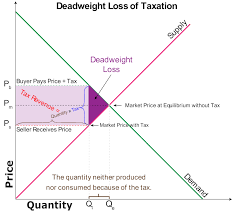

---
output:
  html_document: default
  ioslides_presentation: default
  pdf_document: default
---

## 
In this module, we are going to look at the cost of protecting the environment. We will talk about:

* Engineering vs. Opportunity Cost
* Productivity Effects
	- The Porter Hypothesis
* Employment Effects
	- Is environmental regulation a job killer?
	- Is "Green Jobs" the future of our society?
	- Pollution Havens
* Double Dividends
	- Are there free lunches?

## What are we talking about when we talk about costs?

* Environmental protection does not grow on itself
* We will have to divert private and public resources to improve environmental quality
* What are the costs? And how do we measure it? 

## Engineering Costs
* How much will our society spend on:
	- Equipment (installing and maintaining)
	- Personnel
	- Governmental regulatory efforts
* The most widespread cost figure out there
* This is often the *predicted* cost, and assumptions have to be made:
	- On the choice of pollution-abating technology
	- On the cost of that technology

## 
{height=450px}

## Engineering vs. Opportunity Cost
* Opportunity cost: the value of resources in their next best use
* What are the opportunity costs to environmental protection?

## True costs of environmental protection
* Foregone capital gains
* Productivity growth 
  - Does regulation increase or decrease economic productivity?
* Employment effects
  - Does environmental regulation kill jobs or create new "green jobs"

## 
{height=450px}  
  
## Productivity effects
* Productivity: economic output per worker
  - Total factor productivity: output per worker, physical, and financial capital
* Economic arguments on both sides

## Evidence FOR productivity growth
* The "free-lunch" argument
  - There are environmentally friendly policies are also cost-saving
* The Porter Hypothesis
  - Michael Porter from Harvard (the Five Forces Model)
  - Regulation forces newer, modern production processes, extra R&D
  - Promotes thinking "outside-the-box"
* Empirical evidence generally supports the Porter Hypothesis

## Evidence AGAINST productivity growth
* Business complaints
  - Regulatory burdens
  - Administrative costs: filling for permits, holding public hearings
* Less evidence on actual productivity decreases
  - Limited impacts in heavily regulated industries (coal mining)
  - Rolling back environmental regulations would not help those industries anyway

## Jobs vs. the Environment
Is environmental regulation:

* Job killers?
* "Green Jobs" engine?
* Or, neither?

## Questions
What are the arguments on both sides? As a smart economist, which of the arguments do you think make sense?

## GOP Senators on the EPA's climate rule, 2010

<iframe width="560" height="430" src="https://www.youtube.com/embed/lou6WX1ZhvQ" frameborder="0" allow="accelerometer; autoplay; encrypted-media; gyroscope; picture-in-picture" allowfullscreen></iframe>

## Ed Markey (Sen D-MA) on the Green New Deal

<iframe width="560" height="430" src="https://www.youtube.com/embed/v-riyZcUGrg" frameborder="0" allow="accelerometer; autoplay; encrypted-media; gyroscope; picture-in-picture" allowfullscreen></iframe>

## Are there economy-wide structural changes in employment because of environmental regulation?
No!

* US lost millions of manufacturing jobs since 1980, timing coincided with new environmental regulation
* But, that is mainly due to 
	- Automation
	- Production shipped off-shore
* **Structural unemployment** is possible when transiting from dirty manufacturing to clean services jobs
* In the "long run", the economy still has **full employment**
	- Definitely true under today's economy

## How many jobs are killed from environmental regulation?
Of course, there are short-term, local impacts due to environmental regulation

* Plants shutdown
* Decreasing competitiveness
* Forced layoff

But other times, these are just scapegoats for poor management/inevitable business cycles

## John Oliver on Coal
<iframe width="560" height="430" src="https://www.youtube.com/embed/aw6RsUhw1Q8?start=266" frameborder="0" allow="accelerometer; autoplay; encrypted-media; gyroscope; picture-in-picture" allowfullscreen></iframe>

## Less than 0.1% of the job lost are due to environmental regulation
{height=450px}

## How many green jobs will be created?
Sen Markey claims the Green New Deal will "create" 10 million jobs. 

What's the problem with that statement? 

## Opportunity cost
* If the government do not invest in the green sector, it can always invest in somewhere else
* The **opportunity cost** of investing in the green sector:
  - Invest in other sectors
  - Rebate to citizens (tickle-down economics)
* The REAL job created is 10 million minus number of jobs created in alternative investments 
  - This could be more or less than 10 million
  - That also depends on whether green spending alleviates structural unemployment

## Structural Unemployment
* In the "long-run", NO net jobs will be created
  - Full employment in 1974, full employment now
* But as Keynes famously put it, "in the long run we are all dead"
* Investing in green energy could alleviate short-run structural unemployment
  - Most jobs are blue-collar in nature (solar panel installer)
  - Is that the type of job we want in the long term?
  
## Obama's green stimulus package
* $100 billion over two years
  - Energy retrofit
  - Smart electricity grid
  - Expand mass transit and rails
* Will create 1.9 million jobs
* Rebating that money to household will create 1.7 million jobs
  - Freedom dividend (UBI)
* Net job creation: only 200,000

## 
{height=450px}

## Are firms fleeing to places with lax environmental regulation?
* In theory, firms would want to move to places where environmental/labor regulations are more "business friendly"
  - U.S. South
  - Developing countries: China, Vietnam, Mexico, Honduras, ...
* This gives them comparative advantages as they do not have to bear the cost of compliance
* This phenomenon is referred to as the **pollution haven** hypothesis
* Globalization & trade liberalization may in theory exacerbate pollution havens 

## Some empirical evidence
* Mild evidence that stringent environmental policy leads to within country industrial shifts in the US:
  - Fewer new plants
  - Fewer incoming foreign investment
* Environmental policy also correlates with labor costs/regulations in the US
  - "Labor haven" rather than "pollution haven"
* NO evidence of pollution outsourcing to developing countries
  - Not from US to rest of the world
  - Not from Japan to Malaysia, Indonesia, and the Philippines

## The political economy of pollution haven
A closely related concept to the pollution haven is the idea of **race to the bottom**

* Politicians attract investments by voluntarily lowering standards of environmental regulation
* Prevalent if environmental standards are set and enforced by the local government
* Weaker institutional and public oversight exacerbates the problem
  - Chances for bureaucrats to seek rents

## Promotion Tournament and Perverse Incentives in China
* China was a central-planning economy before 1982
* Deng Xiaoping started the economic reform, bringing Western "market-based" economy to China
* Rapid economic growth since then, the "China miracle"
  - Lifted 1 BILLION people out of poverty 

## Bureaucrat incentives
* Economic development was the No.1 imperative in the 1990s to early 2000s
  - Deng: "It doesn't matter whether a cat is black or white, as long as it catches mice."
* Promotions of bureaucrats were (almost) entirely based on economic performance 
  - Bureaucrats do not directly answer to constituents. Rather they answer to the Party HR (the Organization Department of CCP)
  - GDP was the Key Performance Indicator (KPI) to determine promotion
* Best way to boost GDP: attract Foreign Direct Investments (FDI)
  - FDI brought in capital and technology, quickly lifted the economy up
  - Also gained the opportunity to seek rents (bribes)

## Race to the bottom
This quickly turns into a tournament for FDI:

* Every city would go up and down to attract investment
* Environmental protection was often sidelined
  - Environmental protection bureau was under direct control of the city Mayor/Party Secretary
* Negligence
  - Why would an official care about the environment if that did not affect his/her promotion?

## Kong and Chen (2015)
"Combining the opportunity (to seek rents) with the pressure of time (that bureaucrats are actually in power), attracting FDI often becomes the top priority for the local (government), with almost all their manpower and at all costs. Because that the (incentive) of getting FDI is so high, it is not difficult to understand that the government gives out (public) lands for free, offers subsequent tax breaks, and **turns a blind eye to environmental pollution**"

##
{height=450px}

## 
{height=450px}

## To be fair
* FDI usually have better environmental performance than private or state-owned enterprises
  - Better technology
* Environmental indicators have been added into bureaucrats' KPI
  - President Hu Jintao: Sustainable development
  - President Xi Jinping: "Green mountains and clear water are equal to mountains of gold and silver."

## A different type of incentives
Once bureaucrats started to care about the environment, things quickly turned around

* Strong regulatory steps
  - Carbon cap-and-trade
  - Pollution fees
* Improved environmental performance

##
{height=450px}

## 
{height=450px}

## Are there really "free lunches"?
Environmental taxes can: 

1. Correct the externality from pollution 
	- What a tax/cap-and-trade is intended to do
2. Raise governmental revenue
	- Can be used to correct other distortionary taxes
	- Income tax, capital gain tax, etc. 

Economists call that the **"double-dividend"** hypothesis. 

## Deadweight loss in regular taxes
{height=450px}

## 
* The top priority for any environmental policy is to correct for market failures 
	- Revenue-generating policy may or may not be the most efficient/feasible one to achieve that goal
* Lots of real-world policies are revenue neutral, or even revenue-losing
	- Sulfur dioxide trading: permits are handed out for free
	- Conservation reserves: providing subsidies to landowners for conservation

## Even when environmental taxes do raise revenue

* Welfare gains depend on the type of revenue rebates
	- Rebate with a lump-sum payment (freedom-dividend): welfare losses
	- Cutting existing capital taxes: small welfare gains
	- Cutting existing labor taxes: almost no effect
* These effects are really small in magnitude
	- Comparing to the main objective of the environmental tax
	
## Takeaways from the module
* Engineering cost is a benchmark, but not the full cost of environmental regulation
* Environmental regulation can potentially encourage innovation
  - Porter hypothesis
* Employment effects
  - The job-killer myth
  - The green jobs semi-myth
* Pollution haven
* Double-dividend
  - Limited evidence supporting the free-lunch argument

 

