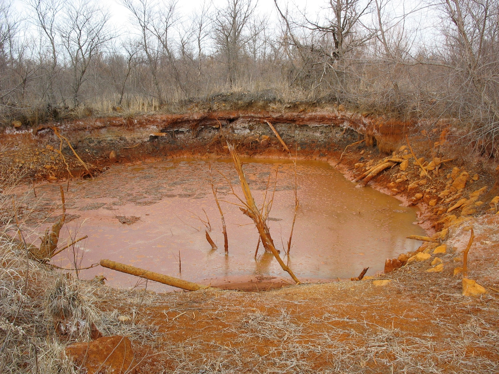
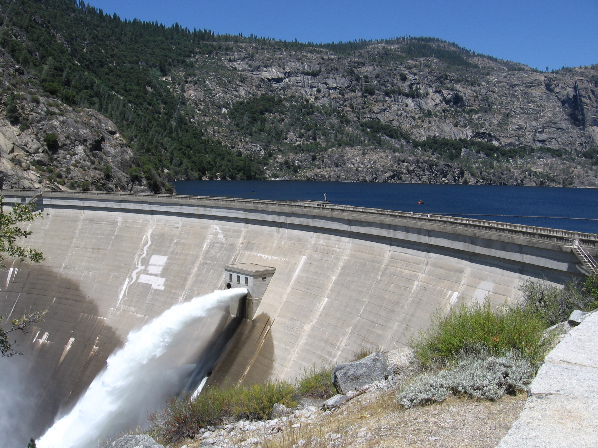
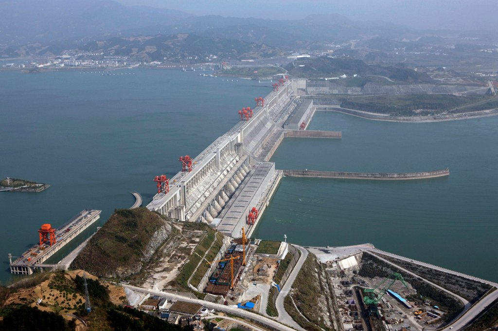
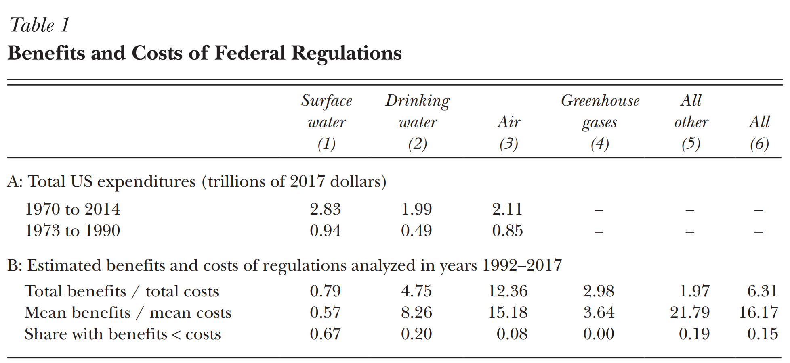
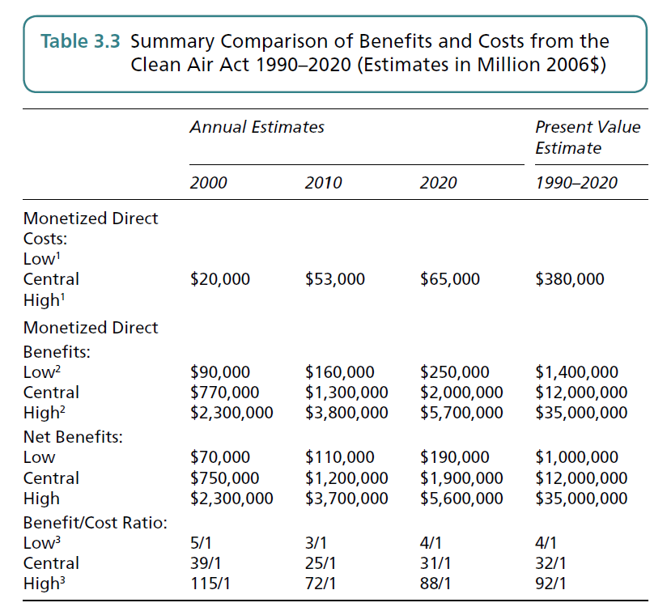

---
output:
  html_document: default
  ioslides_presentation: default
---

title: 'Module 8: Benefit-Cost Analysis and Dynamic Decision-Making'
output:
  slidy_presentation: default
  beamer_presentation: default
  ioslides_presentation: default

## 
So far in this class we have talked about:

* How to measure benefits from environmental protection
    - Revealed preference vs. stated preference
    - Use value, option value, and non-use value
* How to measure costs of environmental protection
    - Engineering cost vs. opportunity cost
    - Productivity effect
    - Employment effect

## 
In this module, we are going to look at how to compare between benefits and costs. We will talk about:

* Benefit-cost analysis
* Discounting and present value
    - Private vs. Public discount rates
* Dynamic decision-making
* Decision-making under uncertainty

## 
One of the most important reasons to environmental benefits and costs is to evaluate public policy decisions:

## 
{height=450px}  

## 
{height=450px} 

## 
{height=450px} 

## 
{height=450px} 

## And these projects need to be funded by the public

* Free-riding problem: private entities will under-private public goods
* One of the major functionalities of the government is public good provision: 
    - Education
    - Health
    - Environment

## The Decision Rule
Let B be the benefits from a proposed policy, and C be the costs. The decision rule is: 

**If B>C, do it. Otherwise, don't do it.**

Alternatively, 

**If the benefit-cost ratio B/C>1, do it.**

## Benefit-cost Analysis
Benefit-cost analysis provides a **normative** criteria to evaluate **public** policy **decisions**

* Normative: entails a value judgment
    - That the societal welfare is measured by the TOTAL economic benefits and costs
* Public: Benefit-cost analysis only applies to decisions that involves a public project
    - Private companies will automatically evaluate decisions based on revenue and cost
    - Public projects do not face the scrutiny of economic(accounting) calculus
* Decision
    - Whether to do the project or not
    - Need a decision rule that is clear-cut

## Of course, benefit-cost analysis is NOT the only decision rule: 

* Impact analysis
    - What are the environmental impacts of a proposed action?
    - If there is harm, then could it be mitigated? 
    - Environmental Impact Analysis, Wetland Permit, Endangered Species Act
* Cost-effectiveness
    - Wish to achieve some normative societal outcome (social justice, universal healthcare)
    - What is the way that involes the least cost to achieve the policy target?

## And there is this
Executive Order 13771 (1/30/2017): "*(c) ...any new incremental costs associated with new regulations shall, to the extent permitted by law, be offset by the elimination of existing costs associated with at least two prior regulations.*"

* The Milton Friedman tradition: too much existing regulation are hurting businesses
* Total costs of the regulation should remain the same (or lower)
* But what about benefits?

## And benefit-cost analysis does not guarantee economic efficiency
* BCA essentially evaluates whether total benefit is larger than total costs
    - Or, whether net benefit is larger than zero
* That does not guarantee that the proposed policy MAXIMIZES societal welfare

## What does benefit-cost analysis look like?
{height=450px} 

## 
{height=450px} 

## 
{height=450px} 

## An inherent puzzle with public investments
* Many public projects involve a large sum of investment in the current period
    - Three-gorge dam
    - Superfund cleanup
    - Climate change mitigation
* The streams of benefit come at a later point
* How do we evaluate benefits and costs at different time horizons
    - Do we sacrifice future generations?
    - Do we sacrifice current economic development opportunities?

##
Cleaning up a waste site near Kingslanding costs $25 million in year 2019. Starting from 2020, it provides economic benefits of $10 million per year for the next three years, before another cleanup is due. 

How to evaluate the benefits and the costs?

## Discounting the future
In general, we might want to value more heavily with money on hand. This is true for several reasons:

* Investment generates returns
* Time preference: the desire to enjoy now more than later in the future
* Inflation: future (nominal) money is less valuable

This leads to a positive **discount rate** of r

## Discount rate and opportunity cost
Discount rate essentially represents the **opportunity cost** of spending:

* Spending now: get the project done
* Spending later: money can be used to invest, and generate return
    - The next best alternative
    - Investing on the financial market will grow the money by r in the next year

## Present value of benefits & costs
With the discount rate established, we can now evaluate the benefits and costs for the waste cleanup problem.

Assuming the base year is 2019, and a discount rate of 5%. Our problem is to put every benefit stream occuring in the future back into 2019 terms. For example, a benefit of $10 million in 2020 is worth:

**$10 million in 2020 = $10 million / (1+5%) = $9.52 million in 2019**        
**$10 million in 2021 = $10 million / (1+5%)^2 = $9.07 million in 2019**      
**$10 million in 2022 = $10 million / (1+5%)^3 = $8.64 million in 2019**     

## The present value benefits and costs for the project is:
The present value benefits: 
$$PVB = 10 * \frac{1}{(1+5\%)}+10 * \frac{1}{(1+5\%)^2} + 10 * \frac{1}{(1+5\%)^3}$$

= 9.52+9.07+8.64    
= $27.23 million

The present value costs:
PVC = $25 million

## Present value net benefits
The **present value net benefits** is thus:

PVNB = PVB - PVC     
=27.23-25 = $2.23 million

PVNB is equivalent to the idea of net benefit in the one time-period problems

## Present value vs. current value
* Current value: economic values that are generated in the future(current) year, before discounting
* Present value: the equivalent economic values generated in the future to the present year

And we have the following formula:    

$$PV = \frac{CV}{(1+r)^t}$$      
$$CV = PV * (1+r)^t$$  

where        
PV: Present value of benefits    
CV: Current value of benefits    
r: Discount rate    
t: Number of periods    

## Present value benefits for the infinite horizon
In many circumstances, future benefit/cost streams will run for a long period of time, or indefinitely: 

* Benefits from mitigating climate change
* Flood control and hydro-power generation from major dams
* Regulatory expenses to maintain a program

And how do we put that into account?

## 
The construction of the Three Gorges Dam cost $30 billion in year 0. Starting from year 1, it provides economic benefits of $1 billion per year until the earth is occupied by the three-body civilization. Assume an interest rate of 5%.

Current value costs: $30 billion in year 0
Current value benefits: $1 billion starting in year 1, indefinitely

## 
Present value costs: $30 billion
Present value benefits:

$$ 1 / 1.05 + 1/1.05^2 + 1/1.05^3 + 1/1.05^4 + ...$$      

using the summation rule of geometric sequences:
$$\sum_{s=1}^t A * \frac{1}{(1+r)^s} = A * \frac{1 - (\frac{1}{1+r})^t}{1 - \frac{1}{1+r}}$$    
$$ =$$

## 
**PV of an infinite stream of cash flows = $\frac{CV}{r}$**

## From the financial markets' perspective:
* Private markets establish equilibrium interest rates for savings and loans
    - 10-year treasury bill: 1.79% 
    - Alipay's Tianhong Monetary Fund (Yu'e Bao): 2.25%
    - Prime-rate auto loan: 4%
    - Sub-prime mortgages: 8%
    - Average return on US stock market (S&P): 9.9%
* Risky assets on average yields higher return
* We call this **private discount rate**

## From consumers' perspective
There are (at least) two main reasons why an individual values present wealth more than future wealth:

* Time preference (the short-sighted desire)
    - Between consuming now and consuming later, individuals almost always desire to consume now
    - Your favorite restaurant
    - Concert from your favorite singer
* Economic growth (money growing on trees)
    - By saving instead of consuming, more wealth could be generated in the future
    - 

