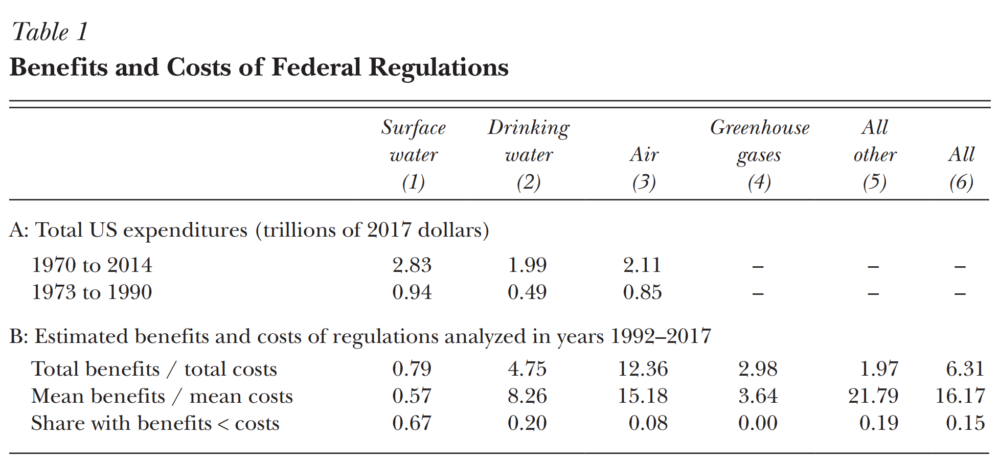
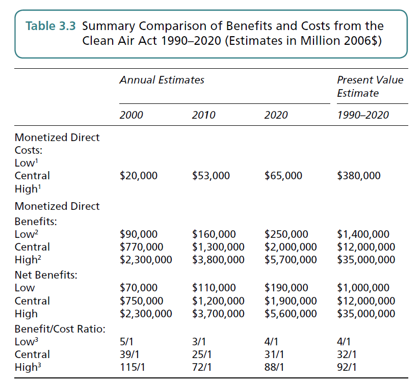

## 
So far in this class we have talked about:

* How to measure benefits from environmental protection
    - Revealed preference vs. stated preference
    - Use value, option value, and non-use value
* How to measure costs of environmental protection
    - Engineering cost vs. opportunity cost
    - Productivity effect
    - Employment effect

## 
In this module, we are going to look at how to compare between benefits and costs. We will talk about:

* Benefit-cost analysis
* Discounting and present value
    - Private vs. Public discount rates
* Dynamic decision-making
* Decision-making under uncertainty

## 
One of the most important reasons to environmental benefits and costs is to evaluate public policy decisions:

## 
{height=450px}  

## 
{height=450px} 

## 
{height=450px} 

## 
{height=450px} 

## And these projects need to be funded by the public

* Free-riding problem: private entities will under-private public goods
* One of the major functionalities of the government is public good provision: 
    - Education
    - Health
    - Environment

## The Decision Rule
Let B be the benefits from a proposed policy, and C be the costs. The decision rule is: 

**If B>C, do it. Otherwise, don't do it.**

Alternatively, 

**If the benefit-cost ratio B/C>1, do it.**

## Benefit-cost Analysis
Benefit-cost analysis provides a **normative** criteria to evaluate **public** policy **decisions**

* Normative: entails a value judgment
    - That the societal welfare is measured by the TOTAL economic benefits and costs
* Public: Benefit-cost analysis only applies to decisions that involves a public project
    - Private companies will automatically evaluate decisions based on revenue and cost
    - Public projects do not face the scrutiny of economic(accounting) calculus
* Decision
    - Whether to do the project or not
    - Need a decision rule that is clear-cut

## Of course, benefit-cost analysis is NOT the only decision rule: 

* Impact analysis
    - What are the environmental impacts of a proposed action?
    - If there is harm, then could it be mitigated? 
    - Environmental Impact Analysis, Wetland Permit, Endangered Species Act
* Cost-effectiveness
    - Wish to achieve some normative societal outcome (social justice, universal healthcare)
    - What is the way that involes the least cost to achieve the policy target?

## And there is this
Executive Order 13771 (1/30/2017): "*(c) ...any new incremental costs associated with new regulations shall, to the extent permitted by law, be offset by the elimination of existing costs associated with at least two prior regulations.*"

* The Milton Friedman tradition: too much existing regulation are hurting businesses
* Total costs of the regulation should remain the same (or lower)
* But what about benefits?

## And benefit-cost analysis does not guarantee economic efficiency
* BCA essentially evaluates whether total benefit is larger than total costs
    - Or, whether net benefit is larger than zero
* That does not guarantee that the proposed policy MAXIMIZES societal welfare

## Mike Pompeo on the Paris Agreement, 11/4/2019
https://finance.yahoo.com/video/mike-pompeo-explains-why-us-002029088.html

## 
Where does the Secretary of State get wrong?

## What does benefit-cost analysis look like?
{height=450px} 

## 
{height=450px} 

## 
{height=450px} 

## An inherent puzzle with public investments
* Many public projects involve a large sum of investment in the current period
    - Three-gorge dam
    - Superfund cleanup
    - Climate change mitigation
* The streams of benefit come at a later point
* How do we evaluate benefits and costs over different time horizons
    - Do we sacrifice future generations?
    - Do we sacrifice current economic development opportunities?

##
Cleaning up a waste site near Kingslanding costs $25 million in year 2019. Starting from 2020, it provides economic benefits of $10 million per year for the next three years, before another cleanup is due. 

How to evaluate the benefits and the costs?

## Discounting the future
In general, we might want to value more heavily with money on hand. This is true for several reasons:

* Opportunity cost of money: investment generates returns
* Time preference: the desire to enjoy now more than later in the future
* Inflation: future money is less valuable

This leads to a positive **discount rate** of r

## Present value of benefits & costs
With the discount rate established, we can now evaluate the benefits and costs for the waste cleanup problem.

Assuming the base year is 2019, and a discount rate of 5%. Our problem is to put every benefit stream occuring in the future back into 2019 terms. For example, a benefit of $10 million in 2020 is worth:

**$10 million in 2020 = $10 million / (1+5%) = $9.52 million in 2019**        
**$10 million in 2021 = $10 million / (1+5%)^2 = $9.07 million in 2019**      
**$10 million in 2022 = $10 million / (1+5%)^3 = $8.64 million in 2019**     

## The present value benefits and costs for the project is:
The present value benefits: 
$$PVB = 10 * \frac{1}{(1+5\%)}+10 * \frac{1}{(1+5\%)^2} + 10 * \frac{1}{(1+5\%)^3}$$

= 9.52+9.07+8.64    
= $27.23 million

The present value costs:
PVC = $25 million

## Present value net benefits
The **present value net benefits** is thus:

PVNB = PVB - PVC     
=27.23-25 = $2.23 million

* PVNB is equivalent to the idea of net benefit in the one time-period problems
* Decision rule for a BCA becomes: ** PVNB > 0: do it; PVNB <0: don't do it**

## Present value vs. current value
* Current value: economic values that are generated in the future(current) year, before discounting
* Present value: the equivalent economic values generated in the future to the present year

And we have the following formula:    

$$PV = \frac{CV}{(1+r)^t}$$      
$$CV = PV * (1+r)^t$$  

where        
PV: Present value of benefits    
CV: Current value of benefits    
r: Discount rate    
t: Number of periods    

## Present value benefits for the infinite horizon
In many circumstances, future benefit/cost streams will run for a long period of time, or indefinitely: 

* Benefits from mitigating climate change
* Flood control and hydro-power generation from major dams
* Regulatory expenses to maintain a program

And how do we put that into account?

## 
The construction of the Three Gorges Dam cost $30 billion in year 0. Starting from year 1, it provides economic benefits of $1 billion per year until the earth is occupied by the three-body civilization. Assume a discount rate of 5%.

Current value costs: $30 billion in year 0    
Current value benefits: $1 billion starting in year 1, indefinitely

## 
Present value costs: $30 billion    
Present value benefits:

$$ 1 / 1.05 + 1/1.05^2 + 1/1.05^3 + 1/1.05^4 + ...$$      

using the summation rule of geometric sequences:
$$\sum_{s=1}^t A * \frac{1}{(1+r)^s} = A * \frac{1}{1+r}* \frac{1 - (\frac{1}{1+r})^t}{1 - \frac{1}{1+r}}$$    

## 
When t goes to infinity, we have: 
$$\sum_{s=1}^t A * \frac{1}{(1+r)^s} = A * \frac{1}{1+r}* \frac{1}{\frac{r}{1+r}}$$      
$$= \frac{A}{r}$$

Or: 

PV of an infinite stream of payoff = $\frac{\text{CV of each year's payoff}}{r}$

## 
And the PVB for the project is: 1/0.05 = $20 billion.     
The PVNB is thus: 20-30 = $-10 billion

## The influence of discount rate
Discount rate has a critical impact on benefit-cost analysis. Suppose for the same project ($30B initial cost, $1B indefinite benefit), different discount rates are chosen:

```{r,echo=F}
r = c(0.01,0.02,0.03,0.05,0.1,0.2)
cost=30
benefit=1/r
pvnb=benefit-cost
out=data.frame(Discount_rate=r,PVB=benefit,PVC=cost,PVNB=pvnb)
print(out,row.names=F,digits=2)
```

## Internal Rate of Return
Another way to evaluate policy projects (or business ones) is to calculate the internal rate of return.

IRR = the discount rate when the project is just breaking even

## 
{height=450px} 

## Put it in another way
* Climate change is going to cause $5 trillion (5,000,000,000,000) in damage by 2100
* With 3% discount rate, this is $382 billion in NPV
    - Half of the annual US military spending 
* With 5% discount rate, this is $72 billion
    - How much China invests in its high-speed rail system
* With 7% discount rate, this is $13 billion
    - 4 months of Netflix subscription for the entire US

##
* Higher discount rate: welfare for the present is relatively more valuable
* Lower discount rate: welfare for the future is relatively more valuable

## From the financial markets' perspective:
* Private markets establish equilibrium interest rates for savings and loans
    - 10-year treasury bill: 1.79% 
    - Alipay's Tianhong Monetary Fund (Yu'e Bao): 2.25%
    - Prime-rate auto loan: 4%
    - Sub-prime mortgages: 8%
    - Average return on US stock market (S&P): 9.9%
* We call this **private discount rate**
* Risky assets will yield higher return
  - A "risk premium" for taking on extra risk

## From consumers' perspective
There are (at least) two main reasons why an individual values present wealth more than future wealth:

* Time preference (the impatient desire)
    - Between consuming now and consuming later, individuals almost always desire to consume now
    - Think about going to your favorite restaurant, or a concert from your favorite singer
* Economic growth (money growing on trees)
    - By saving instead of consuming, more wealth could be generated in the future
    
## Social vs. private discount rate
But the problem with a market-driven discount rate is, private discount rates are higher than the social discount rate

* Investors are more impatient than the society as a whole (higher time preference)
    - Make money in three years, otherwise I will not invest in your start-up
* Higher risk premium
    - Government can better shield institutional risks
    - Government can impose risks to private firms

## 
By the same logic, developed countries may have lower interest rate than developing countries:

* Divergence in credit ratings of national debts (cost of raising capital)
* Divergence in institutional risks
* Divergence in growth rates

This is to say, while US should use a discount rate of 3%, Mozambique should use a discount rate of 8%.

What are the implications of this?

## Frank Ramsey and the Ramsey equation
Frank Ramsey is NOT an economist. He was a philosophy/mathematician working with the great Wittgenstein. He was encouraged by John Maynard Keynes and Arthur Pigou(!) though. 

Ramsey wrote only three economics papers in his life:

* A Contribution to the Theory of Taxation (landmark in public finance)
* Truth and Probability (the foundation of modern statistics)
* A Mathematical Theory of Saving (first chapter in every advanced macroeconomics book)

##
Paul Samuelson: "three great legacies – legacies that were for the most part mere by-products of his major interest in the foundations of mathematics and knowledge."

John Maynard Keynes: "one of the most remarkable contributions to mathematical economics ever made, both in respect of the intrinsic importance and difficulty of its subject..."

## The Ramsey equation
Ramsey (1928): How to maximize present value benefits over time? Or rather, how should the society tradeoff current consumption with future ones?

##
{height=200px} 

{height=300px} 

##
After some difficult (but elegant) math, it goes as simple as this:

$$r = \delta + \eta g$$

where:    
r: discount rate     
$\delta$: pure time preference      
$\eta$: elasticity of marginal utility of consumption      
g: growth rate of the economy      

## 
In other words, discount rate consists of two part:

* Pure time preference: $\delta$
* Future economic growth, weighted by the diminishing marginal utility of consumption: $\eta$g

## Some estimates of the social discount rate
* Obama Administration: 3% - 5%
* Nordhaus: Observe parameters on the market
    - $\delta$ = 1.5; $\eta$=2
    - r = 4.5%-6.5%
* Stern: Choosing parameters from a moral stand point
    - $\delta=0.1$; $\eta$=1
    - r = 1.4%

## Consequences of discount rate choices
Drastic differences on the social cost of carbon (price of a carbon tax):

* Obama Administration: $40 per ton
* Nordhaus (DICE): $8 per ton
* The Stern Report: $200 per ton


## Discount rate as a political tool
And of course, discount rate is a power weapon if politicians want to "play with the numbers":

* The Trump administration revisited the social cost of carbon
* Among other things, they chose a discount rate of 7%(!)
* Leads to a social cost of carbon of less than $1 per ton
    - Almost no climate policy will pass the BCA with that
    - Basis for revoking existing climate regulations


## Nordhaus vs. Weitzman vs. Stern
* Nordhaus: simulation modeling
  - Investment in climate change has relatively low rate of return
  - Resource better spent on other projects with higher return: Child education, fighting poverty
  - Favors a carbon tax
* Weitzman: the fat tail problem
  - Need to avoid potential catastrophic events (with small probability, but fat tails)
  - Favors a cap-and-trade
* Stern: Discount rate should be a moral choice
  - Discount rate as low as possible

## What do you think the discount rate should be? 
* How should it be determined?
* How high should it be?
* Any problems with discounting in this way?
   - What about catastrophic risk in the future?
   - What about future growth rates?


## Decision-making under uncertainty

In the real world, it is hard to state the consequence of a policy with certainty. 

* Exposure to radioactive substances from the Fukushima Nuclear site is lethal to human 1 in 10,000 time, and non-lethal for the rest 9999 times. 
* Climate change may cause massive damage to the society, or it may cause relatively small damage
* Mars-landing may cost NASA 100 billion dollars if everything goes right, but it may cost up to 1 trillion

## How does benefit-cost analysis incorporate uncertainty?
A government can implement one of the three programs to restore a migratory bird habitat. Three plans have the same cost of $1000. The economic benefits from each strategy is the following:

| | Outcome A| Outcome B| Outcome C|
|---------------|------------|--------|--------|
|Economic Benefits | 500 | 1000|2000|
|Plan A | 30% | 50%| 20%|
|Plan B | 10%| 65%| 25%|
|Plan C | 20%| 40%| 40%|

Which plan should the government pick?

## Dominant policy
A **dominant policy** is one that confers higher net benefits for every outcome. 

Also, a dominated policy is a policy that confers lower net benefits for every outcome comparing to another policy. 

Is there a dominant strategy there? Is there a dominated strategy there?

## Expected value maximization
If there is no dominant strategy, then we will have to rely on something else: **maximize the expected value of net benefits**

Expected Net Benefit of Choice j = $\sum_{i=1}^I p_i NB_{ij}$

## 
Plan A: E(NB) = 500 * 30% + 1000 * 50% + 2000 * 20% = 1050

Plan B: E(NB) = 500 * 10% + 1000 * 65% + 2000 * 25% = 1200

Plan C: E(NB) = 500 * 20% + 1000 * 40% + 2000 * 40% = 1300

## Another example
Honduras is thinking of a national climate change adaptation plan that costs $70 million. There is a 70% chance that the plan is successful, and create an annual benefit of $4 million indefinitely. There is a 30% chance that the plan is unsuccessful, creating only $1 million indefinitely. 

Assuming a discount rate of 5%, should the government go through with the plan?

## Maximizing expected present value net benefits
E(PVNB) = 4,000,000/5% * 70% + 1,000,000/5% * 30% - 70,000,000         
 = -$8,000,000

Honduras should not go through with that plan. 

## 
* Using expected net value maximization implicitly assumes that the society is risk-neutral
    - i.e., the society is indifferent between a certain $50 payoff and a 50% chance of getting $100
* This may be a simplification
    - What if there is a catastrophic risk that we cannot bear?

## Takeaways from the module
* Benefit-cost analysis
    - Normative, public decisions
* Dynamic decision-making
    - Present value vs. current value
* Discount rate
    - The Ramsey formula
    - Private vs. social discount rate
    - Implications for climate change
# Decision-making under uncertainty
