## 
So far in this class we have talked about:

* Resource management regimes
    - Tragedy of the commons
    - Privatization
    - Community-based management
* Inter-temporal decision making
    - How to evaluate costs and benefits that happen in the future

## 
In this module, we are going to look at non-renewable resources in the world, with the looming question: 

Are we running out of them?

##
We will talk about:

* Physical vs. economic scarcity
    - What really measures scarcity?
    - The Simon-Erhlich wager
* A two-period model of resource extraction
    - Scarcity rent
* A multi-period model 
    - Hotelling's rule
    - Backstop, discovery, and environmental concerns
* Sustainability 
    - Hartwick's rule
    - Weak vs. strong sustainability

## 
* Renewable resources: resources that can replenish over time
    - Could you name some renewable resources?
* Non-renewable resources: resources that cannot be replenished
    - If we used up all the *reserves*, then there is none left
    - Could you name some non-renewable resources?

## But how do we figure out if we're running out of a particular non-renewable resource? 

## Reserve-to-production ratio

One measure is the "reserve-to-production ratio" (R/P)

* There are only 1 million tons of Lithium in reserve
* Currently, we use 50,000 tons of Lithium each year
* That implies a R/P of 20:
    - In 20 years, the world will run out of Lithium
    - With its importance in producing rechargeable batteries, we must do something(!)

## How long will we run out of our resources?
In the 1950-1960s, scientists worked extensively on figuring out R/P, and the picture did not look great. That picture has not recovered even till this day.  

| Mineral|Reserve to Production|
|-----------|------|
| Copper| 32 years
| Nickel| 63 years
| Chromium| 18 years
| Silver| 12 years
| Zinc| 26 years
| Gold| 16 years

## And it is not only metals

Hubbert (1956): There will be a "peak oil" if we keep the current pace of growth

* There is only so much oil (or other fossil fuels) buried underground
* Population is growing
* The economy is growing

And Hubbert predicted a peak of oil use in 2000

## 
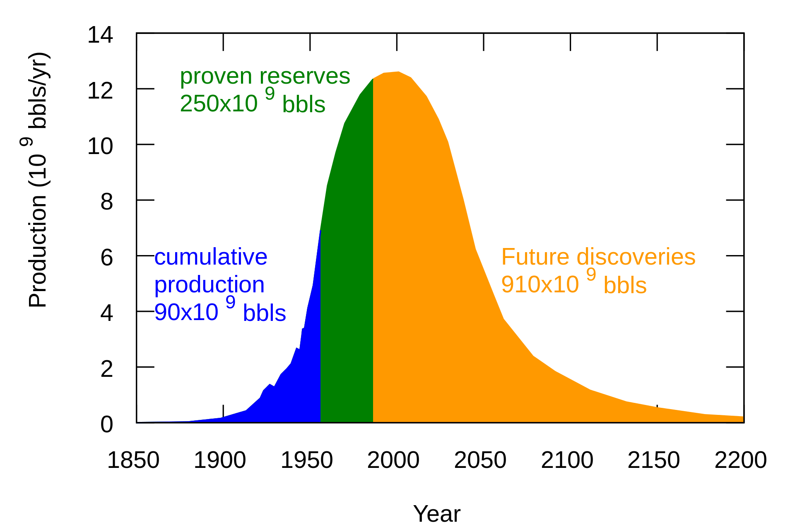{height=450px}

## Why is it a big deal? 

Looking back into the evolution of human civilization, human development centered around better harvesting of surplus energy:

* Energy surplus is needed to build complex social structures
* Development of math, science and history all rely on energy surplus in ancient societies
* Surplus energy = extra entropy for the society

## EROI

Energy return on investment = Energy delivered / energy cost to acquire fuels

| Type of Energy Source | EROI|
|---------------|--------|
| Hunting and gathering | 1.05 : 1 |
| Agriculture for food| 1.1-1.3 : 1|
| Coal| 48 : 1|
| Oil| 25 : 1|
| Wind| 18 : 1|
| Solar PV| 6 : 1|
| Corn ethanol| 0.8-1.6 : 1|

## The existential crisis
Estimates suggest that our society needs at least an EROI of 10:1 to grow sustainably.

Will the society be able to survive/thrive when we run out of oil and coal?

## Limits to growth
In 1972, MIT scientist Donella Meadows and her group published the famous "Limits to Growth" Report for the Club of Rome. The book sold 9 million(!) copies worldwide. 

They offered a neo-Malthusian prediction: 

* Exponential growth in global population and the economy in general
* This leads to exponential growth in the use of non-renewable resources
    - Fossil fuels
    - Essential metals
    - Agricultural land
* Human civilization will experience a "sudden and uncontrollable decline in both population and industrial capacity" if we keep running business as usual 

##
{height=450px}

## Predictions from LoG
* Global Industrial output per capita reaches a peak around 2008, followed by a rapid decline
    - Global food per capita reaches a peak around 2020, followed by a rapid decline
    - Global services per capita reaches a peak around 2020, followed by a rapid decline
    - Global population reaches a peak in 2030, followed by a rapid decline
* Growth trends existing in 1972 could be altered so that sustainable ecological and economic stability could be achieved.
* The sooner the world's people start striving for the second outcome above, the better the chance of achieving it.

## A quiet dissent
Economists, on the other hand, are generally more optimistic. Julian Simon, for example, argued for a drastically different picture:

* With more population comes more human capital
  - Echoed by Weitzman, Romer, Krugman
* Human ingenuity will guide us through the problem with
  - Innovation
  - Technological advancements
* And we will not run out of natural resources

## The Simon-Erhlich Wager
* Julian Simon bet the world that the prices of natural resources would not increase
* Paul Erhlich and his colleagues chose five metals
    - Chromium, copper, nickel, tin, and tungsten
    - R/P was alarming for the above five metals
* Simon and Erhlich bet $1000 on whether the real market price of these five metals would increase in 10 years

## The looming question with the Simon-Erhlich bet

* Even just by looking at the reserve-to-production ratio, we are not in good hands
* What is going to happen with the exponential growth of population and their affluence?

## Debate
Is resource depletion a problem, 40 years after the bet?

If so, what type of resources are in danger?

## But, wait a minute
* Reserve-to-production ratio is what we refer to as the **physical scarcity** of a resource.
    - Also known as absolute scarcity
* The idea of Thomas Malthus: there are physical limits to resources
* Is reserve-to-production ratio a good measure of scarcity?
* Or, do physical properties of a resource tell us about everything about the scarcity of it?

## Physical scarcity vs. Economic scarcity
Economics is the study of how to allocate scarce resources

* To balance between our unlimited desire and limited budget
* To balance between demand and supply

## 
What is the economic scarcity of a resource?

(Hint: what Simon and Erhlich wagered on)

(And note: this thing is close to, but not exactly the measure of scarcity. We'll see)

## 
* Market prices serve as a measure of the **relative scarcity** of a resource
* Scarcity driven by supply and demand
    - A resource is scarce when supply cannot meet demand
    - That drives up prices
* Why is water so cheap, and diamond so expensive?

## 
* Will growing physical scarcity of a resource be inevitable, and drives market prices of resources up the roof?
    - A prediction made in "Limits to Growth", and underlying Erhlich's reasoning in the bet
* We know that is not the case

## 
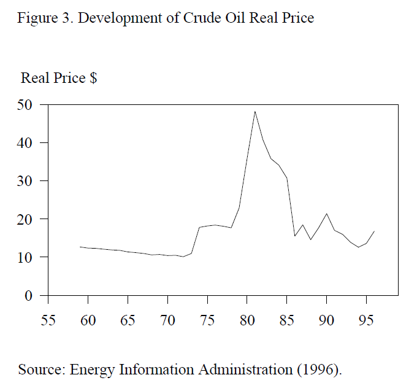{height=450px}

##
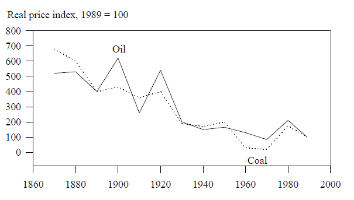{height=450px}

##
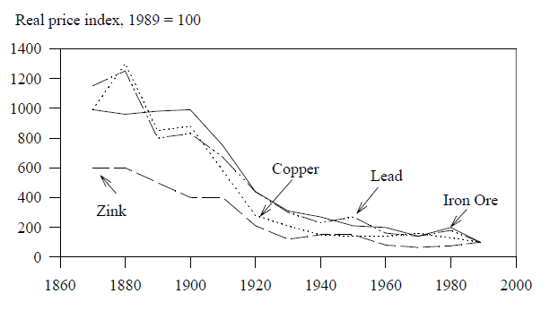{height=450px}

##
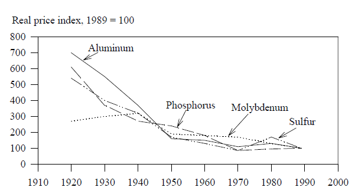{height=450px}

## What is really happening with scarcity?
Or, by looking at the reserve-to-production ratio, what can we get, and what we missing?

## A sneak peek
* Discovery
* Technology
* Substitutes
* (Environmental cost)


## A stylized example
Getty Inc. controls an iron mine, with a fixed amount of supply. The company can extract and sell iron in two periods, before the world ends. 

* The firm wants to maximize present value net benefits from the mine
* Only 20 units of iron can be extracted
* Demand (marginal WTP) for iron is constant
    - Demand curve: P = 8 - 0.4Q
* Marginal cost of extraction is also constant
    - MC = $2

## 
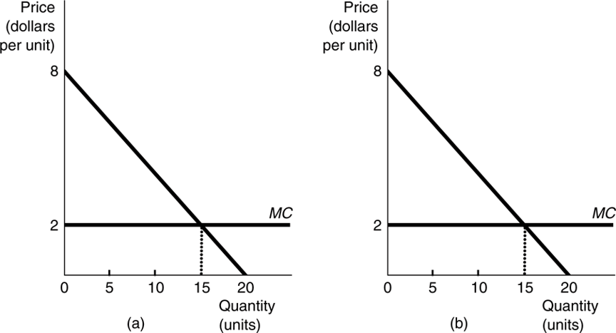{height=450px}

## 
* The society demands 15 units of iron in each period
    - Equate supply with demand: 8-0.4q=2
* There is only 20 units left
    - There is not enough iron to be produced to satisfy the need of the society

## Maximize PVNB?
* Getty wants to maximize the present value net benefits of this mine in two periods
* It faces the trade-off of (producing and) selling the iron either in the first period, or in the second period
* To maximize the sum of PVNBs, the PVNB of the last unit that Getty sells in the first period should be equal to the PVNB of the last unit sold in the second period.

## The dynamic efficiency rule
**The present value MARGINAL net benefit (PVMNB) should be equalized across the two periods.** 

## 
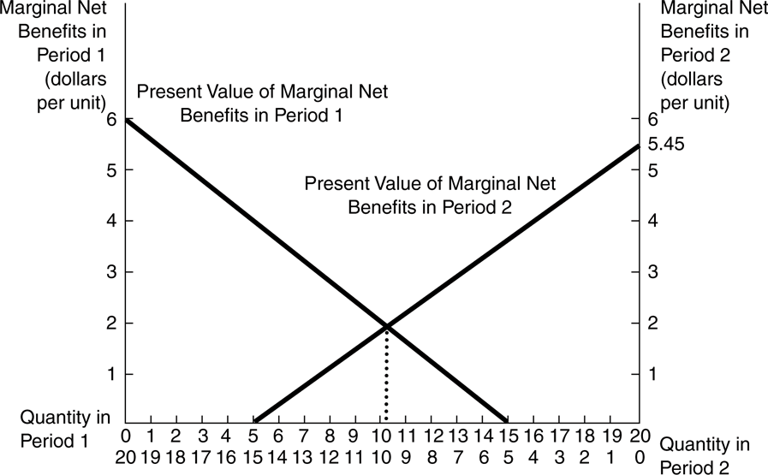{height=450px}

## Some math to solve the problem
Solve the system of equations:

$q_0 + q_1 = 20$ (Total amount of production is no more than the reserve)

$PVMNB_0 = PVMNB_1$ (PVMNB should be equalized between two period)    

Or, $8- 0.4q_0 - 2 = (8 - 0.4q_1 - 2)/(1+r)$

## Dynamically Efficient Allocation (DEA)
Assume an interest rate of r=10%, the dynamically efficient allocation (DEA) is characterized by: 

$q_0 = 10.24$, $q_1=9.76$, and

$p_0 = 3.905$, $p_1=4.095$

## Scarcity rent
* Notice that at the DEA, marginal benefit is larger than the marginal cost
* This is not the general rule for a producer in a static, competitive market: 
    - When MB=MC, producer surplus is maximized
* Scarcity of a resource creates an economic rent by holding on to the reserve for future periods
    - Known as the **scarcity rent**
    - Also referred to as the *royalty* or the *marginal user cost*


## Scarcity rent
For a non-renewable resource, we have the following rule:      

**Price = Marginal Cost + Scarcity Rent**

* "Rent": extra payoff above the break-even margin
    - Rent dissipation in our fishery (tragedy of the commons) model
    - Scarcity rent is the "natural capital", or the "shadow value" of a natural resource

## The role of physical reserves
* If supply is sufficient to meet demand, then a static efficient solution will provide the optimal allocations over time, regardless of the discount rate.
* In the case where supply cannot meet demand, scarcity rent represents the *economic scarcity* of a depletable resource
    - The less of the resource stock, the higher the scarcity rent
* Producers receive a royalty from the scarcity of the resource
    - Amount of royalty (scarcity rent) equals to their current value net benefits

## 
* What will happen when the amount of reserve is 10 units instead of 20? 
* What will happen when the amount of reserve is 30 units? 

## The role of discount rate
* From an opportunity cost perspective, holding on to the resource reserves have economic values
* Holding a particular asset should generate a return at least equal to the alternative investment
    - Which is the discount rate (private or social)

## Hotelling's Rule
Hotelling (1931): **Rate of growth in the scarcity rent of a resource equals to the rate of return on an alternative investment**

We can verify that with our two-period model: 

* Period 1: Royalty = 3.905-2=1.905
* Period 2: Royalty = 4.095-2=2.095
* Hotelling's rule: Royalty at p2 = Royalty at p1 * (1+r)
    - 1.905 * (1+0.1) = ?

## How discount rate affects inter-temporal allocation of resources
Solve the same system of equations with different discount rates, here's what we have:

```{r,echo=F}
a = c(0,0.01,0.02,0.05,0.1,0.2,0.5)
b = 20*(a+1)/(a+2)
c =20-b
out=data.frame(r=a,q0=b,q1=c)
out
```

## 
* When discount rate r=0, we should see equal allocation between the two periods
* When r increases, Hotelling's rule suggests that more rents need to be extracted in future periods
* This means that more resources will be extracted in the present, and less saved for the future
* Alternatively, the society will use up the resource stock more quickly in order to develop with a higher discount rate
    - Ramsey's formula: discount rate = time preference + weighted growth rate

## Sustainability implications
* It may be rational for developing countries to use up their resource stock more quickly than developed countries
    - Because of the discount rate differences
* As long as physical capital can substitute natural capital
    - Will come back to that point

## The infinite period case
* Non-renewable resources can be extracted for multiple periods
    - Or even indefinitely, if properly planned
* What governs the optimal trajectory of resource extraction under uncertainty?

## 
* In order for the PVNB of a mine to be maximized, the following extraction rule should hold:

**Present value marginal net benefits (PVMNB) should be equalized across all periods.**

And, the marginal net benefits (MNB) in the current period is just the scarcity rent the producer receives.

## Hotelling's rule, the infinite horizon version
The scarcity rent will increase over time with a rate equal to the interest rate, or      
$$SR_t = SR_0 * (1+r)^t$$

And, the price of a resource, assuming constant marginal cost, will be governed by:

$$P_t = (P_0-MC) * (1+r)^t + MC$$

## 
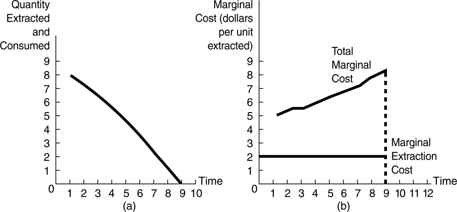{height=450px}

## 
Hotelling's rule does suggest that the scarcity of a resource rising exponentially over time. But, there are strings attached to it:

* The reserve remains as is
* No substitutes
* No technological development
* No environmental cost


## Reserves
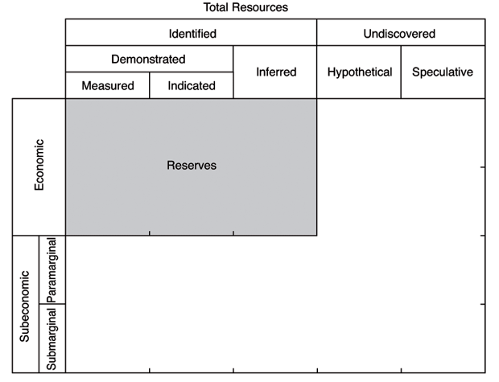{height=450px}

## Discovery
With increasing price (and royalty) for a resource, it creates incentives for discovering new reserves, which will

* Increase the reserve base
* Decrease the level of scarcity
* Drive prices down, increase production

##
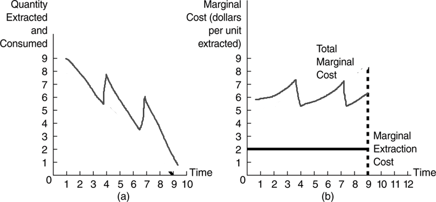{height=450px}

## Substitutes
There are always substitutes for a particular resource, but the alternatives could be

* More expensive
* Of less quality/utility

But when the price rises up to a certain point, the substitute starts to kick in. This means that

* The resource cannot be priced above its substitute
* The price for the substitute is called the **backstop price**

## 
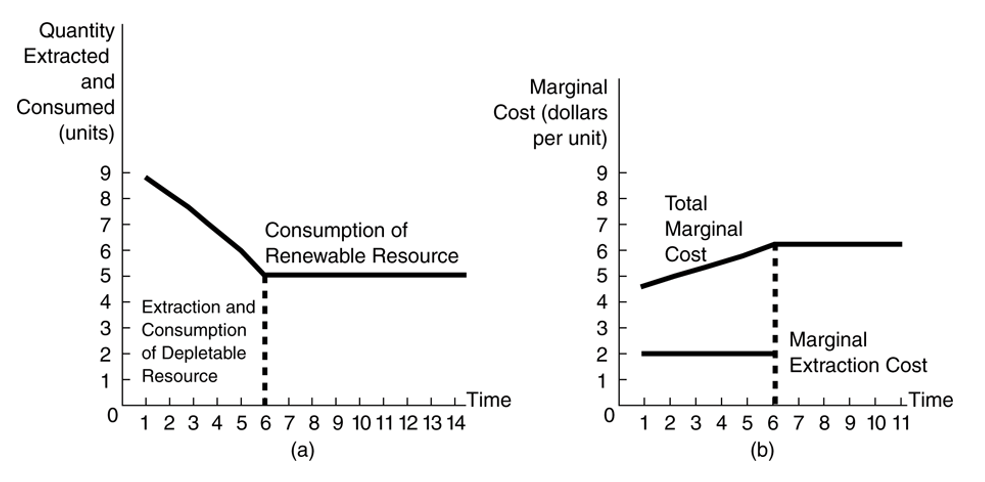{height=450px}

## Technological development
* Higher resource price also encourages firms to develop more productive extraction technologies
* Overtime, the royalty remains the same
* But the market price of the resource decreases

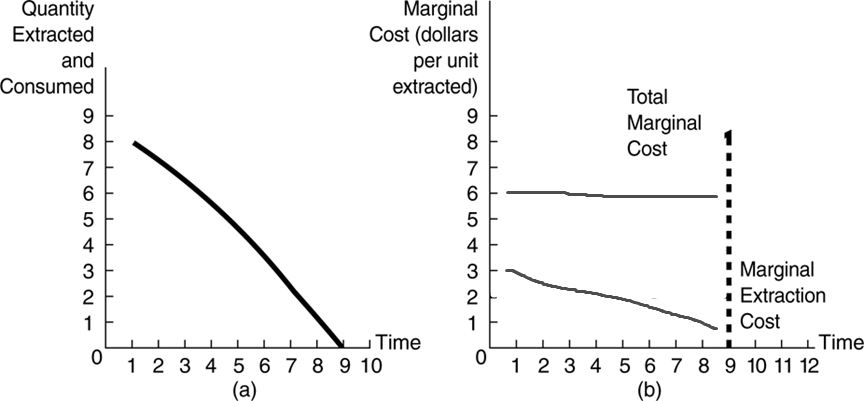{height=450px}

## What real tech improvement looks like
* In 1947, the president of Republic Steel, C.M. White, calculated that the Mesabi Range in Minnesota could only last for 5-7 before depletion.
* Mesabi supplied 60% of the US iron during WWII
* At that time, only iron ores with 50-65% percent iron can be economically extracted
* More iron ores existed in the 30% crude form

## Pelletization
* Until there's the technology called "pelletization"
* Turns iron into pellets on site
* Saves enormous costs despite using inferior iron ores

## 
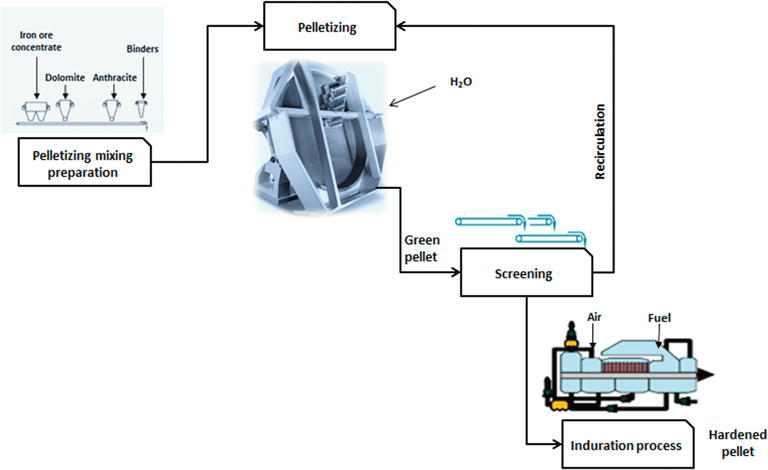{height=450px}

##
{height=450px}

## 
* By 1955, only 8 years later, US News and World Report concluded that worry over the scarcity of iron COULD BE FORGOTTEN(!)

## Environmental Concerns of Mining
* Mining could bring environmental concerns to the local environment
    - Destroy ecosystems
    - Pollute water systems
    - Emits greenhouse gases

## 
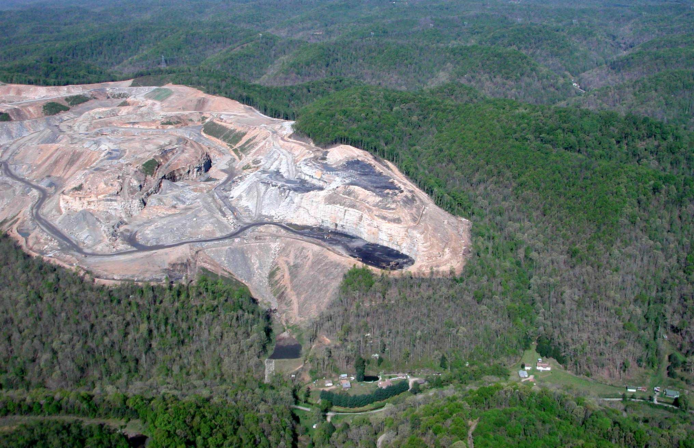{height=450px}

##
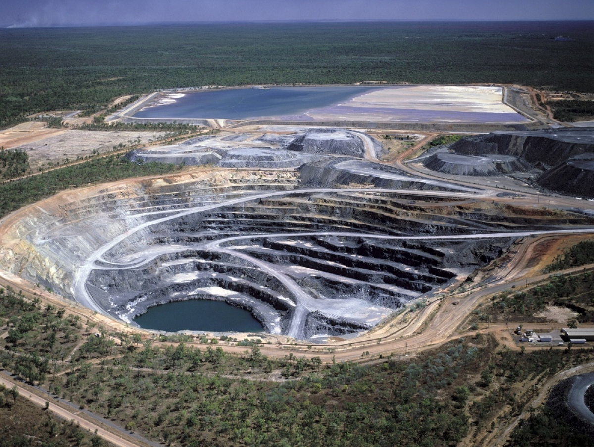{height=450px}

## Modelling environmental cost
* That essentially increases the social cost of production
    - We talked about the static case in previous modules
* The marginal social costs (MSC) should be higher than the mere extraction cost
* Should extract fewer resource over time


## What can we learn from variations of the Hotelling's rule?
* Physical scarcity only captures part of the picture
    - The original Hotelling's rule: price grows exponentially
* But, only measuring physical scarcity will be misleading in many ways
    - It ignores the feedback mechanisms within economic systems
* Price is a signal for the economic scarcity of a resource
    - Price signals will stimulate societal changes & adjustments

##
* Price signals will encourage
    - Discovery
    - Substitutes
    - Technological development
    - Recycling
* Taking it altogether, we are probably NOT running out of our non-renewable resources

## Taking three steps back
There are two important assumptions/exceptions underlying all the above economic analysis. If those two conditions break, then Simon's prediction of infinite resources will fall short.

Can you spot them?

(Hint: we have talked about both of them in this class)

## 
1. What is fundamentally different between drilling for oil, and harvesting fisheries?

What drives the tragedy of the commons?
  
## Property rights
* By saving resources for the future, the producer has to have exclusivity to the reserve first
    - If the reserve no longer belongs to me after this period, then I'd better extract it first before somebody else does
    - Scarcity rent dissipates because of open-access
* This is plaguing non-renewable resources with weak property rights
    - Groundwater aquifer
    - Precious minerals in Sub-Saharan Africa
    
## 
* Most oil/coal/natural gas extraction sites have well-defined property rights
    - Oil companies nationalized or backed up by sovereign states (Petronas, Sinopec, Petrobras, Aramco)
    - Issues with off-shore drilling & shale gas 

## 
2. What if there is no market signal for the underlying economic scarcity? 

Or, what if the market signal is distorted?

## Real-world scarcity
The Red Sox will take on the Yankees in the 7th game of the World Series at Fenway Park. In order to reward the loyal fans here in Boston, the Red Sox announced that they will issue the ticket to the first 10,000 fans who come to the ticket office to claim it.

What do you think is going to happen?

##
{height=450px}

## Scarcity
Imagine that you manage to get into the Red Sox-Yankees game, and the Red Sox win the World Series. You step out of Fenway Park and ready to go home. It is in the middle of the night, public transit has all shut down. And it is raining cats and dogs outside. 

You desperately look for a cab, as do everybody else coming out of the Park. You wait, and wait, and wait, for an hour. No taxi comes to pick you up. 

##
You open your Uber app on the phone. There is a surge pricing of 5 times here at Fenway Park. You clicked the agree button, and 5 minutes later, an Uber comes to your rescue. 

##
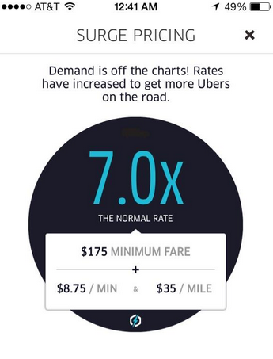{height=450px}

##
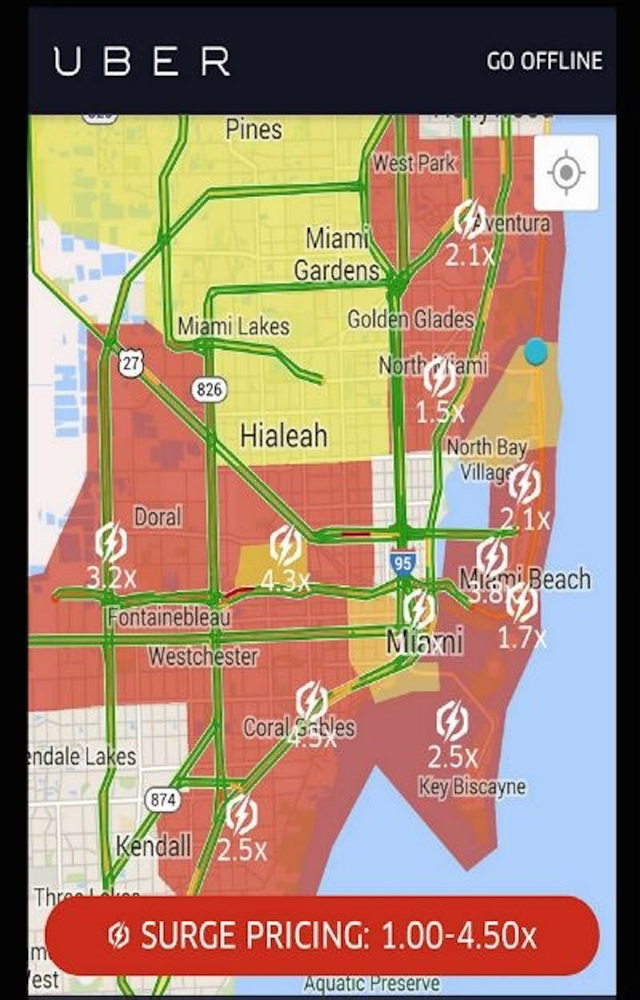{height=450px}

## 
What can you learn about scarcity from the above examples? 


## Missing or distorted market signal
* The surge pricing is essentially a *scarcity rent*
    - Drivers are pricing their vehicles above their marginal costs
* Signals for economic scarcity are distorted when prices are controlled
    - Fixed prices taxi -> No cab will come to your rescue
* Situation gets worse when there is no price signal at all
    - The economic costs for lining up & camping are much greater
    - The allocation of resources is also not efficient
  
## Erhlich's second bet
After losing the first bet, Erhlich offered Simon a second set of bets in 1994. Each of these questions worth $1000. 

1. The three years 2002–2004 will on average be warmer than 1992–1994
2. There will be more carbon dioxide in the atmosphere in 2004 than in 1994
3. There will be more nitrous oxide in the atmosphere in 2004 than 1994
4. The concentration of ozone in the lower atmosphere (the troposphere) will be greater than in 1994
5. Emissions of the air pollutant sulfur dioxide in Asia will be significantly greater in 2004 than in 1994
6. There will be less fertile cropland per person in 2004 than in 1994
7. There will be less agricultural soil per person in 2004 than 1994


## 

8. There will be on average less rice and wheat grown per person in 2002–2004 than in 1992–1994
9. In developing nations there will be less firewood available per person in 2004 than in 1994
10. The remaining area of virgin tropical moist forests will be significantly smaller in 2004 than in 1994
11. The oceanic fishery harvest per person will continue its downward trend and thus in 2004 will be smaller than in 1994
12. There will be fewer plant and animal species still extant in 2004 than in 1994
13. More people will die of AIDS in 2004 than in 1994
14. Between 1994 and 2004, sperm cell counts of human males will continue to decline and reproductive disorders will continue to increase
15. The gap in wealth between the richest 10% of humanity and the poorest 10% will be greater in 2004 than in 1994


## Simon just shaked it off
"Let me characterize their offer as follows. I predict, and this is for real, that the average performances in the next Olympics will be better than those in the last Olympics. On average, the performances have gotten better, Olympics to Olympics, for a variety of reasons. What Ehrlich and others says is that they don't want to bet on athletic performances, they want to bet on the conditions of the track, or the weather, or the officials, or any other such indirect measure."

## 
* None of these statements involve a market(!)
    - Thus warranted Simon's response: there is no (direct) price signal for scarcity
* Some of them are indeed market failures
    - And thus requires governmental intervention (or warrants our attention)
    - Some have been solved, others remain as looming threats
* Others are not problems at all
    - The invisible hand will adjust the problem  	
 

## A poll

* This is a problem needs to be solved
* This is a problem that has already been addressed
* Why do we even care?
    - Track condition, weather, or officials?

## Fact-checker
1. The three years 2002–2004 will on average be warmer than 1992–1994 ($\checkmark$)
2. There will be more carbon dioxide in the atmosphere in 2004 than in 1994 ($\checkmark$)
3. There will be more nitrous oxide in the atmosphere in 2004 than 1994 (X)
4. The concentration of ozone in the lower atmosphere (the troposphere) will be greater than in 1994 ($\checkmark$)
5. Emissions of the air pollutant sulfur dioxide in Asia will be significantly greater in 2004 than in 1994 ($\checkmark$, sulfur emission peaked in 2008 in Asia)
6. There will be less fertile cropland per person in 2004 than in 1994 (Don't care) 
7. There will be less agricultural soil per person in 2004 than 1994 (Don't care)

## 
8. There will be on average less rice and wheat grown per person in 2002–2004 than in 1992–1994 (Don't care)
9. In developing nations there will be less firewood available per person in 2004 than in 1994 (Don't care)
10. The remaining area of virgin tropical moist forests will be significantly smaller in 2004 than in 1994 ($\checkmark$ ?)
11. The oceanic fishery harvest per person will continue its downward trend and thus in 2004 will be smaller than in 1994 (?)
12. There will be fewer plant and animal species still extant in 2004 than in 1994 ($\checkmark$)
13. More people will die of AIDS in 2004 than in 1994 ($\checkmark$, AIDS death peaked at 2009 though)
14. Between 1994 and 2004, sperm cell counts of human males will continue to decline and reproductive disorders will continue to increase ($\checkmark$, but...)
15. The gap in wealth between the richest 10% of humanity and the poorest 10% will be greater in 2004 than in 1994 ($\checkmark$)

## Sustainability
We keep hearing about the word "sustainability", but really what is it?

And does a dynamically efficient allocation guarantee sustainability?


## Sustainability and inter-generational equity
How much should we leave for future generations? What is the appropriate rate of discounting? 

* A Theory of Justice (John Rawls) 
    - Everyone with unknown generations, standing behind a “veil of ignorance,” decides the rules
* The sustainability criterion
    — Future generations should be left no worse off than current generations and should perhaps be left better off 

## Another interpretation of sustainability 
* We want to leave our future generation with no less capital stock than our current generation do
    - Physical capital
    - Human capital
    - Natural capital
* Extracting natural resources essentially converts natural capital into physical/human capital
    - Iron for buildings
    - Oil for plastic
    - Wood for timber/paper/furniture
    - Surplus energy for human capital development

## 
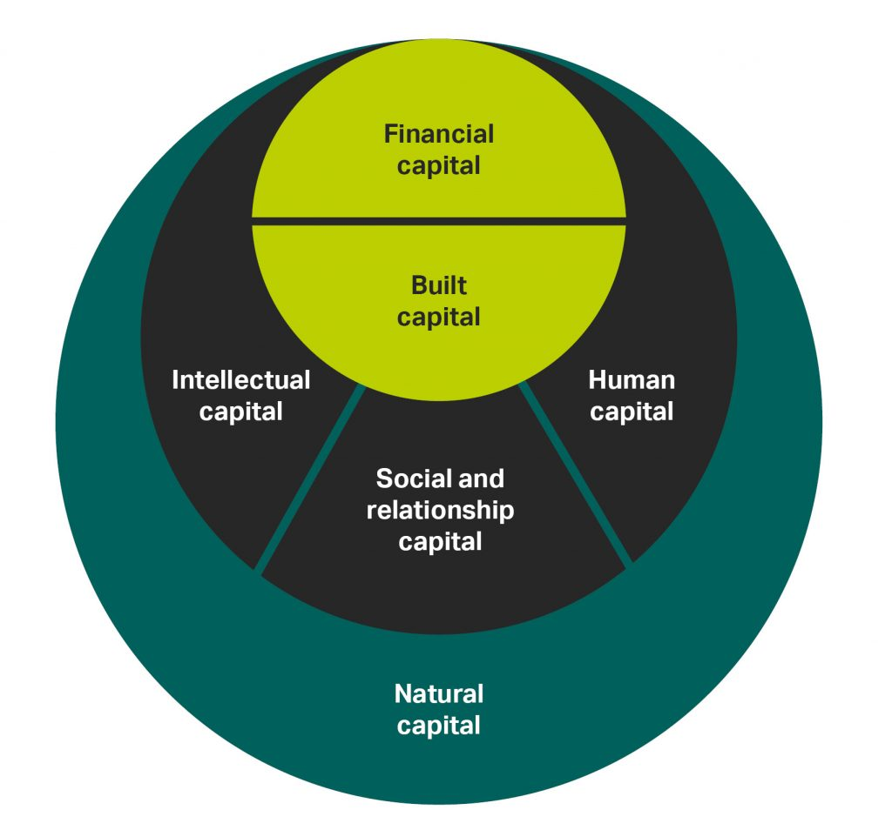{height=450px}

## Hartwick's Rule
If we invest the entirety of the scarcity rent generated from natural resources to invest in other capitals, then the total capital of the economy will not decline over time. 

## Different levels of sustainability
* Weak sustainability — the maintenance of total capital
* Strong sustainability — the maintenance of the value of the stock of natural capital
* Environmental sustainability — to maintain certain physical flows of certain individual resources


## 
* A dynamic efficient allocation will not automatically satisfy the sustainability criterion, but can be consistent with sustainability
    - With a discount rate greater than zero, an economically efficient allocation will allocate more of a resource to the first period than the second. Net benefits will be greater in the first period than the second.
    - The sustainability criterion can still be met if the first period sets aside sufficient net benefits for the second period.
    
## Applying the Sustainability Criterion
* It is very difficult to implement because it requires knowledge of the preferences of the future generation.
    - Total capital is defined as physical capital plus natural capital.
    - Hartwick’s Rule: If all scarcity rent is invested in capital, the value of the total capital stock will not decline.
    - If the principal or the value of total capital is declining, the allocation is not sustainable. 
* But complete substitutability between physical and natural capital is an extremely strong assumption. 

## Implications for Environmental Policy

* Not all efficient allocations are sustainable and not all sustainable allocations are efficient. 
* Market allocations may be either efficient or inefficient and either sustainable or unsustainable. 
* Net benefits are increased by correcting an inefficiency through policy changes, which can produce win-win situations.

## Takeaways from the module
* Physical vs. economic scarcity
    - Price serves as a signal for economic scarcity
* The two-period model of resource extraction
    - Dynamically efficient allocations
* The infinite-period model of resource extraction
    - Hotelling's rule
    - Discovery, substitute, technology, and environmental cost
* Sustainability principles


